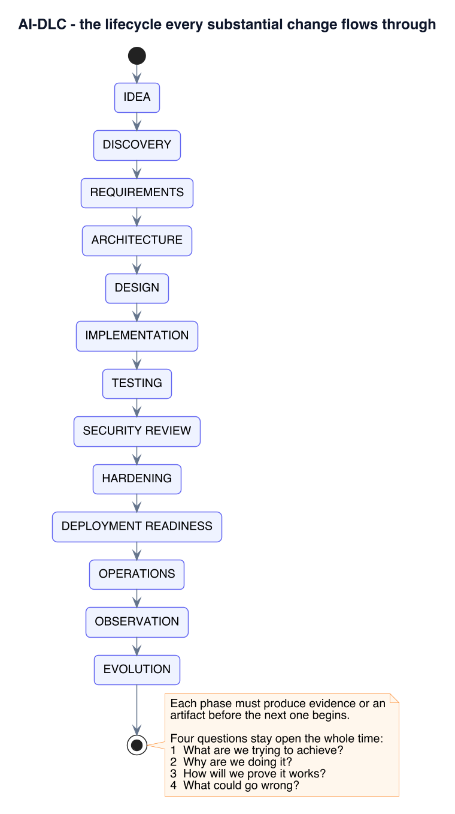
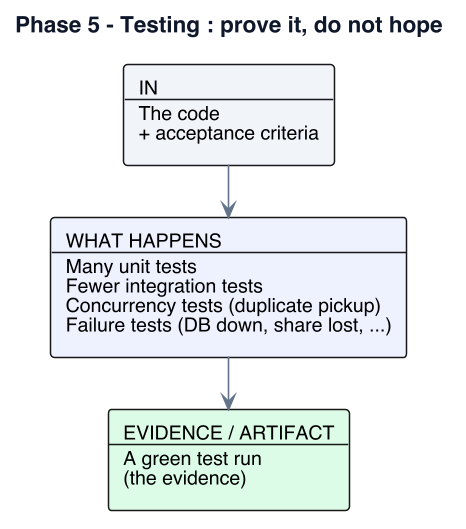
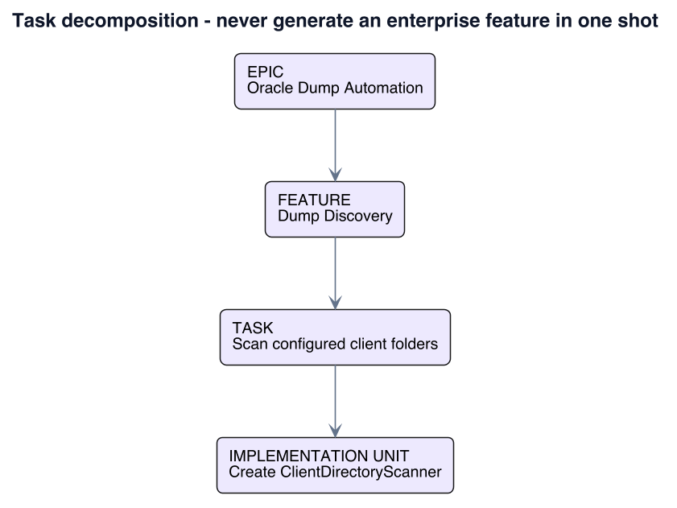
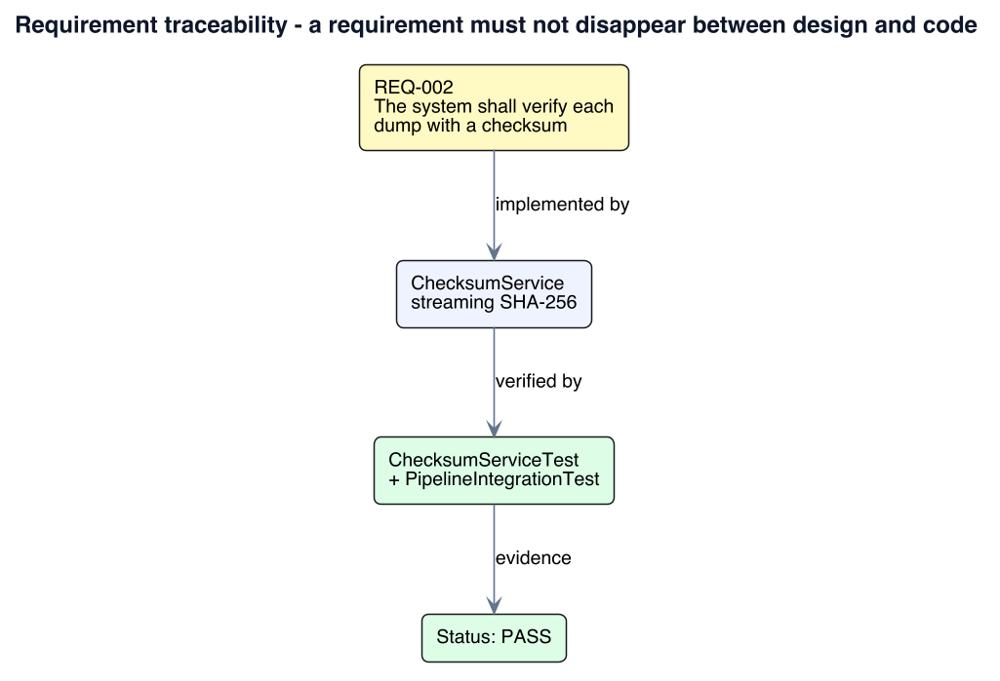

# AI-DLC — The AI-Driven Development Lifecycle

> This document explains **how software is built in this repository when Claude is involved**.
> The full rule set lives in [`cluade.md`](cluade.md) (the project's `CLAUDE.md`); this file is the
> *readable, illustrated* companion — the same process, explained thoroughly, with worked examples
> drawn from the real project that ships here: the **Oracle Dump Importer** under
> [`oracle_dump/`](oracle_dump/).
>
> All diagrams are stored as light-background PNGs in [`images/`](images/) and are referenced
> inline — there is no diagram *code* in this file, only the rendered picture plus a short remark.

---

## Table of Contents

1. [What this document is](#1-what-this-document-is)
2. [The repository at a glance](#2-the-repository-at-a-glance)
3. [Why AI-DLC exists](#3-why-ai-dlc-exists)
4. [The lifecycle — 13 phases](#4-the-lifecycle--13-phases)
5. [The four questions that never close](#5-the-four-questions-that-never-close)
6. [Core principles](#6-core-principles)
7. [Who owns what — human vs Claude](#7-who-owns-what--human-vs-claude)
8. [Phase 0 — Foundation](#8-phase-0--foundation)
9. [Phase 1 — Discovery, requirements & acceptance criteria](#9-phase-1--discovery-requirements--acceptance-criteria)
10. [Risk classification](#10-risk-classification)
11. [Phase 2 — Architecture & ADRs](#11-phase-2--architecture--adrs)
12. [Phase 3 — Technical design: data, concurrency, idempotency](#12-phase-3--technical-design-data-concurrency-idempotency)
13. [Phase 4 — Implementation standards](#13-phase-4--implementation-standards)
14. [Phase 5 — Testing](#14-phase-5--testing)
15. [Phase 6 — Security review](#15-phase-6--security-review)
16. [Phase 7 — Hardening](#16-phase-7--hardening)
17. [Phase 8 — Deployment readiness & CI/CD](#17-phase-8--deployment-readiness--cicd)
18. [Phase 9 — Operations, incidents & root-cause analysis](#18-phase-9--operations-incidents--root-cause-analysis)
19. [Phase 10 — Evolution](#19-phase-10--evolution)
20. [Task decomposition & the implementation-unit loop](#20-task-decomposition--the-implementation-unit-loop)
21. [Definition of Done](#21-definition-of-done)
22. [Requirement traceability](#22-requirement-traceability)
23. [Worked example — `oracle_dump` end to end](#23-worked-example--oracle_dump-end-to-end)
24. [Project context](#24-project-context)
25. [Project commands](#25-project-commands)
26. [Hard rules — quick reference](#26-hard-rules--quick-reference)
27. [References](#27-references)

---

## 1. What this document is

AI-DLC is a **controlled engineering process** for turning a human request into software that is
reliable, maintainable, secure, testable, observable and production-ready.

The central rule:

> **Generating compilable code does not mean the task is complete.**
> A task is complete only when requirements are understood, impact is analyzed, the architecture
> is appropriate, the implementation is finished, tests exist *and pass*, security and error
> handling are covered, observability is considered, documentation is updated, acceptance
> criteria are verified, and no known critical issue remains.

When Claude works in this repo it does not act as an autocomplete engine. It acts, in turn, as a
business analyst, requirements analyst, software architect, technical designer, senior engineer,
test engineer, security reviewer, database engineer, DevOps engineer, code reviewer,
documentation engineer and production-support assistant.

> **Note.** For a one-line CSS tweak, most of this collapses to a sentence of analysis. The
> ceremony scales with **risk** (see [§10](#10-risk-classification)), not with ego.

---

## 2. The repository at a glance

```
oracle_dump/                     <- git root
├── Ai-dlc.md                    <- this file
├── cluade.md                    <- the CLAUDE.md rule set (AI-DLC, generic)
├── images/                      <- diagrams for this file
├── README.md
└── oracle_dump/                 <- the Maven project (Spring Boot 4.1 / Java 25)
    ├── CLAUDE.md                <- Windows Server runtime contract (project-specific)
    ├── architecture.md          <- full architecture, diagrams, config reference
    ├── runbook.md               <- build / run / feed / verify / recover, with screenshots
    ├── images/                  <- the project's own diagrams & screenshots
    ├── pom.xml
    └── src/…
```

The shipped project — **Oracle Dump Importer** — is used throughout this document as the running
example because it exercises almost every phase: background scanning, large-file I/O over UNC
shares, a metadata state machine, a bounded worker pool, retry/backoff, crash recovery, an
external process (`impdp.exe`), health checks and graceful shutdown.

> **Note — two `CLAUDE.md` files, two scopes.** `cluade.md` at the root is the *methodology*.
> `oracle_dump/CLAUDE.md` is the *runtime contract* for that specific service (Windows paths, UNC
> shares, Oracle client, service account). When they appear to conflict, the order in
> [§26](#26-hard-rules--quick-reference) applies — but security and data integrity never lose.

---

## 3. Why AI-DLC exists

AI can produce a plausible-looking class in seconds. That is exactly the danger: plausible is not
correct, and "it compiles" is not "it works". Common failure modes without a lifecycle:

| Symptom | Root cause AI-DLC removes it at |
| --- | --- |
| Duplicate imports under concurrency | Phase 3 — concurrency design ([§12](#12-phase-3--technical-design-data-concurrency-idempotency)) |
| 20 GB file loaded into memory | Phase 1 NFR + Phase 4 file-processing rules |
| `impdp` password in the log | Phase 4 logging standards + Phase 6 security review |
| Silent `catch (Exception e) {}` | Phase 4 error handling |
| "Done" with zero passing tests | Phase 5 + Definition of Done ([§21](#21-definition-of-done)) |
| Network share down ⇒ app won't start | Phase 1 constraints + Phase 7 hardening |

Each phase must leave behind **evidence or an artifact** before the next begins — a requirement
list, an ADR, a design note, a passing test run, a security checklist.

---

## 4. The lifecycle — 13 phases



*Remark: the spine of AI-DLC. Movement is normally top-to-bottom, but **OPERATIONS → OBSERVATION
→ EVOLUTION** loops straight back into **DISCOVERY** for the next change — the process is a
cycle, not a waterfall.*

| Phase | Produces |
| --- | --- |
| **Idea** | a request, in the human's words |
| **Discovery** | business goal, users, inputs/outputs, rules, failure cases, dependencies, constraints |
| **Requirements** | identified, testable `REQ-*` / `FR-*` / NFR items + acceptance criteria |
| **Architecture** | component boundaries, data flow, failure flow, concurrency strategy, ADRs |
| **Design** | classes, interfaces, entities, tables, indexes, jobs, exceptions |
| **Implementation** | the smallest coherent change, with validation + error handling + logging + tests |
| **Testing** | unit / integration / concurrency / failure tests that pass |
| **Security review** | findings from five perspectives ([§15](#15-phase-6--security-review)) |
| **Hardening** | timeouts, retries, limits, cleanup, graceful shutdown, config validation |
| **Deployment readiness** | the checklist in [§17](#17-phase-8--deployment-readiness--cicd) satisfied |
| **Operations** | logs, metrics, health checks, runbook |
| **Observation** | real errors, latency, throughput, resource use |
| **Evolution** | lessons captured, docs updated, debt recorded |

> **Example — how a request enters the lifecycle.**
> *"Also stop importing the same dump twice."* → **Discovery**: which "same"? (answer: same
> *client* + same *content*, not same filename — Windows is case-insensitive). → **Requirements**:
> `REQ-003 The system shall prevent duplicate processing of the same dump (client + SHA-256).` →
> **Architecture**: de-dup check belongs in the processor, after checksum, before import. →
> **Design**: `ProcessingSteps.ImportDecision.{Proceed,Duplicate,Aborted}`. → **Implementation +
> Tests**: unit test for the decision, integration test that drops the same file twice. →
> **Security**: does the check leak another client's data? (no — scoped by `clientId`).

---

## 5. The four questions that never close

At every phase, Claude keeps answering:

1. **What** are we trying to achieve?
2. **Why** are we doing it?
3. **How** will we prove that it works?
4. **What could go wrong?**

> **Note.** Question 4 is the one humans skip and AI skips harder. In `oracle_dump` it is the
> reason the design has a `StaleRecordReaper` (what if a worker dies mid-import?), an `IoFailure`
> classifier (what if the share blips?), and a `*.part` convention (what if the scanner sees a
> half-copied file?).

---

## 6. Core principles

### 6.1 Understand before implementing

Do **not** emit code the moment a request arrives. First establish the business objective,
functional and non-functional requirements, the existing architecture, the affected components,
the data flow, and the security / performance / operational implications.

> **Example.** "Add a REST endpoint to list failed dumps" looks trivial. Understanding first
> surfaces: pagination (there could be thousands), authorization (whose failures?), and *data
> exposure* — the `lastError` field must not echo an Oracle connection string.

### 6.2 The repository is the source of truth

Inspect before changing: language, framework **version**, dependency management, existing
patterns, config structure, tests, CI. Do not import a "better" architecture because it is
fashionable — prefer consistency unless there is a strong technical reason.

> **Example.** `oracle_dump` already expresses strategy selection with a functional
> `DumpImporter` interface + `ImporterConfig` bean picking. A new importer variant follows *that*
> pattern; it does not introduce Spring `@Conditional` gymnastics or a new DI framework.

### 6.3 Prefer minimal correct changes

The smallest coherent change that *completely* satisfies the requirement. No drive-by refactors,
no speculative abstractions, no premature optimization, no dead code.

### 6.4 Production quality by default

Never intentionally ship demo-only logic, placeholder auth, empty catch blocks, unbounded
retries, unsafe SQL, uncontrolled threads, or unbounded memory / file processing. If temporary
code is unavoidable, mark it explicitly:

```
TODO:
Reason:
Required follow-up:
Risk:
```

> **Example — the real TODO in this repo** (`OracleDataPumpImporter`, per `oracle_dump/CLAUDE.md`
> §10). Real `impdp.exe` execution is *deliberately* unimplemented: the `ProcessBuilder` and
> environment construction are built and unit-tested, but `importDump` throws
> `UnsupportedOperationException`, and the default runtime bean is `MockDumpImporter`. The gap is
> visible, tested up to the boundary, and switchable by one config key — not hidden.

---

## 7. Who owns what — human vs Claude


*Remark: the boundary is about **authority**, not effort. Claude drafts the architecture; a human
**decides** it. Claude finds a security weakness; a human **accepts or rejects** the residual
risk. Claude never runs a destructive production operation on its own initiative.*

> **Note.** "Claude must never hide uncertainty." Anything not known for certain is tagged
> `ASSUMPTION`, `QUESTION`, `RISK` or `RECOMMENDATION` in the response — e.g.
> *"ASSUMPTION: dumps are always Data Pump (`impdp`), never legacy `imp`; confirm before I wire
> the executable check."*

---

## 8. Phase 0 — Foundation

**In plain terms:** look around before you touch anything. You cannot build the right thing if
you do not know the language version, the framework, where it runs, and how it is tested.


*Remark: the output of Phase 0 is the small fact sheet in [§24](#24-project-context). Every later
phase reads it instead of guessing.*

Before significant work, inspect the environment and record what matters: application name and
purpose, language + version, framework + version, build tool, database, ORM, auth model,
deployment platform, OS, CI/CD, test framework, logging, monitoring, external integrations.

> **Simple example.** Five minutes of Phase 0 on this repo answers: *Java 25, Spring Boot 4.1,
> Maven, H2, JUnit 5, runs as a Windows Service.* Skipping it is how you end up writing Spring
> Boot 3 code that does not compile, or assuming Linux paths on a Windows box.

> **Example — foundation record for this repo** (also see [§24](#24-project-context)):
>
> | Field | Value |
> | --- | --- |
> | Application | Oracle Dump Importer |
> | Language | Java 25 |
> | Framework | Spring Boot 4.1.1 (web, data-jpa, actuator, validation) |
> | Build | Maven (wrapper committed) |
> | Database | H2 — file-based (default) / in-memory (`dev`); real RDBMS for multi-instance |
> | ORM | Spring Data JPA / Hibernate |
> | Auth | none yet (internal service; a `CRITICAL`-risk gap if it is ever exposed) |
> | OS | Windows Server (UNC shares, `impdp.exe`, Windows Service) |
> | Tests | JUnit 5 + Spring Boot Test — 40 tests incl. an end-to-end `PipelineIntegrationTest` |
> | External | Oracle client CLI (`impdp.exe` / `imp.exe`), network file shares |

> **Note.** Getting the framework **version** wrong is a classic AI failure. Spring Boot 4.x is
> not 3.x — APIs, defaults and starters differ. Verify against `pom.xml`, never from memory
> ([§26](#26-hard-rules--quick-reference), "no hallucinated APIs").

---

## 9. Phase 1 — Discovery, requirements & acceptance criteria

**In plain terms:** a request like *"import the dumps automatically"* is a wish, not a spec. This
phase asks the boring questions until the wish becomes a list of statements you can test.


*Remark: the two outputs — numbered requirements and Given/When/Then acceptance criteria — are
what Phase 5 tests against and Phase 10 verifies.*

### 9.1 Discovery

For each request, pin down: **business goal**, **users**, **input**, **output**, **rules**,
**failure cases**, **dependencies**, **constraints** (performance, security, compliance,
infrastructure, technology, cost, backward compatibility).

### 9.2 Requirements — specific, testable, traceable, unambiguous

Use identifiers. Vague ("the app should be fast") is banned; bind it to a measurable statement.

```
REQ-001  The system shall discover *.dmp files in each configured client directory.
REQ-002  The system shall verify each dump with a streaming SHA-256 checksum.
REQ-003  The system shall not import the same (client + content) dump twice.
REQ-004  The system shall record processing status and the path to a per-import log.
REQ-005  The system shall expose failure information when processing fails.

REQ-PERF-001  Checksum processing shall use streaming I/O and shall not load a
              multi-gigabyte file into memory.
```

### 9.3 Functional requirements

For every `FR-*`, name its **Input / Process / Output / Validation / Failure behavior /
Authorization / Persistence**.

> **Example — `FR-005 Processing`:**
> *Input:* a `PENDING_IMPORT` `DumpFileRecord`. *Process:* claim → checksum → de-dup → import.
> *Output:* status `IMPORTED` / `DUPLICATE` / `FAILED` + `logPath`. *Validation:* file still
> present, size + mtime unchanged since discovery. *Failure:* classify via `IoFailure`; retryable
> ⇒ backoff, else `FAILED`. *Authorization:* service account has read on the share, execute on
> the Oracle CLI. *Persistence:* every transition persisted through `DumpFileRecord.transitionTo`.

### 9.4 Non-functional requirements

Always consider **performance, scalability, reliability, security, maintainability,
observability**.

> **Example mapping in `oracle_dump`:**
> *Performance* — streaming SHA-256, 8 MB buffer, stored hash reused while path+size+mtime hold.
> *Scalability* — atomic status-guarded `claim` + `@Version` so multiple instances are safe
> (with a real RDBMS). *Reliability* — `RetryPolicy` exponential backoff with ceiling;
> `StaleRecordReaper` for crash recovery. *Observability* — `/api/status`, `/actuator/health`
> with `dumpDirectories` and `oracleClient` indicators, per-import log files.

### 9.5 Acceptance criteria — Given / When / Then

```
AC-001
  Given a valid dump that has never been processed
  When the scanner discovers it and it becomes stable
  Then a record is created and progresses to IMPORTED
  And a per-import log file path is stored.

AC-002
  Given a dump whose (client + SHA-256) already exists as IMPORTED
  When the scanner detects a file with that content again
  Then the record ends as DUPLICATE and impdp is never invoked.

AC-003
  Given a worker process is killed during IMPORTING
  When stale-processing-timeout elapses (or on next startup)
  Then the record is reset to PENDING_IMPORT and retried.
```

Acceptance criteria are the contract that Phase 5 tests and Phase 10 verification check against.

---

## 10. Risk classification

Classify the change **before** implementing it. The class sets how much validation is required.


*Remark: most of `oracle_dump` is **SIGNIFICANT** — concurrency, background jobs, file
processing, an external process. Adding real `impdp` execution with credentials would be
**CRITICAL** (secrets + a production database).*

| Class | In this project | Validation expected |
| --- | --- | --- |
| NORMAL | tweak a log message, rename a DTO field used only internally | brief analysis, existing tests |
| SIGNIFICANT | change the claim query, adjust the retry curve, touch the state machine | design note + unit + concurrency/integration tests |
| CRITICAL | wire real `impdp` with a DB password, add an auth layer, a schema migration | ADR + security review + failure tests + explicit human sign-off |

---

## 11. Phase 2 — Architecture & ADRs

**In plain terms:** decide the *shape* — what the big pieces are, how data flows between them,
what happens when a piece fails, and how many things run at once. Write down every choice that
would be expensive to reverse.


*Remark: an ADR is short — Context, Options, Decision, Reason, Consequences — but it means the
next person (or the next Claude session) does not re-open a settled question.*

Architecture defines **responsibilities, boundaries, dependencies, data flow, failure flow,
transaction boundaries, concurrency strategy** — for asynchronous systems, the classic shape is:

```
Source → Scanner → Queue → Worker → Processor → Persistence → External System
```

That is exactly the shape `oracle_dump` takes (see [§23](#23-worked-example--oracle_dump-end-to-end)).

### Architecture Decision Records

Material choices are written down as ADRs: **Status / Context / Options (with pros & cons) /
Decision / Reason / Consequences**. Things that warrant one: database choice, queue technology,
locking strategy, a major library, the file-processing model.

> **Example — ADR-worthy decisions already made in `oracle_dump`:**
>
> - **Bounded `ThreadPoolTaskExecutor`, not virtual threads.** *Context:* imports are heavy,
>   out-of-process work (`impdp` on 10 MB–20 GB files). *Decision:* a fixed pool
>   (`core = max = maxWorkers`, bounded queue) plus a per-client `Semaphore`. *Reason:* virtual
>   threads would let unbounded concurrent `impdp` processes exhaust the host. *Consequence:*
>   throughput is capped and predictable; back-pressure is explicit (the dispatcher only claims
>   what the pool can accept).
> - **Atomic status-guarded `claim` UPDATE + `@Version`**, not `if (!exists) insert`. *Reason:*
>   two threads (or instances) must never both own the same file. *Consequence:* safe across
>   instances *if* the metadata DB is a real RDBMS; H2 is single-instance only.
> - **`DumpStagingService` is an interface with no implementation** — a deliberate seam for the
>   future "copy dump into an Oracle `DIRECTORY`" step, left unbuilt until the Oracle deployment
>   architecture is confirmed (`oracle_dump/CLAUDE.md` §15–§16).

---

## 12. Phase 3 — Technical design: data, concurrency, idempotency

**In plain terms:** turn the shape into a parts list. Name the classes, the tables, the columns,
the constraints, the jobs. Decide exactly how two workers avoid grabbing the same file, and how
a step that runs twice does no harm.


*Remark: the two questions that matter most here — "what stops a duplicate?" and "what happens if
this runs twice?" — are answered on paper before any code is written.*

### 12.1 Design catalogue

Turn the architecture into concrete **classes, interfaces, services, repositories, entities,
DTOs, events, exceptions, configuration, tables, indexes, endpoints, scheduled jobs, workers** —
with non-overlapping responsibilities.

> **Example — the discovery slice of `oracle_dump`:**
> `ScanScheduler` (fires on `fixedDelay`) → `DirectoryScanner` / `ClientDirectoryScanner` (one
> transaction per client) → `FileStabilityChecker` (size + mtime stable for N scans + quiet
> period) → repository write of `DumpStatus.PENDING_IMPORT`.

### 12.2 Data design

Define the model before persisting anything — primary keys, foreign keys, **unique constraints**,
indexes, nullability, types, audit fields, retention, growth.

```
DUMP_FILE_RECORD
  id, client_id, file_name, file_path, file_size, last_modified,
  sha256, status, attempt_count, next_eligible_at, log_path,
  version (@Version), created_at, updated_at
```

> **Note.** "Do not rely solely on application logic for uniqueness when a database constraint
> can guarantee it." De-dup is enforced by design as `client + sha256`, and a re-import
> short-circuits to `DUPLICATE` rather than racing an insert.

### 12.3 Concurrency design

Any code touching multiple threads / workers / servers / schedulers must state its behavior for
race conditions, duplicate execution, locking, isolation, atomic updates.

> **Banned as the *only* guard:**
> ```java
> if (!exists()) { insert(); }   // two threads both pass the check
> ```
> **Used instead in `oracle_dump`:** a single `UPDATE … SET status = 'QUEUED', worker_id = ?,
> claimed_at = ? WHERE id = ? AND status = 'PENDING_IMPORT'` — whoever's row-count comes back `1`
> owns the file; everyone else moves on. `@Version` catches any lost update.

### 12.4 Idempotency

Operations that can run more than once must not cause duplicate effects: file processing,
payments, webhooks, message consumption, scheduled jobs, retries.

> **Example.** A crashed import leaves a record in `IMPORTING`. On recovery it is reset and
> retried — and because the importer keys on `client + content`, re-running it produces
> `DUPLICATE`, not a second load.

---

## 13. Phase 4 — Implementation standards

**In plain terms:** now write the code — but only the code the requirement needs, in the style
the repo already uses, with the input checks, the error handling, the logs and the tests all in
the same change. Then read your own diff before you call it done.


*Remark: "implementation" is not just the feature code. Validation, error handling, logging and
tests ship in the **same** change — not in a follow-up that never comes.*

Per implementation: identify affected files → follow existing architecture → smallest coherent
change → **validation → error handling → logging → tests → verification → review the diff**.

### 13.1 Naming & size

```java
public void proc(String x)            // bad
public void processOracleDump(Path dumpFile)   // clear
```

Small focused methods; one primary responsibility per class; SOLID where it *helps*, not
mechanically. "Simple code is better than unnecessary abstraction."

### 13.2 Error handling

Never swallow errors.

```java
try { process(); } catch (Exception e) { }   // forbidden
```

Instead: log context, preserve the cause, update status if needed, decide whether retry is
appropriate, and never expose secrets. Define domain exceptions —
`DumpNotFoundException`, `ChecksumException`, `ImportExecutionException`,
`DuplicateDumpException`, `ClientConfigurationException`.

> **Example — `oracle_dump`'s `IoFailure`.** Windows/UNC I/O errors ("The process cannot access
> the file because it is being used by another process", "The specified network name is no longer
> available", `AccessDeniedException`) are classified via `Predicate<Throwable>` rules into
> **retryable** vs **non-retryable**, so an antivirus scan holding a file for two seconds does
> not become a permanent `FAILED`.

### 13.3 Logging standards

Logs answer *what happened, when, for which operation, for which entity, success?, if not why?*
Use `TRACE…ERROR` deliberately. **Never** log passwords, tokens, private keys, full credentials,
sensitive customer data. Prefer structured context:

```
clientId=client-a dump=backup_2026.dmp checksum=abc123… status=IMPORTING
```

> **Note.** The `impdp` TODO in this repo carries an explicit comment: *"Never log Oracle
> passwords."* The `ProcessBuilder` design passes the connect string as a separate argument and
> the log line records only the exit code, duration and log-file path.

### 13.4 Configuration

Environment-specific values (DB passwords, API keys, network paths, prod URLs, client
credentials) are **never** hardcoded — environment variables, external config, secret managers.
Safe defaults only where reasonable.

> **Example — `application.yaml` (`oracle-import` prefix), bound to typed
> `@ConfigurationProperties`:**
> ```yaml
> oracle-import:
>   scanner:    { interval: 30s, stable-file-check-delay: 30s, stable-scans-required: 2 }
>   processing: { max-workers: 4, max-attempts: 5, retry-backoff: 1m,
>                 retry-backoff-max: 1h, stale-processing-timeout: 2h, shutdown-grace-period: 2m }
>   checksum:   { algorithm: SHA-256, buffer-size-mb: 8 }
>   oracle-client: { impdp-path: "C:/Oracle/.../impdp.exe", oracle-home: "...", tns-admin: "..." }
>   importer:   { mode: mock, import-log-root: "./logs/imports" }
>   clients:
>     - client-id: client-a
>       dump-directory: "//nas01/oracle-dumps/client-a"   # UNC or local — never a mapped drive
>       source-schema: APP
>       target-schema: CLIENT_A
>       oracle-directory-name: CLIENT_A_IMPORT_DIR
>       max-parallel-imports: 1
> ```

### 13.5 File processing

Large files: never load whole; use buffered streams, streaming APIs, chunking, NIO, incremental
hashing. On network drives expect latency, disconnects, partial reads; use timeouts; avoid
repeated full scans.

> **Note.** `oracle_dump` never opens a `.dmp` with `java.io.File`; it is `Path` / `Files` /
> `DirectoryStream` throughout, and it prefers the upstream `*.part` → rename convention over
> trying to detect an actively-copied file.

---

## 14. Phase 5 — Testing

**In plain terms:** "it works on my machine" is not evidence. Write tests that a machine can run
and that fail loudly when the behavior breaks — lots of small ones, a few big ones, and some
that deliberately break things.



*Remark: the green run **is** the evidence. "Tests pass" is only a real claim when a command was
run and its output was read.*

Testing is mandatory for meaningful changes. Shape it as a pyramid — many unit tests, fewer
integration tests, a few end-to-end.

| Level | Covers | In `oracle_dump` |
| --- | --- | --- |
| **Unit** | happy path, boundaries, invalid input, exceptions, business rules, state transitions | `DumpStatusTest`, `ChecksumServiceTest`, `RetryPolicyTest`, `WindowsPathsTest`, `IoFailureTest`, `FileStabilityCheckerTest`, `OracleDataPumpImporterTest`, `MockDumpImporterTest` |
| **Integration** | repository + DB, REST, filesystem, external adapters | `PipelineIntegrationTest` — drops real files into temp dirs and drives the whole scan→import cycle |
| **Concurrency** | duplicate pickup, races, concurrent update, lock behavior, worker failure | claim-contention assertions in the integration test |
| **Failure** | DB down, network failure, invalid file, permission denied, timeout, external-process failure, partial processing, bad config | `IoFailure` classification + retry/backoff assertions |

> **Example — the concurrency scenario every reviewer should check:**
> ```
> Thread A discovers file X.   Thread B discovers file X.
> Expected: exactly one obtains ownership; the other exits without processing.
> ```

> **Note — when a test fails.** Do **not** delete it. Read the failure → find the root cause →
> decide whether the *code* or the *test* is wrong → fix the underlying issue → re-run. A test is
> only edited when its expectation is demonstrably wrong because intended behavior changed.

---

## 15. Phase 6 — Security review

**In plain terms:** before you call it ready, stop being the author and become the attacker —
then the ops person, then the data-protection officer. Ask how each of them would break it or be
hurt by it.


*Remark: the phase produces a findings list. Each finding is either fixed, or explicitly accepted
by a human — it is never quietly ignored.*

Review every non-trivial change from five angles before calling it production-ready.


*Remark: the same change, read five ways. A finding from any angle blocks "production-ready"
until a human accepts the residual risk.*

**Always explicitly consider:** SQL injection, command injection, path traversal, XSS, CSRF,
SSRF, broken access control, auth bypass, sensitive-data exposure, insecure deserialization,
resource exhaustion, secrets exposure, dependency vulnerabilities. For AI-enabled features also:
prompt injection (direct & indirect), tool abuse, data leakage, over-privileged agents, unsafe
generated commands, untrusted retrieved content.

> **Example — `oracle_dump` attack surface:**
> - **Command injection** → `impdp` is invoked via `ProcessBuilder` with **separate arguments**,
>   never a concatenated string, never `cmd.exe /c`.
> - **Path traversal** → scanning is confined to each client's configured directory; paths are
>   `toAbsolutePath().normalize()`d; `..` cannot climb out.
> - **Secrets exposure** → no DB password in code, config or logs; the Oracle connect string is
>   an argument, and only exit code / duration / log path are logged.
> - **Resource exhaustion** → bounded pool + per-client semaphore + bounded queue + retry ceiling
>   (no retry storm).
> - **Least privilege** → a dedicated Windows service account with read on the share, execute on
>   the Oracle CLI, write on log dirs — *not* `LocalSystem`, *not* a DBA account.

### Self-review personas (for higher-risk changes)

Senior Engineer (architecture, maintainability) · Security Engineer (exploitable weaknesses) ·
Test Engineer (missing scenarios) · Operations Engineer (how is a production failure diagnosed
and recovered?) · Performance Engineer (resource, scalability, latency, concurrency). Consolidate
findings before declaring the work complete.

---

## 16. Phase 7 — Hardening

**In plain terms:** the feature works when everything is fine. This phase makes it behave when
things are *not* fine — the network blips, a file is locked, the disk fills, someone hits Ctrl-C
mid-import.


*Remark: every retry has a ceiling, every resource has a limit, and shutdown leaves no record
stuck half-done. "It hangs forever" and "it retries forever" are both hardening failures.*

After the code and tests exist, review production readiness: timeouts, retries, circuit
breakers, concurrency limits, connection pools, memory limits, file limits, DB indexes,
transaction behavior, cleanup, **graceful shutdown**, configuration validation, error recovery.

### Retry strategy — controlled, never infinite

Max attempt count · backoff · max delay · retryable-exception classification.

```
Attempt 1 → immediate      Attempt 3 → 5s
Attempt 2 → 2s             Attempt 4 → 15s   … up to a ceiling, then FAILED
```

> **Example.** `RetryPolicy` in `oracle_dump`: exponential backoff from `retry-backoff` to
> `retry-backoff-max`, `max-attempts` cap, `attemptCount` + `nextEligibleAt` persisted on the
> record so a restart resumes the same curve. Permanent failures (non-retryable `IoFailure`) are
> not retried at all.

### Resource management & graceful shutdown

Always close streams, DB resources, files, connections, external processes — prefer
try-with-resources. On shutdown: stop accepting new work → let safe in-flight work finish →
persist state → release resources → **leave no ambiguous `IMPORTING` records**.

> **Example.** `ProcessingLifecycle` (a Spring `SmartLifecycle`) stops the dispatcher first, then
> drains in-flight imports within `shutdown-grace-period`; anything still running when the grace
> period expires is left recoverable by the `StaleRecordReaper`.

---

## 17. Phase 8 — Deployment readiness & CI/CD

**In plain terms:** can this actually ship, and can you undo it if it goes wrong? Run a short
checklist, let a pipeline re-prove everything, and write down the rollback before you press
deploy.


*Remark: "deployable" and "reversible" are both required. A deploy with no rollback plan is not
ready, however green the tests are.*

### Readiness checklist

```
[ ] Application builds            [ ] Security review completed
[ ] Unit tests pass              [ ] Logging available
[ ] Integration tests pass       [ ] Health endpoint available
[ ] Configuration validated      [ ] Monitoring considered
[ ] Secrets externalized         [ ] Rollback approach defined
[ ] DB migrations reviewed       [ ] Breaking changes documented
```

### Pipeline


*Remark: security scan and acceptance tests are pipeline gates, not afterthoughts. Production sits
behind a manual approval and a defined rollback path.*

### Rollback

Every meaningful deploy answers: can binaries roll back? are migrations reversible? are schema
changes backward-compatible? will the old version understand new data? is manual recovery
needed?

> **Example — `oracle_dump` deployment shape** (`oracle_dump/CLAUDE.md` §20–§21): packaged jar
> run as a Windows Service (WinSW / NSSM / Java Service Wrapper — the app depends on none of
> them), local disk for the H2 file and logs, UNC path for dumps, a dedicated service account.
> Rollback = swap the jar; there is no schema migration yet, so backward compatibility is trivial
> today and becomes a `CRITICAL` concern the day one is added.

---

## 18. Phase 9 — Operations, incidents & root-cause analysis

**In plain terms:** shipping is not the end. Watch the running system, and when something breaks,
stop the bleeding first, then find the *real* cause — not just the thing you noticed.


*Remark: "the queue was stuck" is a symptom. "the NAS NIC driver was flapping" is the root
cause. Only the second one stops it happening again.*

After deployment, observe: errors, latency, throughput, resource consumption, DB performance,
security events, failures, user behavior. Operational problems are the input to the next
lifecycle turn.

### Operational status model

Long-running work uses explicit, auditable states — `DISCOVERED → QUEUED → IN_PROGRESS →
IMPORTED`, with `IN_PROGRESS → ERROR → RETRY_PENDING → IN_PROGRESS`. `oracle_dump`'s concrete
version is in [§23](#23-worked-example--oracle_dump-end-to-end).

### Incident handling


*Remark: **CONTAIN** before **DIAGNOSE** — stop the bleeding, then find the cause. Never patch
production straight from a symptom.*

### Root-cause analysis

`Problem · Impact · Timeline · Symptoms · Evidence · Root cause · Contributing factors · Fix ·
Prevention` — and keep **symptom ≠ cause ≠ root cause** distinct.

> **Example.** *Symptom:* imports for client-b stuck in `IMPORTING`. *Cause:* the share
> `//nas01/oracle-dumps/client-b` dropped mid-read. *Root cause:* NIC driver flapping on the NAS.
> *Fix now:* `StaleRecordReaper` already reset the records; they retried and passed. *Prevention:*
> alert on `dumpDirectories` health `DOWN` for > 5 min so ops sees it before the queue backs up.

---

## 19. Phase 10 — Evolution

**In plain terms:** after a big piece of work, spend ten minutes on "what did we learn?" — write
it down, record any shortcuts taken as named debt, update the docs, and let that feed the next
round of Discovery.


*Remark: this is the arrow that closes the loop back to [Phase 1](#9-phase-1--discovery-requirements--acceptance-criteria).
Debt that is named and prioritized gets fixed; debt that is invisible just grows.*

After significant work, capture lessons: what worked, what failed, what was unnecessarily hard,
what pattern recurred, what should be automated, what debt was introduced, what changes next —
then update the docs. Technical debt is recorded, never left invisible:

```
TECH-DEBT-ID: · Description: · Reason: · Impact: · Risk: · Recommended solution: · Priority:
```

> **Example — standing debt in this repo:** real `impdp` execution is unimplemented
> (`Priority: high — the service cannot perform production imports until this lands`);
> H2 is single-instance (`Priority: medium — blocks horizontal scale-out`);
> there is no authentication on the REST surface (`Priority: high if the service is ever exposed
> beyond localhost`).

---

## 20. Task decomposition & the implementation-unit loop

### Decomposition — never one uncontrolled generation



*Remark: `EPIC → FEATURE → TASK → IMPLEMENTATION UNIT`. Claude builds one implementation unit at
a time, each with its own verification, rather than emitting a whole subsystem in a single pass.*

### The master workflow (conceptual, every substantial request)


*Remark: steps 1–5 are analysis and 7–10 are proof. Implementation (step 6) is a thin slice in
the middle — and it is never where the process stops.*

### The implementation-unit loop (with the autonomous verification loop)


*Remark: `UNDERSTAND → INSPECT → PLAN → IMPLEMENT → COMPILE → TEST → INSPECT FAILURE → FIX →
(repeat) → REVIEW`. The loop exits only when the build passes, tests pass, acceptance criteria
pass, and no known critical defect remains.*

> **Note.** "Do not repeatedly modify code without understanding failures." Each turn of the loop
> begins with reading the actual failure output, not guessing.

---

## 21. Definition of Done


*Remark: a task is DONE only when every **applicable** box is ticked. "Applicable" scales with
risk — a NORMAL change may legitimately skip concurrency review; a SIGNIFICANT or CRITICAL one
may not.*

### AI-DLC work summary (reported at the end of significant work)

```
IMPLEMENTED     - …
FILES CHANGED   - …
ARCHITECTURE    - …
TESTING         - …
SECURITY        - …
RISKS           - …
TODO            - …
VERIFICATION
  Build: PASS/FAIL   Unit: PASS/FAIL   Integration: PASS/FAIL   Acceptance: PASS/FAIL
```

> **Note.** "Never report PASS without evidence when execution tools are available." PASS means a
> command was run and its output was read.

---

## 22. Requirement traceability



*Remark: every requirement traces forward to code and to a test, and the test's result is the
evidence. A requirement that has no test — or no implementation — is a hole in the work.*

| Requirement | Implementation | Test | Status |
| --- | --- | --- | --- |
| REQ-001 discover `*.dmp` | `ClientDirectoryScanner` | `PipelineIntegrationTest` | PASS |
| REQ-002 checksum | `ChecksumService` | `ChecksumServiceTest`, `PipelineIntegrationTest` | PASS |
| REQ-003 no duplicate import | `ProcessingSteps.ImportDecision` | `PipelineIntegrationTest` | PASS |
| REQ-004 record status + log path | `DumpFileRecord`, `ImportLogPaths` | `DumpStatusTest`, integration | PASS |
| REQ-005 expose failure info | `StatusController` `/api/dumps?status=FAILED` | integration | PASS |

---

## 23. Worked example — `oracle_dump` end to end

### Architecture (Phase 2)

![The oracle_dump async pipeline: Source (local drive / UNC share, .dmp files) to Scanner (ScanScheduler, ClientDirectoryScanner, FileStabilityChecker) to Queue (DumpFileRepository, status = PENDING_IMPORT) to Worker pool (ImportDispatcher, bounded ThreadPoolTaskExecutor, per-client Semaphore) to Processor (ChecksumService streaming SHA-256, de-dup by client plus content, ProcessingSteps with a short transaction each), which writes to Persistence (H2 in dev / RDBMS in prod, DumpFileRecord with @Version) and calls the External system (OracleDataPumpImporter to impdp.exe, MockDumpImporter by default)](images/proj-pipeline.png)

*Remark: this is the generic `Source → Scanner → Queue → Worker → Processor → Persistence →
External System` shape, filled in with the real class names. Slow work — hashing and import —
runs **outside** any DB transaction; only the short state transitions are transactional.*

Key deliberate decisions (each an ADR candidate — see [§11](#11-phase-2--architecture--adrs)):

- **Bounded pool, not virtual threads** — `impdp` is heavy out-of-process work that must be
  capped; a per-client `Semaphore` enforces `max-parallel-imports`.
- **Claiming is an atomic status-guarded `UPDATE` + `@Version`** — safe across threads and
  instances (with a real RDBMS).
- **`ProcessingSteps` holds only short `@Transactional` steps**; `ImportDispatcher` scopes each
  claim with a `TransactionTemplate` (self-invocation would bypass the proxy).
- **Real `impdp` execution is a tested-to-the-boundary TODO**; `MockDumpImporter` is the default
  so the whole pipeline is exercised safely.
- **`DumpStagingService` is an interface-only seam** for future Spring-dir → Oracle `DIRECTORY`
  staging.

### State machine (Phases 3 & 8)

![oracle_dump operational status model: DISCOVERED to STABILIZING; STABILIZING to PENDING_IMPORT when size and mtime are stable for N scans plus a quiet period; PENDING_IMPORT to QUEUED when claimed by a worker via an atomic status-guarded UPDATE; QUEUED to CHECKSUMMING; CHECKSUMMING to IMPORTING when the hash is computed and it is not a duplicate, or to DUPLICATE when client plus sha256 is already IMPORTED; IMPORTING to IMPORTED on impdp exit 0; QUEUED, CHECKSUMMING and IMPORTING can go to FAILED on error; FAILED back to PENDING_IMPORT while attempts are below max with exponential backoff; STABILIZING and IMPORTING can go to MISSING when the file vanishes; IMPORTED and DUPLICATE are terminal](images/proj-state-machine.png)

*Remark: the allowed transitions are declared **once** in `DumpStatus` and enforced by
`DumpFileRecord.transitionTo(...)`. `IMPORTED` and `DUPLICATE` are terminal; a file that changes
on disk later re-opens the record via the scanner; an operator can requeue a `FAILED` record
through `POST /api/dumps/{id}/retry`.*

### Robustness map (Phases 5 & 7)

| Concern | Handling |
| --- | --- |
| Copy still in progress | N stable scans (size + mtime) **and** a quiet period; `*.part/*.tmp/*.partial/*.copying` ignored |
| Windows / UNC I/O errors | `IoFailure` classifies into retryable / non-retryable |
| Transient failures | `RetryPolicy` exponential backoff with ceiling, persisted on the record |
| Crash mid-import | `StaleRecordReaper` resets in-flight records past `stale-processing-timeout`, plus a startup sweep |
| Concurrency | atomic `claim` UPDATE + `@Version` optimistic locking |
| Back-pressure | dispatcher only claims what the bounded executor can accept |
| Graceful shutdown | `ProcessingLifecycle` drains in-flight imports within `shutdown-grace-period` |
| Big files | streaming SHA-256; stored hash reused while path + size + mtime are unchanged |
| Oracle CLI missing | `OracleClientValidator` checks `impdp.exe` / `imp.exe` at startup; surfaced via `/actuator/health` |

### REST & Actuator surface (Phase 8 observability)

| Endpoint | Purpose |
| --- | --- |
| `GET /api/status` | counts by `DumpStatus`, importer mode, worker count |
| `GET /api/dumps?status=FAILED&limit=50` | recent records |
| `POST /api/dumps/{id}/retry` | requeue a `FAILED` / `MISSING` dump |
| `GET /actuator/health` | includes `dumpDirectories` and `oracleClient` indicators |

> For the full treatment see [`oracle_dump/architecture.md`](oracle_dump/architecture.md) and the
> step-by-step [`oracle_dump/runbook.md`](oracle_dump/runbook.md).

---

## 24. Project context

Populated from Phase 0 (`cluade.md` §76). Claude updates this whenever the repo says otherwise.

```
Project Name:        Oracle Dump Importer
Business Purpose:    Automatically import Oracle Data Pump .dmp files dropped by clients into
                     per-tenant schemas, exactly once, with an audit trail.

Primary Language:    Java          Language Version:   25
Framework:           Spring Boot   Framework Version:  4.1.1
Build Tool:          Maven (wrapper committed)

Database:            H2 (file-based default / in-memory in `dev`)   Version: runtime
ORM:                 Spring Data JPA (Hibernate)

Operating System:    Windows Server
Runtime Environment: Windows Service (jar run under WinSW / NSSM / Java Service Wrapper)

Authentication:      none yet (internal service)     Authorization:  none yet
Testing Framework:   JUnit 5 + Spring Boot Test (40 tests, incl. end-to-end PipelineIntegrationTest)
CI/CD:               not yet configured (see §17 for the target pipeline)
Deployment:          single Windows Service instance; local disk for H2 + logs; UNC for dumps
Monitoring:          Spring Boot Actuator (/actuator/health with custom indicators) + per-import logs

External Systems:    Oracle client CLI (impdp.exe / imp.exe), network file shares (UNC)

Important Constraints:
  - Windows paths + UNC shares; never depend on mapped drives for a Windows Service.
  - "Spring Boot can see the dump" != "Oracle Data Pump can see the dump" — keep the source
    directory and the Oracle DIRECTORY separate; a future DumpStagingService bridges them.
  - Real impdp execution is a deliberate TODO; MockDumpImporter is the default.
  - H2 is single-instance; multi-instance needs a real shared RDBMS.
  - Files range from ~10 MB to 20+ GB — everything stays streaming.
```

---

## 25. Project commands

```bash
# from oracle_dump/oracle_dump  (the Maven project)

./mvnw clean package          # build
./mvnw test                   # 40 tests: unit + full end-to-end pipeline
./mvnw verify                 # full verification

# dev profile: in-memory H2, local scan dirs auto-created under ./var/oracle-dumps, mock importer
./mvnw spring-boot:run -Dspring-boot.run.profiles=dev
#   then drop a .dmp into ./var/oracle-dumps/client-a and watch the logs

./mvnw spring-boot:run        # default profile: file-based H2, no clients configured
```

> **Note.** The git root is `oracle_dump/`; the Maven project is **nested** at
> `oracle_dump/oracle_dump/`. Run Maven from the nested directory.

---

## 26. Hard rules — quick reference

**Precedence when guidance conflicts** (`cluade.md` §64) — security and data integrity always
win regardless:

```
Project-specific architecture  >  Established code pattern  >  Framework convention  >  Generic CLAUDE.md example
```

- **Never declare done because code was generated.** Completion requires evidence.
- **Never** hardcode secrets; **never** log credentials; flag any exposed credential immediately.
- **Never** use `if (!exists) insert` as the only concurrency guard.
- **Never** swallow exceptions; **never** implement infinite retries.
- **Never** load a multi-GB file into memory.
- **Never** delete a failing test to go green — diagnose first.
- **Never** invent a library method, annotation, property, CLI flag or version-specific API —
  verify against the dependency version and existing usage.
- Treat as **high-risk** and require explicit human authorization: `DROP`, `TRUNCATE`, unbounded
  `DELETE`, production migration, force push, history rewrite, recursive file deletion,
  credential rotation, production data modification.
- **Label every uncertainty** `ASSUMPTION` / `QUESTION` / `RISK` / `RECOMMENDATION`.
- AI-generated output is **never** automatically trusted input.
- Commit messages use `feat: / fix: / refactor: / test: / docs: / build: / ci: / security: / perf:`
  and keep unrelated changes apart.

---

## 27. References

### In this repository

- [`cluade.md`](cluade.md) — the full AI-DLC rule set (the project `CLAUDE.md`).
- [`oracle_dump/CLAUDE.md`](oracle_dump/CLAUDE.md) — Windows Server runtime contract.
- [`oracle_dump/architecture.md`](oracle_dump/architecture.md) — full architecture, diagrams,
  config reference, Windows deployment.
- [`oracle_dump/runbook.md`](oracle_dump/runbook.md) — build / run / feed / verify / recover,
  with screenshots.
- [`oracle_dump/README.md`](oracle_dump/README.md) — project summary and pipeline sketch.

### External — process & practice

- Architecture Decision Records — Michael Nygard, *"Documenting Architecture Decisions"* (2011);
  <https://adr.github.io/>.
- *"Making Architecture Decisions"* / ADR patterns — <https://github.com/joelparkerhenderson/architecture-decision-record>.
- Test pyramid — Martin Fowler, *"The Practical Test Pyramid"*;
  <https://martinfowler.com/articles/practical-test-pyramid.html>.
- Given/When/Then — <https://martinfowler.com/bliki/GivenWhenThen.html>.
- OWASP Top 10 — <https://owasp.org/www-project-top-ten/>.
- OWASP ASVS (Application Security Verification Standard) — <https://owasp.org/www-project-application-security-verification-standard/>.
- OWASP Top 10 for LLM Applications — <https://owasp.org/www-project-top-10-for-large-language-model-applications/>.
- SRE incident response & postmortems — *Google SRE Book*, chs. 14–15;
  <https://sre.google/sre-book/managing-incidents/> and <https://sre.google/sre-book/postmortem-culture/>.
- Conventional Commits — <https://www.conventionalcommits.org/>.
- Twelve-Factor App (config, disposability) — <https://12factor.net/>.
- SOLID — Robert C. Martin, *"Design Principles and Design Patterns"* (2000).
- Idempotency & retries — AWS, *"Timeouts, retries and backoff with jitter"*;
  <https://aws.amazon.com/builders-library/timeouts-retries-and-backoff-with-jitter/>.

### External — technology used by the worked example

- Spring Boot reference — <https://docs.spring.io/spring-boot/index.html>.
- Spring Framework `SmartLifecycle` — <https://docs.spring.io/spring-framework/reference/core/beans/factory-nature.html#beans-factory-lifecycle-processor>.
- Spring Data JPA optimistic locking (`@Version`) — <https://docs.spring.io/spring-data/jpa/reference/jpa/locking.html>.
- Java NIO `Path` / `Files` — <https://docs.oracle.com/en/java/javase/25/docs/api/java.base/java/nio/file/package-summary.html>.
- `java.lang.ProcessBuilder` — <https://docs.oracle.com/en/java/javase/25/docs/api/java.base/java/lang/ProcessBuilder.html>.
- `MessageDigest` (SHA-256, streaming) — <https://docs.oracle.com/en/java/javase/25/docs/api/java.base/java/security/MessageDigest.html>.
- Oracle Data Pump (`impdp`, `DIRECTORY` objects) — <https://docs.oracle.com/en/database/oracle/oracle-database/19/sutil/oracle-data-pump.html>.
- Running a JAR as a Windows Service — WinSW <https://github.com/winsw/winsw>, NSSM <https://nssm.cc/>.

### Diagrams

All diagrams in this document are in [`images/`](images/) (`aidlc-*.png`, `proj-*.png`),
rendered on a light background from PlantUML sources kept outside the repo. Regenerate them if
the process or the project changes.

---

*This document is the readable face of [`cluade.md`](cluade.md). If the two disagree on a rule,
`cluade.md` wins and this file should be corrected.*
