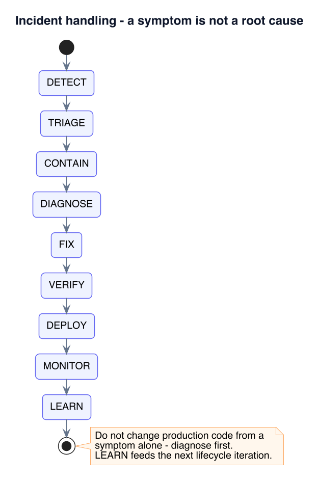
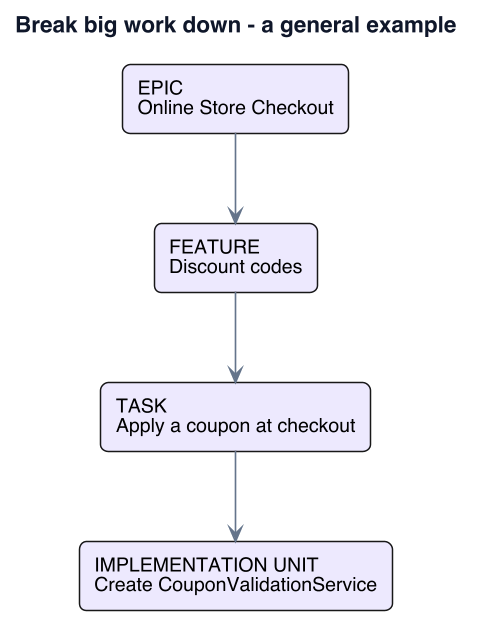
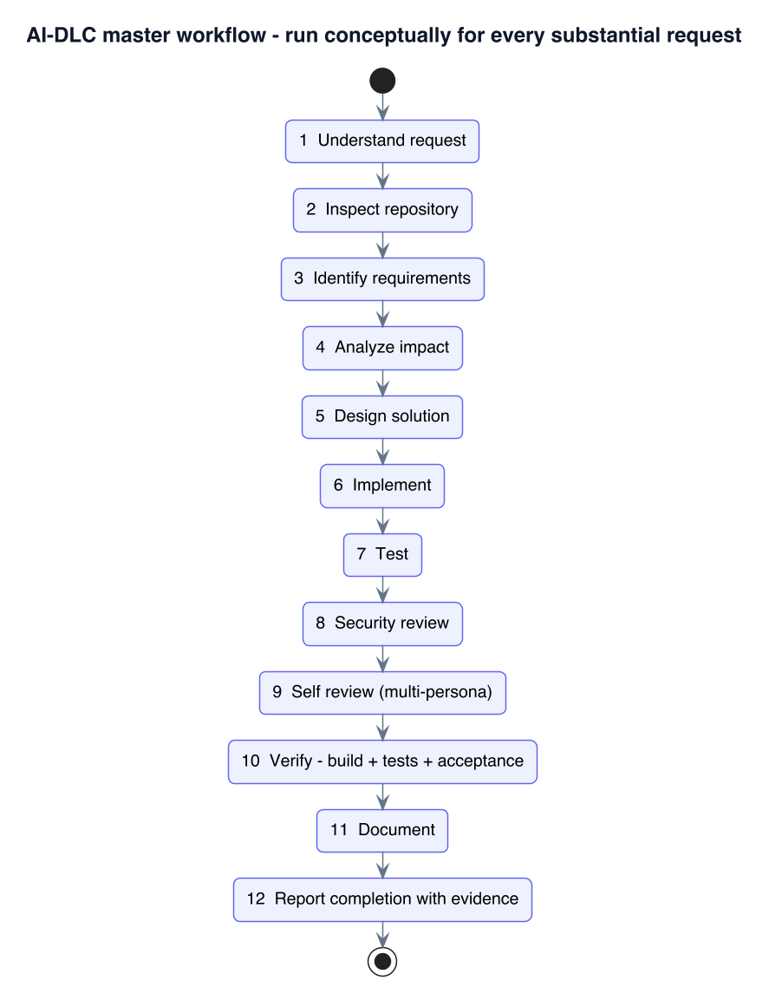

# NEW_AIDLC.md — The AI-Driven Development Lifecycle, explained from scratch

> **What this is.** A plain-language guide to **AI-DLC (the AI-Driven Development Lifecycle)** —
> the process this repository uses whenever an AI assistant (Claude) helps build software. It is
> written so that a **junior developer** *or* a **non-technical manager** can follow it.
>
> The full rule set is in [`cluade.md`](cluade.md) (the project's `CLAUDE.md`). This document is
> the readable companion: the same process, explained slowly, with **general examples** — an
> online-store checkout, a login screen, a contact form — not tied to any one codebase. It also
> **compares AI-DLC with the traditional SDLC** so you can see exactly what changes and what does
> not.
>
> All pictures are stored as light-background images in [`images/`](images/) and shown inline —
> there is no diagram source code in this file, only the rendered picture and a short remark.

---

## Table of Contents

1. [Who should read this, and why](#1-who-should-read-this-and-why)
2. [The one-minute version](#2-the-one-minute-version)
3. [SDLC vs AI-DLC — the comparison](#3-sdlc-vs-ai-dlc--the-comparison)
   - 3.1 [What "SDLC" means](#31-what-sdlc-means)
   - 3.2 [What AI-DLC changes](#32-what-ai-dlc-changes)
   - 3.3 [Side-by-side table](#33-side-by-side-table)
   - 3.4 [A manager's view: speed, cost, risk](#34-a-managers-view-speed-cost-risk)
   - 3.5 [What stays exactly the same](#35-what-stays-exactly-the-same)
   - 3.6 [Does AI-DLC replace Agile / Scrum?](#36-does-ai-dlc-replace-agile--scrum)
4. [The AI-DLC lifecycle at a glance](#4-the-ai-dlc-lifecycle-at-a-glance)
5. [The four questions that never close](#5-the-four-questions-that-never-close)
6. [Core principles](#6-core-principles)
7. [Who owns what — human vs AI](#7-who-owns-what--human-vs-ai)
8. [Risk classification — how much process is enough](#8-risk-classification--how-much-process-is-enough)
9. [Phase 0 — Foundation](#9-phase-0--foundation)
10. [Phase 1 — Discovery & requirements](#10-phase-1--discovery--requirements)
11. [Phase 2 — Architecture & decision records](#11-phase-2--architecture--decision-records)
12. [Phase 3 — Technical design: data, concurrency, idempotency](#12-phase-3--technical-design-data-concurrency-idempotency)
13. [Phase 4 — Implementation](#13-phase-4--implementation)
14. [Phase 5 — Testing](#14-phase-5--testing)
15. [Phase 6 — Security review](#15-phase-6--security-review)
16. [Phase 7 — Hardening](#16-phase-7--hardening)
17. [Phase 8 — Deployment readiness & CI/CD](#17-phase-8--deployment-readiness--cicd)
18. [Phase 9 — Operations & incidents](#18-phase-9--operations--incidents)
19. [Phase 10 — Evolution](#19-phase-10--evolution)
20. [Breaking big work down + the build loop](#20-breaking-big-work-down--the-build-loop)
21. [Definition of Done](#21-definition-of-done)
22. [Requirement traceability](#22-requirement-traceability)
23. [Worked example — "apply a coupon at checkout", end to end](#23-worked-example--apply-a-coupon-at-checkout-end-to-end)
24. [FAQ for developers and managers](#24-faq-for-developers-and-managers)
25. [Glossary](#25-glossary)
26. [References](#26-references)

---

## 1. Who should read this, and why

| You are… | What you'll get from this document |
| --- | --- |
| **A junior developer** | A checklist you can actually follow: what to do before you write code, what "done" really means, and why tests and security are part of the task, not extra. |
| **A senior developer / tech lead** | A shared vocabulary for reviewing AI-assisted work and for deciding how much rigour a given change needs. |
| **An engineering manager** | A way to reason about **speed, cost and risk** when your team uses AI to write code — and where a human must still sign off. |
| **A product manager** | Where requirements and acceptance criteria fit, and why vague requests slow everything down. |

The core idea in one sentence:

> **Writing code is the easy part now. AI-DLC is the discipline that makes AI-written code
> actually safe to ship.**

---

## 2. The one-minute version

Traditional software delivery (SDLC) is often drawn as a line: gather requirements → design →
build → test → release → maintain. You walk that line once, and changing your mind late is
painful.

**AI-DLC keeps all the same activities but turns the line into a fast, repeating loop**, run for
*every individual change*, with two rules bolted on:

1. **Every phase must leave behind evidence** — a requirement list, a design note, a passing test
   run, a security checklist. No evidence, no progress.
2. **"It compiles" is never "it's done."** Done means requirements met, tests passing, security
   reviewed, errors handled, docs updated, acceptance criteria checked, no known critical bug.

The AI (Claude) does the heavy lifting — analysis, design drafts, code, tests, documentation. A
**human keeps authority** over business intent, big architecture calls, risk acceptance and
anything that touches production.

---

## 3. SDLC vs AI-DLC — the comparison

### 3.1 What "SDLC" means

**SDLC = Software Development Life Cycle**: the sequence of stages a piece of software goes
through from idea to retirement. The classic stages are:

```
Requirements  →  Design  →  Implementation  →  Testing  →  Deployment  →  Maintenance
```


*Remark: this "waterfall" drawing is the textbook SDLC. Real teams use variations — **iterative**,
**spiral**, **V-model**, and especially **Agile / Scrum** (many short cycles instead of one long
one) — but the stages inside each cycle are the same six.*

> **Note.** SDLC is not one method; it is the *map of stages*. Waterfall, Agile and DevOps are
> different *ways of moving through* that map. AI-DLC is another such way — tuned for a human and
> an AI working together on one change at a time.

### 3.2 What AI-DLC changes


*Remark: the phase names barely change. The **rhythm** changes: AI-DLC runs the whole loop for a
single small change, in minutes-to-hours, and the last step (Evolve) explicitly feeds the next
first step (Discover).*

Three concrete shifts:

1. **The loop is per-change, not per-project.** You don't "do the design phase" once. You do a
   little design every time you touch the system.
2. **The AI compresses the slow middle.** "Implement → compile → run tests → read the failure →
   fix" used to take a developer hours or days between feedback. With an AI in the loop it is a
   tight cycle measured in minutes, so more of the effort moves to *deciding what is right* and
   *proving it works*.
3. **Evidence and "definition of done" are enforced every loop**, not saved for a release
   checklist that gets skipped under deadline pressure.

### 3.3 Side-by-side table


*Remark: read this top-to-bottom once. The pattern: AI-DLC makes each unit of work **smaller**,
each feedback loop **faster**, and the finish line **evidence-based**.*

The same content as text:

| Aspect | SDLC (traditional) | AI-DLC |
| --- | --- | --- |
| **Overall shape** | Straight line, walked once | Loop, repeated for every change |
| **Unit of delivery** | A whole release or project | One small change, fully finished |
| **Main author of code** | A team of people | An AI (Claude), directed by a human |
| **Requirements** | Big document up front, often frozen | Elaborated per change; testable; traceable |
| **Design** | One large phase, then stop | Just-enough design each pass; decision records for the big calls |
| **Coding feedback** | Weeks before anyone runs it | Implement → compile → test loop in minutes |
| **Testing** | A phase near the end | Written *with* the code; a gate for "done" |
| **Security** | Often a late, separate audit | Reviewed on every change, from five viewpoints |
| **Documentation** | End of project (if at all) | Updated as part of "done" |
| **Speed of feedback** | Slow (days to weeks) | Fast (every loop) |
| **Cost of a late change** | Very high — ripples through frozen design | Low — the change was small and isolated |
| **Process weight** | One size for everything | Scales with risk: NORMAL / SIGNIFICANT / CRITICAL |
| **"Done" means** | "The code was delivered" | Evidence: build + tests + acceptance criteria + review |

### 3.4 A manager's view: speed, cost, risk

- **Speed.** More changes reach "done" per week, because the slow part (a developer waiting on a
  build, then context-switching) shrinks. But *typing speed was never the bottleneck* —
  understanding and verifying were. AI-DLC deliberately keeps that human effort.
- **Cost of change.** In waterfall SDLC, the cost of fixing a mistake grows sharply the later you
  find it (a classic finding in software-engineering literature). AI-DLC keeps every change tiny,
  so "late" is only a few hours away and the blast radius is small.
- **Risk.** AI can produce confident, plausible, **wrong** code fast. AI-DLC answers this with a
  fixed rule — *no "done" without evidence* — and a **risk tier** ([§8](#8-risk-classification--how-much-process-is-enough))
  that forces more review, more tests and an explicit human sign-off on the dangerous changes
  (payments, passwords, personal data, production databases).
- **Accountability.** A human still owns the outcome. The AI proposes; a person approves business
  rules, architecture and anything touching production.

> **Example — the same feature request, two lifecycles.**
> *Request: "add a coupon field to checkout."*
> **Traditional SDLC:** it goes into the next release's requirements doc; design happens in a
> sprint; build in the next; a bug ("coupon can be used twice at the same instant") is found in
> UAT weeks later and forces a design change.
> **AI-DLC:** it is one change. Discovery immediately asks *"used at most how many times, and per
> customer or globally?"*; Phase 3 names the race condition and makes the check-and-record one
> atomic step; a concurrency test proves it; the change ships the same day with evidence
> attached.

### 3.5 What stays exactly the same

AI-DLC is **not** a shortcut. These SDLC fundamentals are unchanged — if anything they are
enforced harder:

- Requirements must be clear, testable and agreed.
- Design decisions with long-term consequences are written down.
- Code is reviewed before it ships.
- Testing is mandatory; failing tests block release.
- Security and data protection are non-negotiable.
- Humans — not tools — decide business rules and accept risk.

### 3.6 Does AI-DLC replace Agile / Scrum?

**No.** Agile/Scrum organises *a team's flow of work* — backlogs, sprints, standups, demos.
AI-DLC governs *how one change is executed well* by a developer working with an AI. They stack:
your team can run Scrum, and each story a developer picks up is delivered by walking the AI-DLC
loop. The backlog item is still written by people; the sprint review still happens; the AI-DLC
loop is just what "working on the story" looks like now.

---

## 4. The AI-DLC lifecycle at a glance


*Remark: the spine of AI-DLC. It looks linear, but **OPERATIONS → OBSERVATION → EVOLUTION** feeds
straight back into **DISCOVERY** for the next change. It is a cycle, not a one-way trip.*

| Phase | What it produces (the "evidence") |
| --- | --- |
| **Idea** | a request, in the requester's own words |
| **Discovery** | goal, users, inputs, outputs, rules, failure cases, dependencies, constraints |
| **Requirements** | numbered, testable requirements + acceptance criteria |
| **Architecture** | the shape: components, data flow, failure flow, concurrency plan, decision records |
| **Design** | the parts list: classes, screens, tables, fields, jobs, error types |
| **Implementation** | the smallest change that fully works — with validation, error handling, logging, tests |
| **Testing** | unit / integration / concurrency / failure tests that **pass** |
| **Security review** | findings from five viewpoints, each fixed or formally accepted |
| **Hardening** | timeouts, capped retries, limits, cleanup, graceful shutdown, config checks |
| **Deployment readiness** | a checklist satisfied + a rollback plan |
| **Operations** | logs, metrics, health checks, a runbook |
| **Observation** | real errors, latency, throughput, resource use |
| **Evolution** | lessons captured, docs updated, technical debt recorded |

---

## 5. The four questions that never close

At every phase, the same four questions stay open:

1. **What** are we trying to achieve?
2. **Why** are we doing it?
3. **How** will we prove that it works?
4. **What could go wrong?**

> **Note.** Question 4 is the one people skip. "What could go wrong?" for a coupon field:
> expired codes, codes that don't exist, a code used past its limit, two shoppers redeeming the
> last use at the same millisecond, a negative total if the discount exceeds the cart,
> case-sensitivity (`save20` vs `SAVE20`), and someone scripting thousands of guesses to find
> valid codes. Each of those becomes a requirement or a test.

---

## 6. Core principles

### 6.1 Understand before implementing

Do not start typing code the moment a request arrives. First establish the goal, the functional
and non-functional needs, the existing system, the parts affected, and the security /
performance / operational impact.

> **Example.** "Add a *Contact us* form" sounds like an afternoon. Understanding first surfaces:
> spam protection, an email-sending dependency (what if it's down?), storing messages (personal
> data — retention? access?), input limits (a 10 MB message body?), and accessibility.

### 6.2 The existing system is the source of truth

Before changing anything, read how the project already does things — its language and framework
**version**, its patterns, its configuration style, its tests. Match them. Do not introduce a
"better" pattern just because it is fashionable.

### 6.3 Prefer the smallest correct change

The least amount of change that *completely* satisfies the requirement. No unrelated refactors,
no speculative "we might need it later" abstractions, no dead code.

### 6.4 Production quality by default

Never intentionally ship placeholder logic, disabled security, empty error handlers, unlimited
retries, unbounded loops over data, or secrets in the code. If something temporary is truly
unavoidable, label it loudly:

```
TODO:
Reason:
Required follow-up:
Risk:
```

> **Example.** If the real payment gateway isn't wired yet, you do **not** silently `return true`
> from `chargeCard()`. You implement everything up to the gateway call, make the gateway call
> throw a clear "not implemented" error, default the app to a safe *mock* mode, and write the
> TODO block above so nobody mistakes it for finished.

---

## 7. Who owns what — human vs AI

![Two columns. HUMAN owns: business intent, final requirements approval, major architecture decisions, risk acceptance, production authorization, regulatory and security exceptions, destructive production operations. AI (CLAUDE) owns: requirement elaboration, repository analysis, architecture and technical design, implementation, test generation and validation, security analysis, documentation, impact analysis and risk identification. Every uncertainty must be labelled ASSUMPTION, QUESTION, RISK or RECOMMENDATION](images/aidlc-roles.png)

*Remark: the split is about **authority**, not effort. The AI can draft the whole architecture;
a human **decides** it. The AI can find a security hole; a human **accepts or rejects** the
leftover risk. The AI never runs a destructive production command on its own.*

> **Note.** The AI must never hide uncertainty. Anything it isn't sure of is tagged in its reply:
> *"ASSUMPTION: coupons are case-insensitive — confirm before I build the lookup."*

---

## 8. Risk classification — how much process is enough

Classify the change **before** building it. The tier decides how much validation is required, so
that a copy-text tweak doesn't get a security review and a payment change doesn't skip one.


*Remark: match the ceremony to the risk. Most feature work is **SIGNIFICANT**. Anything touching
money, passwords, personal data or a production database is **CRITICAL** and needs an explicit
human sign-off.*

| Tier | Everyday examples | What's expected |
| --- | --- | --- |
| **NORMAL** | reword a button, add a read-only report, rename an internal variable | brief analysis, existing tests still pass |
| **SIGNIFICANT** | add the coupon feature, change a database table, call a new third-party API | design note + unit tests + integration/concurrency tests |
| **CRITICAL** | change how login works, take a payment, migrate a production database, handle personal data | decision record + security review + failure tests + a human signs off |

---

## 9. Phase 0 — Foundation

**In plain terms:** look around before you touch anything. You can't build the right thing if you
don't know the language version, the framework, where it runs, and how it's tested.


*Remark: the output is a short fact sheet — language, framework and **version**, build tool,
database, test framework, how it deploys, how it's monitored — that every later phase reads
instead of guessing.*

> **Example.** Before adding the coupon feature you learn: it's a React front end talking to a
> Java Spring Boot API, PostgreSQL database, tests in JUnit, deployed via a GitHub Actions
> pipeline to a container platform. Now you know coupon validation belongs in the API (not the
> browser, where anyone could bypass it), and the redemption record is a new PostgreSQL table.

> **Note.** Getting the **framework version** wrong is the classic AI mistake — it will happily
> write code for last year's API. Always check the dependency file, never rely on memory.

---

## 10. Phase 1 — Discovery & requirements

**In plain terms:** a request like *"add coupons"* is a wish, not a spec. This phase asks the
boring questions until the wish becomes a list of statements you can test.


*Remark: two outputs — numbered requirements, and Given/When/Then acceptance criteria — are what
Phase 5 tests against and Phase 10 verifies.*

### Discovery questions

**Goal** (why?), **users** (who?), **input** (what comes in?), **output** (what should happen?),
**rules** (the business logic), **failure cases** (what can go wrong?), **dependencies** (what
else must work?), **constraints** (performance, security, compliance, cost, backward
compatibility).

### Requirements — specific, testable, traceable, unambiguous

Vague ("the site should be fast") is banned. Tie every requirement to something measurable and
give it an ID.

```
REQ-010  A customer can enter one coupon code per order at checkout.
REQ-011  A coupon code lookup is case-insensitive.
REQ-012  An expired or unknown code is rejected with a clear message.
REQ-013  A coupon has a maximum total number of redemptions; once reached, it is rejected.
REQ-014  A coupon may be redeemed at most once per customer.
REQ-015  The discount can never make the order total negative.
REQ-016  Repeated invalid attempts from one client are rate-limited (anti-guessing).
```

### Acceptance criteria — Given / When / Then

```
AC-01
  Given a valid, unexpired coupon "SAVE20" the customer has never used
  When the customer applies it to a $100 cart
  Then the order total becomes $80
  And a redemption record is created for that customer and coupon.

AC-02
  Given a coupon that has reached its maximum redemptions
  When any customer applies it
  Then it is rejected with "This code is no longer available"
  And no redemption record is created.

AC-03
  Given two customers apply the last available redemption of a coupon at the same time
  When both requests are processed
  Then exactly one succeeds and one is rejected.
```

> **Note.** AC-03 is the one a junior developer forgets and a senior developer always adds. It is
> also the reason Phase 3 exists.

---

## 11. Phase 2 — Architecture & decision records

**In plain terms:** decide the *shape* — what the big pieces are, how data flows between them,
what happens when a piece fails, and how many things run at once. Write down every choice that
would be expensive to reverse.


*Remark: a decision record (ADR) is short — Context, Options, Decision, Reason, Consequences —
but it stops the next person re-opening a settled question.*

> **Example — architecture for the coupon feature.**
> The browser sends the code to the **checkout API** (never validated in the browser — that's
> bypassable). The API asks a **CouponService** to validate and reserve a redemption in
> **one database transaction**. A **redemptions table** with a unique constraint on
> *(coupon_id, customer_id)* enforces "once per customer" at the database level, not just in code.
>
> **Decision record worth writing:** *"Enforce per-customer uniqueness with a database unique
> constraint, not an application check."* Reason: two simultaneous requests can both pass an
> application `if-not-exists` check; only the database can reliably reject the second insert.
> Consequence: the code must handle the "duplicate key" error and turn it into a friendly
> "already used" message.

---

## 12. Phase 3 — Technical design: data, concurrency, idempotency

**In plain terms:** turn the shape into a parts list. Name the tables, the fields, the classes,
the error types. Decide exactly how two requests avoid stepping on each other, and how a step
that runs twice does no harm.


*Remark: the two questions that matter most here — "what stops a duplicate?" and "what happens if
this runs twice?" — are answered on paper before any code is written.*

### Data design

```
COUPON              REDEMPTION
  id                  id
  code (unique)       coupon_id  -> COUPON.id
  discount_percent    customer_id
  starts_at           redeemed_at
  expires_at          order_id
  max_redemptions     UNIQUE (coupon_id, customer_id)
  redeemed_count
```

Define primary keys, foreign keys, **unique constraints**, indexes, nullability, and audit
fields (`created_at`, `updated_at`) up front — don't rely on application code alone for
uniqueness when the database can guarantee it.

### Concurrency design

The dangerous line, banned as the *only* guard:

```
if (redemptions_so_far < max_redemptions) {   // two requests both read the same number
    insert_redemption();                       // ...and both insert
}
```

Safe approaches: a single conditional `UPDATE` (`UPDATE coupon SET redeemed_count =
redeemed_count + 1 WHERE id = ? AND redeemed_count < max_redemptions` — check the row count), a
database unique constraint, row locking, or an atomic compare-and-set. Pick one and write it
down.

### Idempotency

If the customer double-clicks "Apply", or the network retries the request, the result must be
the same as clicking once — one redemption, not two. Keying the redemption on
*(coupon_id, customer_id, order_id)* makes a repeat harmless.

> **Note.** Concurrency and idempotency are not "advanced topics" to bolt on later. They are a
> *design decision* made here, in Phase 3, and then *proven* by a test in Phase 5.

---

## 13. Phase 4 — Implementation

**In plain terms:** now write the code — but only the code the requirement needs, in the style
the project already uses, with the input checks, the error handling, the logging and the tests
all in the *same* change. Then read your own diff before calling it done.


*Remark: "implementation" is not just the feature code. Validation, error handling, logging and
tests ship in the same change — not in a follow-up that never comes.*

Quick standards:

- **Names say what they do.** `applyCoupon(cart, code)` — not `doIt(x, y)`.
- **Never swallow errors.**
  ```
  try { redeem(code); } catch (Exception e) { }   // forbidden
  ```
  Instead: log context, keep the original error, decide if a retry makes sense, show the user a
  safe message, and never leak internals.
- **Define real error types** — `CouponNotFoundError`, `CouponExpiredError`,
  `CouponLimitReachedError`, `CouponAlreadyUsedError` — so callers (and messages) can be precise.
- **Log usefully, never secretly.** `coupon=SAVE20 customer=12345 result=REJECTED reason=EXPIRED`
  — never log passwords, tokens, card numbers or full personal records.
- **Config, not hard-coding.** Rate-limit thresholds, feature flags, third-party URLs and keys
  live in configuration or a secret store, never in the source.

---

## 14. Phase 5 — Testing

**In plain terms:** "it worked when I tried it" is not evidence. Write tests a machine runs and
that fail loudly when the behaviour breaks — lots of small ones, a few big ones, and some that
deliberately break things.


*Remark: the green run **is** the evidence. "Tests pass" is only a real claim when a command was
run and its output was read.*

| Test level | Covers | Coupon example |
| --- | --- | --- |
| **Unit** | one rule at a time: happy path, edges, invalid input, errors | expired code rejected; `save20` matches `SAVE20`; discount capped so total ≥ 0 |
| **Integration** | pieces together: API + database | POST the code to the checkout endpoint, assert the total and the redemption row |
| **Concurrency** | two requests at once | two customers redeem the last use simultaneously → exactly one succeeds (AC-03) |
| **Failure** | dependencies misbehave | database unavailable → the customer sees "try again", no partial redemption is left behind |

> **Note — when a test fails, do not delete it.** Read the failure → find the root cause → decide
> whether the *code* or the *test* is wrong → fix the real problem → re-run. A test is only
> changed when its expectation is genuinely outdated because the intended behaviour changed.

---

## 15. Phase 6 — Security review

**In plain terms:** before you call it ready, stop being the author and become the attacker —
then the operations person, then the data-protection officer. Ask how each of them would break
it or be hurt by it.


*Remark: the same change, read five ways. A finding from any viewpoint blocks "production-ready"
until a human accepts the leftover risk.*

**Always consider:** SQL injection, cross-site scripting (XSS), cross-site request forgery
(CSRF), broken access control, authentication bypass, exposure of sensitive data, resource
exhaustion, leaked secrets, and vulnerable dependencies.

> **Example — coupon feature, read as an attacker:**
> - **Guessing** → someone scripts 100,000 code attempts to find valid ones ⇒ rate-limit and
>   log repeated failures (REQ-016).
> - **Bypass** → the discount is calculated in the browser and the API trusts it ⇒ never; the
>   API recomputes the total.
> - **Injection** → the code string goes straight into a SQL query ⇒ use parameterised queries.
> - **Money bug** → a 90%-off code on a $5 cart with a $10 shipping credit yields a negative
>   charge ⇒ clamp the total at zero (REQ-015).
> - **Privacy** → the rejection message says "customer 12345 already redeemed this" to the wrong
>   person ⇒ generic message, details only in server logs.

---

## 16. Phase 7 — Hardening

**In plain terms:** the feature works when everything is fine. This phase makes it behave when
things are *not* fine — a slow database, a dependency that times out, a flood of traffic, someone
pulling the plug mid-request.


*Remark: every retry has a ceiling, every resource has a limit, and shutdown leaves nothing
half-done. "It hangs forever" and "it retries forever" are both hardening failures.*

- **Timeouts** on every call that leaves the process (database, third-party API).
- **Retries** with increasing delays **and a maximum** — then stop and report, never loop
  forever. Don't retry errors that can't succeed (a 404 won't become a 200).
  ```
  Attempt 1 → now      Attempt 3 → +5s
  Attempt 2 → +2s      Attempt 4 → +15s   … then give up and record the failure
  ```
- **Limits** — max concurrent workers, max queue size, max upload size, max rows per query.
- **Graceful shutdown** — stop taking new work, let in-flight work finish, save state, close
  resources, leave no record stuck in an "in progress" state.
- **Config validation at startup** — fail fast with a clear message if a required setting or
  secret is missing, rather than at 3 a.m. on the first real request.

---

## 17. Phase 8 — Deployment readiness & CI/CD

**In plain terms:** can this actually ship, and can you undo it if it goes wrong? Run a short
checklist, let a pipeline re-prove everything, and write the rollback plan before you deploy.


*Remark: the security scan and acceptance tests are pipeline **gates**, not afterthoughts.
Production sits behind a manual approval and a written rollback path.*

**Readiness checklist:**

```
[ ] Builds cleanly              [ ] Security review done
[ ] Unit tests pass             [ ] Logging in place
[ ] Integration tests pass      [ ] Health check endpoint exists
[ ] Config validated            [ ] Monitoring/alerts considered
[ ] Secrets outside the code    [ ] Rollback plan written
[ ] DB changes reviewed         [ ] Breaking changes documented
```

**Rollback questions:** can we redeploy the previous version? Is the database change reversible?
Will the old code still work with the new data if we roll back? Is any manual recovery needed?

> **Example.** The coupon feature adds a `redemption` table. That's a *forward-compatible* change
> (old code ignores the new table), so rollback is just redeploying the old build — safe. A
> change that *renames* an existing column would not be, and would need a two-step migration.

---

## 18. Phase 9 — Operations & incidents

**In plain terms:** shipping is not the end. Watch the running system, and when something breaks,
stop the bleeding first, then find the *real* cause — not just the thing you noticed.




*Remark: **CONTAIN before DIAGNOSE** — stop the harm, *then* investigate. Never patch production
straight from a symptom.*

**Root-cause analysis** separates three things people often blur:

- **Symptom** — "checkout is throwing errors."
- **Cause** — "the coupon service is timing out."
- **Root cause** — "a missing database index made the redemption lookup slow under load."

> **Example.** *Symptom:* customers report "coupon won't apply" spiking at 8 p.m. *Contain:*
> temporarily disable the coupon field via a feature flag. *Diagnose:* the redemption query does
> a full table scan. *Root cause:* no index on `redemption(coupon_id, customer_id)`. *Fix:* add
> the index. *Prevention:* add a slow-query alert and a load test to the pipeline.

---

## 19. Phase 10 — Evolution

**In plain terms:** after a big piece of work, spend ten minutes on "what did we learn?" — write
it down, record any shortcuts taken as *named* debt, update the docs, and let that feed the next
round of Discovery.


*Remark: this is the arrow that closes the loop back to Phase 1. Debt that is named and
prioritised gets fixed; debt that is invisible just grows.*

Record each shortcut in a fixed shape so it can't hide:

```
TECH-DEBT-ID:  Description:  Reason:  Impact:  Risk:  Recommended fix:  Priority:
```

> **Example.** *"The coupon admin screen still lets an admin set `max_redemptions` to 0, which
> makes a coupon that can never be used. We validate on save in the API but not in the UI.
> Impact: confusing admin experience. Risk: low. Fix: add UI validation. Priority: low."*

---

## 20. Breaking big work down + the build loop

### Break big work into small, finishable units



*Remark: `EPIC → FEATURE → TASK → IMPLEMENTATION UNIT`. The AI builds one implementation unit at
a time, each with its own tests and its own "done" — never a whole subsystem in one shot.*

### The master workflow (run in your head for every real request)



*Remark: steps 1–5 are thinking, 7–10 are proving. Writing the code (step 6) is a thin slice in
the middle — and never where the work stops.*

### The build loop (inside every implementation unit)


*Remark: the loop exits only when the build passes, the tests pass, the acceptance criteria pass,
and no known serious bug remains. Each turn of the loop starts by **reading the actual failure**,
not guessing.*

---

## 21. Definition of Done


*Remark: a task is DONE only when every **applicable** box is ticked. "Applicable" scales with
risk — a NORMAL change may skip concurrency review; a CRITICAL one may not.*

At the end of a real piece of work, the AI reports a short summary:

```
IMPLEMENTED   - what changed, in one or two lines
FILES CHANGED - the list
TESTING       - what tests were added / run, and the result
SECURITY      - what was checked, what was found
RISKS / TODO  - anything left, labelled
VERIFICATION  - Build: PASS/FAIL   Tests: PASS/FAIL   Acceptance: PASS/FAIL
```

> **Note.** "PASS" is only written when a command was actually run and its output was read. No
> guessing, no optimism.

---

## 22. Requirement traceability


*Remark: every requirement traces forward to code **and** to a test, and the test's result is the
evidence. A requirement with no test — or no implementation — is a hole in the work.*

| Requirement | Implemented by | Verified by | Status |
| --- | --- | --- | --- |
| REQ-011 case-insensitive lookup | `CouponLookup.normalise()` | `CouponLookupTest` | PASS |
| REQ-013 max total redemptions | `CouponService.reserve()` (conditional UPDATE) | `CouponServiceTest`, `CheckoutIntegrationTest` | PASS |
| REQ-014 once per customer | `redemption` unique constraint + `CouponRedemptionService` | `CouponRedemptionServiceTest` | PASS |
| REQ-015 total never negative | `Cart.applyDiscount()` clamp | `CartDiscountTest` | PASS |
| REQ-016 rate-limit guessing | `CouponRateLimiter` | `CouponRateLimiterTest` | PASS |

---

## 23. Worked example — "apply a coupon at checkout", end to end

Putting the whole lifecycle together on one small, familiar feature.

![Worked example, "apply a coupon at checkout", one request end to end: the customer enters code SAVE20; check the code exists; check it has not expired; check the global usage limit is not reached; check this customer has not used it before; if all checks pass, apply the discount to the cart, record the redemption for customer plus code, and show the new total; otherwise show a clear reason such as expired or already used. A note explains the usage-limit check and the redemption record must be one atomic step, or two shoppers clicking at the same instant both succeed and the coupon is over-used, and that this decision belongs in Phase 3](images/g-coupon-flow.png)

*Remark: five validation checks, then either apply-and-record or explain-why. The note is the
whole point of Phase 3: the "check the limit" and "record the redemption" steps must be **one
atomic operation**.*

| Phase | On this feature |
| --- | --- |
| **0 Foundation** | React front end, Spring Boot API, PostgreSQL, JUnit, GitHub Actions → coupon logic lives in the API |
| **1 Discovery** | REQ-010…016 above; acceptance criteria AC-01…03 (including the simultaneous-redemption case) |
| **2 Architecture** | browser → checkout API → `CouponService` (one transaction); `redemption` table with a unique constraint; decision record: "enforce uniqueness in the database, not the app" |
| **3 Design** | `COUPON` / `REDEMPTION` tables; conditional `UPDATE` for the global limit; key redemptions on *(coupon, customer, order)* for idempotency |
| **4 Implementation** | `applyCoupon(cart, code)`; typed errors; log `coupon/customer/result/reason`; rate-limit config, not hard-coded |
| **5 Testing** | unit (expiry, casing, negative-total clamp); integration (endpoint + DB); concurrency (AC-03); failure (DB down) — all green |
| **6 Security** | anti-guessing rate limit; server recomputes the total; parameterised SQL; generic user-facing messages |
| **7 Hardening** | DB call timeout; startup check that the coupon config table is reachable; double-click is idempotent |
| **8 Deployment** | forward-compatible migration (new table only) → rollback = redeploy previous build; behind a feature flag for the first release |
| **9 Operations** | dashboard: redemptions/hour, rejection reasons; alert on a spike in "limit reached" rejections |
| **10 Evolution** | logged debt: "admin UI lets `max_redemptions = 0`"; note: add a load test for the redemption query to the pipeline |

---

## 24. FAQ for developers and managers

**Q: Isn't this a lot of process for a small change?**
It scales down. A NORMAL change (reword a label) is a sentence of analysis, the edit, and the
existing tests. The full ceremony is for SIGNIFICANT and CRITICAL work.

**Q: The AI writes code in seconds. Why do the slow parts?**
Because typing was never the slow part — *deciding what's correct* and *proving it* were. AI-DLC
speeds up typing and keeps the thinking and the proving, which is where bugs and outages come
from.

**Q: Who is accountable if AI-written code causes an incident?**
The same people as always: the developer who submitted it and the reviewer who approved it. The
AI is a tool. Authority over business rules, architecture and production stays with humans
([§7](#7-who-owns-what--human-vs-ai)).

**Q: Does this replace our Scrum process?**
No. Scrum organises the team's backlog and cadence. AI-DLC is how one story gets built well.
They run together ([§3.6](#36-does-ai-dlc-replace-agile--scrum)).

**Q: What's the single most important rule?**
"It compiles" is not "it's done." Nothing is done without evidence: passing tests, a security
pass, and the acceptance criteria checked.

**Q: How do we adopt this gradually?**
Start with three habits: (1) write acceptance criteria before building, (2) require a green test
run before "done", (3) tag every change NORMAL / SIGNIFICANT / CRITICAL and review accordingly.

---

## 25. Glossary

| Term | Meaning |
| --- | --- |
| **SDLC** | Software Development Life Cycle — the stages software goes through from idea to retirement (requirements, design, build, test, deploy, maintain). |
| **AI-DLC** | The AI-Driven Development Lifecycle — running the SDLC stages as a fast, evidence-gated loop for each change, with an AI doing the build work under human direction. |
| **Acceptance criteria** | Concrete Given/When/Then statements that define when a requirement is satisfied; they become tests. |
| **ADR / decision record** | A short written record of an architecture choice: context, options, decision, reason, consequences. |
| **NFR** | Non-functional requirement — how well the system must behave (speed, security, reliability), as opposed to *what* it does. |
| **Idempotency** | A repeated operation has the same effect as doing it once (a double-clicked "Apply" redeems a coupon once, not twice). |
| **Concurrency** | More than one thing happening at the same time; the source of "it worked in testing but broke under load" bugs. |
| **Race condition** | A bug where the outcome depends on the exact timing of concurrent operations (two shoppers redeem the last coupon use at once). |
| **CI/CD** | Continuous Integration / Continuous Delivery — an automated pipeline that builds, tests, scans and deploys every change. |
| **Rollback** | Returning a deployed system to its previous working state. |
| **Root cause** | The underlying reason for an incident, as opposed to the visible symptom or the immediate cause. |
| **Technical debt** | A deliberate shortcut that will cost more to live with later; recorded so it stays visible. |

---

## 26. References

### Process & lifecycle

- SDLC overview — <https://en.wikipedia.org/wiki/Systems_development_life_cycle>.
- Waterfall model — Winston W. Royce, *"Managing the Development of Large Software Systems"* (1970).
- The Agile Manifesto — <https://agilemanifesto.org/>.
- The Scrum Guide — <https://scrumguides.org/>.
- Cost of fixing defects by phase — Barry Boehm, *Software Engineering Economics* (1981);
  see also the NIST report *"The Economic Impacts of Inadequate Infrastructure for Software
  Testing"* (2002).
- DORA / *Accelerate* — Forsgren, Humble, Kim, *Accelerate: The Science of Lean Software and
  DevOps* (2018); <https://dora.dev/>.

### Requirements, design & testing

- Given/When/Then — <https://martinfowler.com/bliki/GivenWhenThen.html>.
- Architecture Decision Records — Michael Nygard, *"Documenting Architecture Decisions"* (2011);
  <https://adr.github.io/>.
- The practical test pyramid — <https://martinfowler.com/articles/practical-test-pyramid.html>.
- Idempotency & safe retries — AWS Builders' Library,
  *"Timeouts, retries, and backoff with jitter"*;
  <https://aws.amazon.com/builders-library/timeouts-retries-and-backoff-with-jitter/>.
- SOLID design principles — Robert C. Martin, *"Design Principles and Design Patterns"* (2000).

### Security

- OWASP Top 10 — <https://owasp.org/www-project-top-ten/>.
- OWASP Application Security Verification Standard (ASVS) —
  <https://owasp.org/www-project-application-security-verification-standard/>.
- OWASP Cheat Sheet Series — <https://cheatsheetseries.owasp.org/>.
- OWASP Top 10 for LLM Applications —
  <https://owasp.org/www-project-top-10-for-large-language-model-applications/>.

### Operations

- Google SRE Book — incident management and postmortem culture, chs. 14–15;
  <https://sre.google/sre-book/managing-incidents/>,
  <https://sre.google/sre-book/postmortem-culture/>.
- The Twelve-Factor App (config, disposability, dev/prod parity) — <https://12factor.net/>.
- Conventional Commits — <https://www.conventionalcommits.org/>.

### In this repository

- [`cluade.md`](cluade.md) — the full AI-DLC rule set (the project's `CLAUDE.md`).
- [`Ai-dlc.md`](Ai-dlc.md) — the same lifecycle explained against a real project in this repo.

### Diagrams

All images in this document live in [`images/`](images/) (`sdlc-*.png`, `g-*.png`, `aidlc-*.png`,
`phase*-*.png`), rendered on a light background. The coupon-checkout example is illustrative only
— no such code ships in this repository.

---

*This document is an on-ramp. Once the vocabulary is familiar, [`cluade.md`](cluade.md) is the
authoritative rule set; if the two ever disagree, `cluade.md` wins and this file should be
corrected.*
