# Coding Notes — Oracle Dump Importer (`com.demo.oracle_dump`)

> **Companion to [`architecture.md`](architecture.md).** That document explains the *system* —
> data flow, state machine, concurrency model, Windows deployment. This document explains the
> *code* — every package, every class/interface, every method, with a worked example and a
> "why it's built this way" note for each. Read `architecture.md` first for the big picture, then
> use this file as a map when you're actually editing a class.
>
> All diagrams here are pre-rendered **PNG images with a light background**, stored under
> [`images/`](oracle_dump/images/) (prefixed `cn-`), not inline diagram source — open them alongside the text.

---

## Table of contents

1. [How to read this document](#1-how-to-read-this-document)
2. [Package map](#2-package-map)
3. [`config` — client & property model](#3-config--client--property-model)
4. [`domain` — entity, repository, state machine](#4-domain--entity-repository-state-machine)
5. [`scanner` — discovery & file-stability detection](#5-scanner--discovery--file-stability-detection)
6. [`processing` — dispatch, workers, retry](#6-processing--dispatch-workers-retry)
7. [`importer` — the Strategy pattern](#7-importer--the-strategy-pattern)
8. [`staging` — future share-to-DIRECTORY bridge](#8-staging--future-share-to-directory-bridge)
9. [`oracle` — startup executable validation](#9-oracle--startup-executable-validation)
10. [`health` — Actuator indicators](#10-health--actuator-indicators)
11. [`api` — REST surface](#11-api--rest-surface)
12. [`io` — Windows-safe filesystem helpers](#12-io--windows-safe-filesystem-helpers)
13. [`lifecycle` — graceful start/stop](#13-lifecycle--graceful-startstop)
14. [`support` — generic in-call retry](#14-support--generic-in-call-retry)
15. [Application entry point](#15-application-entry-point)
16. [End-to-end code walkthrough (one dump file)](#16-end-to-end-code-walkthrough-one-dump-file)
17. [References](#17-references)

---

## 1. How to read this document

Each package section has:

- **One overview image** (`images/cn-NN-<package>.png`) — a class diagram of every class/interface
  in the package and how they relate. Rendered once with PlantUML/Graphviz on a white background;
  the source is not reproduced here on purpose (images are easier to scan than UML text, and this
  keeps the notes readable).
- **One subsection per class/interface**, each with:
  - **What it is** — one paragraph on its responsibility.
  - **Method-by-method notes** — signature, what it does, and an example or a "note" callout
    where the behaviour is non-obvious.

Conventions used throughout:

> **NOTE** callouts flag a decision that would otherwise surprise a reader — a constraint, a
> workaround, or a "don't do the obvious thing here" warning.

```text
Example code blocks are illustrative call-sites, not copy-pasted test code —
check src/test/java/com/demo/oracle_dump for the real, executable tests.
```

---

## 2. Package map

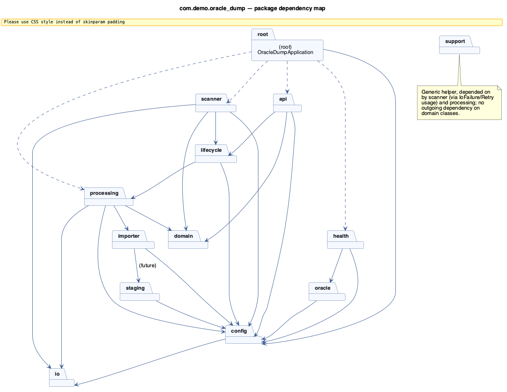
*Twelve packages plus the application root. Arrows are compile-time dependencies (solid) and the
one call that only exists as a `TODO` today (dashed, `importer → staging`). `domain` and `io` sit
at the bottom of the graph — almost everything depends on them, they depend on nothing in this
codebase.*

| Package | One-line role |
|---|---|
| [`config`](#3-config--client--property-model) | Typed configuration (`oracle-import.*`) and per-client runtime state |
| [`domain`](#4-domain--entity-repository-state-machine) | The one JPA entity, its repository, and the `DumpStatus` state machine |
| [`scanner`](#5-scanner--discovery--file-stability-detection) | Finds `.dmp` files and decides when a copy has finished |
| [`processing`](#6-processing--dispatch-workers-retry) | Claims work, drives one dump through checksumming + import, retries failures |
| [`importer`](#7-importer--the-strategy-pattern) | Pluggable "how do we actually import" strategy (mock today, `impdp` pending) |
| [`staging`](#8-staging--future-share-to-directory-bridge) | Interface-only seam for share → Oracle `DIRECTORY` staging |
| [`oracle`](#9-oracle--startup-executable-validation) | Validates `impdp.exe`/`imp.exe`/`sqlplus.exe` exist and are usable |
| [`health`](#10-health--actuator-indicators) | Actuator health for dump directories and the Oracle client |
| [`api`](#11-api--rest-surface) | `GET /api/status`, `GET /api/dumps`, `POST /api/dumps/{id}/retry` |
| [`io`](#12-io--windows-safe-filesystem-helpers) | UNC-aware path normalisation and Windows IO-error classification |
| [`lifecycle`](#13-lifecycle--graceful-startstop) | `SmartLifecycle` graceful drain on Windows Service stop |
| [`support`](#14-support--generic-in-call-retry) | Tiny fluent in-call retry helper (not the durable pipeline retry) |
| *(root)* | [`OracleDumpApplication`](#15-application-entry-point) — the Spring Boot entry point |

---

## 3. `config` — client & property model

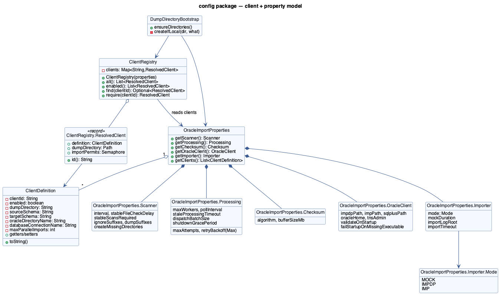
*`OracleImportProperties` is the root `@ConfigurationProperties` bean with five nested config
groups plus the client list; `ClientRegistry` turns that raw list into resolved, semaphore-backed
runtime objects at startup.*

### 3.1 `ClientDefinition`

**What it is.** A plain, mutable POJO — one row of the `oracle-import.clients` YAML list. Bean
validation annotations (`@NotBlank`, `@Min`) guard the fields Spring Boot binds into it.

> **NOTE — five independent fields, not one derived name.** `clientId`, `dumpDirectory`,
> `sourceSchema`, `targetSchema` and `oracleDirectoryName` are modelled as five separate strings on
> purpose (`CLAUDE.md` §27), even though in the simplest deployment they might all be
> `"client-a"`-ish. Don't be tempted to derive `oracleDirectoryName` from `clientId` — the whole
> point is that a client's on-disk folder name, its Oracle schema, and its Oracle `DIRECTORY`
> object name can differ.

Methods are all getters/setters plus:

| Method | Notes |
|---|---|
| `toString()` | Deliberately **omits** any field that could ever hold a secret. There are none today (credentials live outside this class, resolved later via `databaseConnectionName`), and it should stay that way — do not add a password field here. |

### 3.2 `ClientRegistry`

**What it is.** Resolves the raw `List<ClientDefinition>` **once**, at construction time, into a
`Map<String, ResolvedClient>`. This is where "config" becomes "runtime state": each client gets a
normalised absolute `Path` and its own fair `Semaphore`.

```java
public ClientRegistry(OracleImportProperties properties) {
    for (ClientDefinition def : properties.getClients()) {
        String id = def.getClientId();
        if (clients.containsKey(id)) {
            throw new IllegalStateException("Duplicate oracle-import client-id: " + id);
        }
        Path dir = WindowsPaths.toNormalizedPath(def.getDumpDirectory());
        clients.put(id, new ResolvedClient(def, dir, new Semaphore(def.getMaxParallelImports(), true)));
        ...
    }
}
```

| Method | Purpose | Note |
|---|---|---|
| `ClientRegistry(OracleImportProperties)` | Constructor-time validation + resolution. | Fails **application startup** on a duplicate `client-id` — cheaper than discovering it three scans later. |
| `all()` | Every configured client, `enabled` or not. | Returns an immutable `List.copyOf(...)`. |
| `enabled()` | Only clients with `enabled=true`. | What `DirectoryScanner` actually iterates. |
| `find(String)` | `Optional<ResolvedClient>` lookup. | Use when "unknown client" is a normal, handled case. |
| `require(String)` | Same lookup, throws `IllegalArgumentException` if missing. | Use when the caller already assumes the client exists (e.g. `DumpProcessor` acting on a `DumpFileRecord` that names a client). |

**`ResolvedClient` (nested record).** `(ClientDefinition definition, Path dumpDirectory, Semaphore importPermits)`
plus a convenience `id()` that delegates to `definition.getClientId()`. This one object is passed
around the scanner and processing lanes instead of re-resolving the path or re-looking-up the
semaphore every time.

> **NOTE — why a `Semaphore` lives here, not in `processing`.** The semaphore is *per-client*
> state that must be a *singleton for the life of the application* (two different `Semaphore`
> instances for the same client would defeat the whole point). `ClientRegistry` is the only bean
> that constructs clients, so it is the natural, single owner.

### 3.3 `DumpDirectoryBootstrap`

**What it is.** A dev-time convenience that runs once, on `ApplicationReadyEvent`, and creates
missing **local** directories — never a UNC share.

| Method | Behaviour |
|---|---|
| `ensureDirectories()` | Always creates the import-log root if it's local. Only creates client dump directories if `oracle-import.scanner.create-missing-directories=true`. |
| `createIfLocal(Path, String)` | UNC paths (`\\...` or `//...`) are **never** created — a missing share just gets a `WARN` log, because creating a "directory" at a UNC root is meaningless (CLAUDE.md §29: a temporarily-down share is expected). |

```java
// Example: what happens for the two client types in the `dev` profile
createIfLocal(Path.of("/Users/dev/temp/oracle-dumps/client-a"), "dump directory for client 'client-a'");
// -> Files.createDirectories(...) if missing, logged at INFO

createIfLocal(Path.of("//nas01/oracle-dumps/client-b"), "dump directory for client 'client-b'");
// -> unc == true, only Files.isDirectory() checked; a WARN if absent, nothing created
```

### 3.4 `OracleImportProperties`

**What it is.** The `@ConfigurationProperties(prefix = "oracle-import")` root, bound automatically
by Spring Boot's relaxed binding from `application.yaml`. It is a tree of five `@Valid` nested
static classes plus the client list — see the full YAML reference in `architecture.md` §12.

| Nested class | Key fields | What they control |
|---|---|---|
| `Scanner` | `interval`, `stableFileCheckDelay`, `stableScansRequired`, `ignoreSuffixes`, `dumpSuffixes`, `createMissingDirectories` | Discovery cadence and the file-stability heuristic (§5.3). |
| `Processing` | `maxWorkers`, `pollInterval`, `staleProcessingTimeout`, `maxAttempts`, `retryBackoff(Max)`, `dispatchBatchSize`, `shutdownGracePeriod` | Dispatch/retry behaviour (§6). |
| `Checksum` | `algorithm`, `bufferSizeMb` | `ChecksumService` (§6.5). |
| `OracleClient` | `impdpPath`, `impPath`, `sqlplusPath`, `oracleHome`, `tnsAdmin`, `validateOnStartup`, `failStartupOnMissingExecutable` | The `oracle` package (§9). |
| `Importer` (+ nested `Mode` enum) | `mode` (`MOCK`/`IMPDP`/`IMP`), `mockDuration`, `importLogRoot`, `importTimeout` | Which `DumpImporter` bean is active (§7). |

Every field is a plain getter/setter pair generated by hand (no Lombok here, unlike the entity —
this class predates the Lombok dependency being wired in, and its explicit accessors are what
`@ConfigurationProperties` binds against). There is nothing algorithmically interesting in this
class; its value is *centralising* every tunable in one validated tree instead of scattering
`@Value("${...}")` across the codebase.

> **NOTE — `Duration` fields accept `30s`, `2h`, `PT30S`.** Spring Boot's `DurationStyle` parses all
> three; prefer the compact `30s`/`2h` form in YAML for readability.

---

## 4. `domain` — entity, repository, state machine

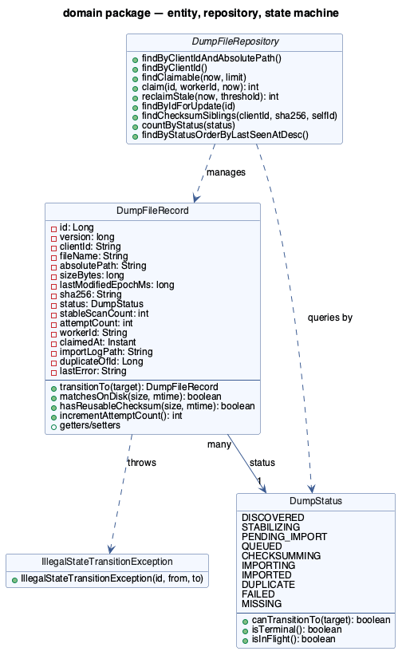
*One entity (`DumpFileRecord`) is the single source of truth; its `status` column is a `DumpStatus`
whose legal transitions are declared once and enforced centrally.*

### 4.1 `DumpStatus`

**What it is.** A 10-value enum plus a static `Map<DumpStatus, Set<DumpStatus>>` of legal
transitions, built once in a `static {}` block. This *is* the state machine — see `architecture.md`
§7 for the full picture of what each state means operationally.

| Method | Purpose |
|---|---|
| `canTransitionTo(DumpStatus target)` | `this == target \|\| ALLOWED.get(this).contains(target)`. Self-transitions are always legal (idempotent re-save). |
| `isTerminal()` | `true` for `IMPORTED` / `DUPLICATE` — a row here needs nothing more done to it (barring the file changing on disk). |
| `isInFlight()` | `true` for `QUEUED` / `CHECKSUMMING` / `IMPORTING` — the states `StaleRecordReaper` watches for abandonment. |

```java
DumpStatus.QUEUED.canTransitionTo(DumpStatus.CHECKSUMMING); // true  – happy path
DumpStatus.IMPORTED.canTransitionTo(DumpStatus.FAILED);      // false – IMPORTED only re-opens to DISCOVERED
```

> **NOTE — this table is the actual regression guard, not documentation.** A prior bug where
> `QUEUED → STABILIZING` was accidentally disallowed (needed when a restored/changed file is caught
> mid-claim) was caught by a unit test asserting the transition table, not by manual QA. When you
> add a new status or a new edge, add the transition here first, then write the test.

### 4.2 `DumpFileRecord`

**What it is.** The JPA `@Entity` mapped to table `dump_file`. Optimistic locking via `@Version`
makes concurrent claims safe (see `architecture.md` §8). Every column is described in
`architecture.md` §5; this section is about the **behaviour**, not the schema.

| Method | Signature | Behaviour |
|---|---|---|
| `transitionTo` | `DumpFileRecord transitionTo(DumpStatus target)` | The **only** sanctioned way to change `status`. Delegates the legality check to `DumpStatus.canTransitionTo`; throws `IllegalStateTransitionException` on an illegal jump. Returns `this` for chaining. |
| `matchesOnDisk` | `boolean matchesOnDisk(long size, long lastModifiedMs)` | `size == this.sizeBytes && lastModifiedMs == this.lastModifiedEpochMs`. The core "has this file changed since we last looked?" check, reused by the scanner, `ProcessingSteps.beginChecksum`, and `FileStabilityChecker`. |
| `hasReusableChecksum` | `boolean hasReusableChecksum(long size, long lastModifiedMs)` | `sha256 present && matchesOnDisk(...)`. This is the entire "checksum reuse" optimisation from `architecture.md` §10 in one line. |
| `incrementAttemptCount` | `int incrementAttemptCount()` | Pre-increments and returns the new value — used once, in `ProcessingSteps.completeChecksum`, right before an import attempt actually starts. |
| getters/setters | — | Straightforward; `id` and `version` have **no setter** (JPA-managed). |

```java
// From ProcessingSteps.beginChecksum — the guarded re-stat before checksumming starts
if (!record.matchesOnDisk(attrs.size(), attrs.lastModifiedTime().toMillis())) {
    record.transitionTo(DumpStatus.STABILIZING);   // file moved under us — back to discovery
    return Optional.empty();
}
record.transitionTo(DumpStatus.CHECKSUMMING);
boolean reusable = record.hasReusableChecksum(attrs.size(), attrs.lastModifiedTime().toMillis());
```

> **NOTE — the no-args constructor is `protected`.** That's a JPA requirement (Hibernate needs it
> to instantiate entities via reflection), not an invitation to use it from application code.
> Application code always goes through the four-argument constructor `(clientId, fileName,
> absolutePath, sizeBytes, lastModifiedEpochMs)`.

### 4.3 `DumpFileRepository`

**What it is.** A Spring Data JPA interface — no implementation code, just method signatures and
`@Query`/`@Modifying` annotations. This is where the two most safety-critical queries in the whole
codebase live.

| Method | JPQL summary | Why it's shaped this way |
|---|---|---|
| `findClaimable(Instant now, Limit limit)` | `status = PENDING_IMPORT and nextEligibleAt <= :now order by nextEligibleAt, id` | Read-only candidate list; ordering gives rough FIFO fairness. |
| `claim(Long id, String workerId, Instant now)` | `UPDATE ... SET status=QUEUED, workerId=?, claimedAt=?, version=version+1 WHERE id=? AND status=PENDING_IMPORT` | **The** atomic claim. Returns `1` if *this* caller won, `0` otherwise — see `architecture.md` §8 for why this single UPDATE is what makes multi-instance deployment safe. |
| `reclaimStale(Instant now, Instant threshold)` | Bulk `UPDATE` resetting `QUEUED/CHECKSUMMING/IMPORTING` rows with `claimedAt < threshold` back to `PENDING_IMPORT` | Used by both `StaleRecordReaper.reclaimStale()` (real threshold) and `.reclaimAll()` (threshold = now, i.e. everything). |
| `findByIdForUpdate(Long id)` | `@Lock(PESSIMISTIC_WRITE)` | Used inside every `ProcessingSteps` transactional method and by the operator-triggered `retry()` — a `SELECT ... FOR UPDATE` so two concurrent writers to the *same* record serialize instead of racing on the optimistic version. |
| `findChecksumSiblings(clientId, sha256, selfId)` | `clientId=? and sha256=? and id<>? and status in (IMPORTED, IMPORTING, CHECKSUMMING)` | The de-duplication query — see `architecture.md` §10. |
| `findByClientIdAndAbsolutePath`, `findByClientId`, `countByStatus`, `findByStatusOrderByLastSeenAtDesc` | Derived query methods (no `@Query` needed) | Spring Data generates the JPQL from the method name. |

```java
// ImportDispatcher.dispatch(), simplified
List<Long> candidates = repository.findClaimable(Instant.now(), Limit.of(batch)).stream()
        .map(DumpFileRecord::getId).toList();
for (Long id : candidates) {
    boolean won = repository.claim(id, instanceId, Instant.now()) == 1;
    if (won) executor.execute(() -> processor.process(id));
}
```

> **NOTE — `findClaimable` and `claim` are two separate calls, not one query.** This is
> intentional: `findClaimable` can run in a read-only snapshot and return more candidates than
> capacity allows, while `claim` is the single-row compare-and-swap that actually reserves work.
> Splitting them means a losing race (`claim` returns 0`) is cheap — just move to the next
> candidate — instead of retrying a whole batch query.

### 4.4 `IllegalStateTransitionException`

**What it is.** A `RuntimeException` with exactly one constructor,
`IllegalStateTransitionException(Long recordId, DumpStatus from, DumpStatus to)`, building the
message `"Illegal transition for dump record <id>: <from> -> <to>"`. Unchecked on purpose — an
illegal transition is a programming bug (a code path that forgot to check `DumpStatus` first), not
a recoverable runtime condition, so it should propagate to `DumpProcessor.process`'s catch-all and
be logged loudly rather than be caught and silently ignored anywhere in between.

---

## 5. `scanner` — discovery & file-stability detection

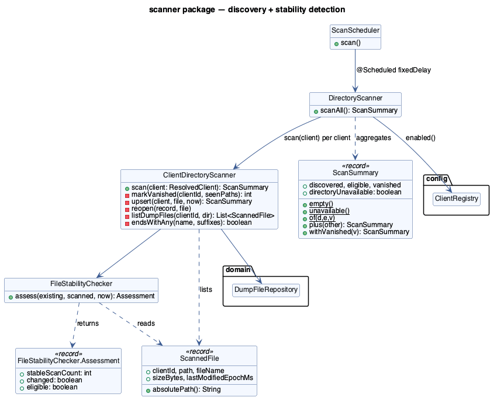
*One scheduler thread drives `DirectoryScanner`, which isolates each client into `ClientDirectoryScanner.scan(...)`
(its own transaction); `FileStabilityChecker` is a pure function called for every unchanged file.*

### 5.1 `ScanScheduler`

**What it is.** The single `@Scheduled` entry point for discovery.

| Method | Detail |
|---|---|
| `scan()` | `@Scheduled(fixedDelayString = "${oracle-import.scanner.interval:30s}", initialDelayString = "...:5s")`. No-ops if `scanner.enabled=false` or the pipeline is draining (`PipelineState.isAcceptingWork() == false`). Catches and logs `RuntimeException` so one bad cycle never kills the scheduler thread. |

> **NOTE — `fixedDelay`, not `fixedRate`.** `fixedDelay` measures the gap from the *end* of one
> run to the *start* of the next. If a scan over a laggy UNC share takes 45 seconds against a 30
> second interval, `fixedRate` would immediately queue a second overlapping run; `fixedDelay`
> simply starts the next one 30 seconds after the first finished. There is exactly one scanner
> thread — overlap was never intended.

### 5.2 `DirectoryScanner`

**What it is.** Fans a single scan cycle out across every enabled client, isolating failures.

| Method | Detail |
|---|---|
| `scanAll()` | Returns `ScanSummary.empty()` immediately if draining. Otherwise loops `clients.enabled()`, calling `clientScanner.scan(client)` for each and summing the results with `ScanSummary.plus`. A `RuntimeException` from any one client is caught, classified via `IoFailure.classify`, logged, and **does not stop the loop** — the next client is still scanned. |

```java
// One client's UNC share being down does not affect client-b
for (ResolvedClient client : clients.enabled()) {
    try {
        total = total.plus(clientScanner.scan(client));
    } catch (RuntimeException ex) {
        IoFailure failure = IoFailure.classify(ex);
        log.warn("Scan failed for client '{}' ... kind={}", client.id(), failure.kind());
        // loop continues
    }
}
```

### 5.3 `ClientDirectoryScanner`

**What it is.** Does the actual work for **one** client, inside its own
`@Transactional(propagation = REQUIRES_NEW)` transaction — see `architecture.md` §8 for why a new
transaction per client (rather than one for the whole `scanAll()`) matters.

| Method | What it does |
|---|---|
| `scan(ResolvedClient)` | Guard clause: if the directory isn't there/readable, return `ScanSummary.unavailable()` immediately (no exception — an absent share is an expected condition, see `DumpDirectoriesHealthIndicator`). Otherwise: list dump files, upsert each into a `DumpFileRecord`, then sweep for vanished files. |
| `listDumpFiles(String clientId, Path dir)` | Opens a `DirectoryStream<Path>` with an inline filter predicate: matches a `dumpSuffixes` extension, does **not** match an `ignoreSuffixes` extension (`.part`, `.tmp`, `.partial`, `.copying`), and is a regular file. Stats each survivor with `Files.readAttributes(..., BasicFileAttributes.class)` and wraps it as a `ScannedFile`. A single unreadable entry is skipped and logged at `DEBUG`, not fatal to the whole scan. |
| `upsert(ResolvedClient, ScannedFile, Instant)` | The core per-file logic — see the walkthrough below. |
| `markVanished(String clientId, Set<String> seenPaths)` | For every **known, present-on-disk** record whose path was *not* in this cycle's listing, flips `presentOnDisk=false` and — only if it was still in a pre-import state (`DISCOVERED`/`STABILIZING`/`PENDING_IMPORT`) — transitions it to `MISSING`. A record already `IMPORTED` that vanishes is *not* force-transitioned; the historical fact that it was imported stands. |
| `reopen(DumpFileRecord, ScannedFile)` | Called when a terminal/failed/missing record's file reappears **changed** (different size or mtime): resets checksum, attempt count, worker/claim fields and duplicate-of-id, then transitions `DISCOVERED → STABILIZING`. This is how a client re-uploading a corrected dump under the same filename gets picked up again. |
| `endsWithAny(String, List<String>)` | Small private helper for the suffix predicates. |

**`upsert` walkthrough** (this is the method worth reading slowly):

```java
DumpFileRecord record = repository.findByClientIdAndAbsolutePath(client.id(), file.absolutePath())
        .orElse(null);

if (record == null) {
    // brand-new file: create it as STABILIZING, stableScanCount = 1
    // a DataIntegrityViolationException here means another thread raced us to insert
    // the same (client_id, absolute_path) row — we just re-fetch and fall through.
}

record.setLastSeenAt(now);
record.setPresentOnDisk(true);

boolean changedOnDisk = !record.matchesOnDisk(file.sizeBytes(), file.lastModifiedEpochMs());
if (isTerminalOrFailedOrMissing(record) && changedOnDisk) {
    reopen(record, file);          // re-upload of a corrected file
    return;
}
if (notDiscoveredOrStabilizing(record)) {
    return;                        // already past discovery (e.g. QUEUED) — nothing to do here
}

FileStabilityChecker.Assessment a = stabilityChecker.assess(record, file, now);
// persist size/mtime/stableScanCount, then:
if (a.eligible()) {
    record.transitionTo(DumpStatus.PENDING_IMPORT);   // hand off to the dispatcher
} else {
    record.transitionTo(DumpStatus.STABILIZING);       // keep waiting
}
```

> **NOTE — the unique-constraint race is handled, not prevented.** Two concurrent scans could both
> see a brand-new file and both attempt an `INSERT`. Rather than locking, the code just tries the
> insert and catches `DataIntegrityViolationException`, re-reading the row the other transaction
> committed. This only matters in a multi-instance deployment; with one scheduler thread per
> instance and one instance, it never fires in practice — but it's cheap insurance for §19 of
> `CLAUDE.md` (future multi-instance support).

### 5.4 `FileStabilityChecker`

**What it is.** A `@Component`, but a **pure function** — no field mutation, no side effects, easy
to unit test with zero mocking. This is the exact algorithm behind `architecture.md` §9.

| Method | Signature | Logic |
|---|---|---|
| `assess` | `Assessment assess(DumpFileRecord existing, ScannedFile scanned, Instant now)` | `changed = !existing.matchesOnDisk(scanned)`. If changed: reset to `(count=1, changed=true, eligible=false)`. Else: `count = existing.count + 1`; `quietFor = now - scanned.lastModifiedEpochMs`; `eligible = count >= stableScansRequired && quietFor >= stableFileCheckDelay`. |

```java
// A file copy still in progress (size just grew)
assess(existingRow /* size=10GB */, scannedNow /* size=17GB */, now)
    // -> Assessment(stableScanCount=1, changed=true, eligible=false)

// Same size/mtime for the 2nd consecutive scan, and quiet for 35s (config: 2 scans, 30s delay)
assess(existingRow /* count=1, size=20GB */, scannedNow /* size=20GB, same mtime */, now)
    // -> Assessment(stableScanCount=2, changed=false, eligible=true)
```

**`Assessment` (nested record).** `(int stableScanCount, boolean changed, boolean eligible)` — the
three numbers `ClientDirectoryScanner.upsert` needs to persist and act on.

### 5.5 `ScannedFile`

**What it is.** An immutable snapshot record: `(String clientId, Path path, String fileName, long
sizeBytes, long lastModifiedEpochMs)`, plus one derived accessor, `absolutePath()` (`path.toString()`).
Exists purely to avoid passing five loose parameters between `listDumpFiles`, `upsert` and
`FileStabilityChecker.assess`.

### 5.6 `ScanSummary`

**What it is.** An immutable counters record: `(int discovered, int eligible, int vanished, boolean
directoryUnavailable)`, with a small algebra for combining results across clients.

| Method | Purpose |
|---|---|
| `empty()` / `unavailable()` / `of(d, e, v)` | Factories for the common starting states. |
| `plus(ScanSummary other)` | Field-wise addition, `directoryUnavailable` ORed — this is how `DirectoryScanner.scanAll()` folds per-client results into one total. |
| `withVanished(int)` | Returns a copy with a different `vanished` count (used once, after the vanish-sweep runs). |

```java
ScanSummary total = ScanSummary.empty();
for (var client : clients.enabled()) {
    total = total.plus(clientScanner.scan(client));
}
// total.discovered(), total.eligible(), total.vanished() logged by ScanScheduler
```

---

## 6. `processing` — dispatch, workers, retry

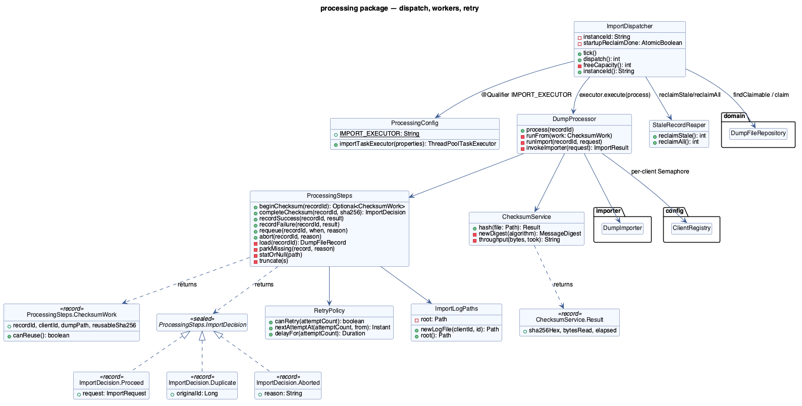
*`ImportDispatcher` claims and submits; `DumpProcessor` runs the 6-segment sequence on a worker
thread; `ProcessingSteps` holds the short transactional writes; `ChecksumService` and `RetryPolicy`
are the two pieces of real algorithm in this package.*

### 6.1 `ProcessingConfig`

**What it is.** A `@Configuration` class that both `@EnableScheduling` (globally, for every
`@Scheduled` method in the app) and defines the one bean that is the hard ceiling on concurrent
imports.

| Member | Detail |
|---|---|
| `IMPORT_EXECUTOR` (constant) | `"importTaskExecutor"` — the bean name other classes `@Qualifier` against, so there's exactly one string literal to change if it's ever renamed. |
| `importTaskExecutor(OracleImportProperties)` | Builds a `ThreadPoolTaskExecutor` with `core = max = maxWorkers`, a **bounded** queue also sized to `maxWorkers`, `AbortPolicy` (reject loudly instead of silently growing a queue), and `waitForTasksToCompleteOnShutdown = true` with the shutdown timeout tied to `shutdownGracePeriod`. |

> **NOTE — why a bounded pool, not virtual threads.** An `impdp` import is heavy, largely
> out-of-process work (the JVM thread mostly just waits on a child process). Unbounded concurrency
> (which virtual threads make trivially easy) would let the scanner/dispatcher throw an unlimited
> number of simultaneous imports at one Oracle instance and one network share — exactly what
> `maxWorkers` and the per-client `Semaphore` exist to prevent. Virtual threads would be a
> reasonable choice for the **scan** stage if the client count grew large, but that's not this pool.

### 6.2 `ImportDispatcher`

**What it is.** The `@Scheduled` bean that turns "there are eligible rows in the database" into
"a worker thread is running `DumpProcessor.process(id)`". This is the piece that makes
multi-instance deployment safe (`architecture.md` §8) via the atomic `claim` query.

| Method | Detail |
|---|---|
| `tick()` | `@Scheduled(fixedDelayString = "...poll-interval:10s", initialDelayString = same)`. No-ops if disabled or draining. First tick ever calls `reaper.reclaimAll()` (full sweep, once, via `AtomicBoolean.compareAndSet`); every tick calls `reaper.reclaimStale()` then `dispatch()`. |
| `dispatch()` | Computes `free = freeCapacity()`; if `<= 0`, returns `0`. Otherwise reads up to `min(free, dispatchBatchSize)` claimable IDs (in one `TransactionTemplate` block), then loops each ID: claim it (a *second*, separate transaction per ID); on success, `executor.execute(() -> processor.process(id))`; on `RejectedExecutionException` (pool saturated despite the capacity math), immediately `steps.requeue(...)` that one ID and stop the loop. Returns the count actually submitted. |
| `freeCapacity()` | `ceiling - (activeCount + queueSize)`, where `ceiling = pool.maximumPoolSize + maxWorkers` — i.e., accounts for both threads already running and work already queued. |
| `instanceId()` | Exposes the random `"svc-" + UUID` this instance claims work under — visible in `DumpFileRecord.workerId` for operator debugging ("which node picked this up?"). |

```java
// dispatch(), annotated
int free = freeCapacity();                                  // e.g. 4 workers, 1 active -> free = 3
List<Long> candidates = txTemplate.execute(s ->
        repository.findClaimable(Instant.now(), Limit.of(3)).stream()
                .map(DumpFileRecord::getId).toList());       // read-only snapshot, up to 3 rows

for (Long id : candidates) {
    boolean won = repository.claim(id, instanceId, Instant.now()) == 1;  // atomic compare-and-swap
    if (won) executor.execute(() -> processor.process(id));               // hand to the bounded pool
}
```

> **NOTE — `TransactionTemplate`, not `@Transactional`, on this bean.** If `dispatch()` called
> `this.someTransactionalMethod()` on a `@Transactional`-annotated method of the *same* bean, the
> Spring AOP proxy would be bypassed (self-invocation) and no transaction would actually start.
> `TransactionTemplate` sidesteps that trap entirely and makes the transaction boundary explicit at
> the call site — you can see exactly which three lines are inside the transaction.

### 6.3 `DumpProcessor`

**What it is.** Runs one already-claimed record through the whole pipeline **on a worker thread**.
This is the class where "the slow phases hold no transaction" (`architecture.md` §8) is actually
implemented — note that no method here is `@Transactional`; the transactional work is entirely
delegated to `ProcessingSteps`.

| Method | Detail |
|---|---|
| `process(long recordId)` | Entry point, called by the executor. Calls `steps.beginChecksum(recordId)`; if present, proceeds via `runFrom`; if empty, the record was re-parked already (file changed/vanished) and there's nothing more to do. Catches `IoFailure.UncheckedPipelineIoException` (classifies and records a failure) and any other `RuntimeException` (logs and calls `steps.abort`) so a bug here can never leave a record silently stuck. |
| `runFrom(ChecksumWork work)` | Hashes the file (`checksumService.hash`) **unless** `work.canReuse()` says the stored hash is still valid for the current size/mtime — this is the checksum-reuse optimisation actually firing. Then calls `steps.completeChecksum(recordId, sha256)` and pattern-matches the sealed `ImportDecision` result with a `switch`. |
| `runImport(long recordId, ImportRequest request)` | Acquires the per-client `Semaphore` with a bounded `tryAcquire(pollInterval, SECONDS)`. No permit free → `steps.requeue(...)` **without** consuming an attempt (this isn't a failure, just "try again shortly"). Permit acquired → calls the importer, folds the `ImportResult` into `recordSuccess`/`recordFailure`, and **always** releases the permit in a `finally`. |
| `invokeImporter(ImportRequest)` | Wraps the actual `importer.importDump(request)` call. Catches `UnsupportedOperationException` (today's mock-for-impdp gap) and reclassifies it as a **retryable** failure — so turning on `mode=impdp` before the real implementation lands degrades to "keeps retrying and logging", never to a silently lost dump. Also catches `IoFailure.UncheckedPipelineIoException` and any other `RuntimeException` the importer might throw, always producing a well-formed `ImportResult.Failure` rather than letting an exception escape to `process()`'s catch-all. |

```java
// switch over the sealed ImportDecision — compiler-enforced exhaustiveness
switch (decision) {
    case ImportDecision.Duplicate d -> log.info("duplicate of {}", d.originalId());
    case ImportDecision.Aborted a   -> steps.abort(recordId, a.reason());
    case ImportDecision.Proceed p   -> runImport(recordId, p.request());
}
```

> **NOTE — a permit not acquired does not burn an attempt.** `attempt_count` is only incremented in
> `ProcessingSteps.completeChecksum`, *before* the permit wait. So "all client-a workers are busy
> right now" never eats into the `max-attempts` budget meant for genuine Oracle/IO failures — it's
> pure back-pressure, not a failure.

### 6.4 `ProcessingSteps`

**What it is.** Every `@Transactional` boundary in the processing lane, and nowhere else. Each
method loads the record with `findByIdForUpdate` (pessimistic write lock, so two workers can never
touch the same row's fields concurrently even if a claim race were somehow missed), mutates it, and
lets the transaction commit the change on method return.

| Method | Transaction does | Returns / notes |
|---|---|---|
| `beginChecksum(long recordId)` | Guards `status == QUEUED`; re-stats the file; if vanished → `MISSING`; if changed → back to `STABILIZING` with checksum/claim fields cleared; else → `CHECKSUMMING`. | `Optional<ChecksumWork>` — empty in the two re-park cases. |
| `completeChecksum(long recordId, String sha256)` | Stores the hash; looks for a `findChecksumSiblings` match; if found → `DUPLICATE` + `duplicateOfId`; else → `IMPORTING`, assigns a fresh log path, increments `attemptCount`, builds the `ImportRequest`. | `ImportDecision` (`Proceed` / `Duplicate` / `Aborted`). |
| `recordSuccess(long recordId, ImportResult.Success)` | → `IMPORTED`; stamps `importFinishedAt`, `importDurationMs`; clears `lastError`, `workerId`, `claimedAt`. | `void`. |
| `recordFailure(long recordId, ImportResult.Failure)` | Stores `lastError`/`lastErrorAt`; if `result.retryable() && retryPolicy.canRetry(attemptCount)` → back to `PENDING_IMPORT` with `nextEligibleAt` from `RetryPolicy`; else → `FAILED`. | `void`. |
| `requeue(long recordId, Instant when, String reason)` | Clears claim fields, sets `nextEligibleAt`, ensures status is `PENDING_IMPORT` (no-ops the transition if already there). **Does not touch `attemptCount`.** | Used for "no permit free" and "executor saturated". |
| `abort(long recordId, String reason)` | Clears claim fields, records the error; if the record was still `isInFlight()`, parks it `PENDING_IMPORT` one minute out. | The catch-all safety net called from `DumpProcessor`'s outer `catch (RuntimeException e)`. |
| `load(long recordId)` (private) | `findByIdForUpdate(...).orElseThrow(...)` — every public method starts here. | Throws `IllegalStateException` if the row was deleted underneath the pipeline (never expected in normal operation — there is no delete path today). |
| `parkMissing`, `statOrNull`, `truncate` (private) | Small shared helpers: transition to `MISSING`; classify a stat `IOException` as "not found" vs. rethrow; cap `lastError` at 8,000 characters. | — |

**Nested types.**

- `ChecksumWork` (record): `(long recordId, String clientId, Path dumpPath, String reusableSha256)`
  plus `canReuse()` (`reusableSha256 != null && !isBlank()`). The handoff from `beginChecksum` to
  `DumpProcessor.runFrom`.
- `ImportDecision` (sealed interface): `Proceed(ImportRequest)`, `Duplicate(Long originalId)`,
  `Aborted(String reason)`. A sealed type here means the `switch` in `DumpProcessor.runFrom` is
  checked by the compiler for exhaustiveness — add a fourth arm and every `switch` site fails to
  compile until handled.

```java
// recordFailure — the retry/park decision in full
boolean retry = result.retryable() && retryPolicy.canRetry(record.getAttemptCount());
if (retry) {
    record.setNextEligibleAt(retryPolicy.nextAttemptAt(record.getAttemptCount(), now));
    record.transitionTo(DumpStatus.PENDING_IMPORT);
} else {
    record.transitionTo(DumpStatus.FAILED);
}
```

### 6.5 `ChecksumService`

**What it is.** Streaming SHA-256 (or whatever `oracle-import.checksum.algorithm` names) over a
file, with a configurable buffer size — see `architecture.md` §18/§10 for why streaming (not
loading the file into memory) matters on a 20 GB UNC dump.

| Method | Detail |
|---|---|
| `hash(Path file)` | Opens a `DigestInputStream` wrapping `Files.newInputStream(file)`, reads in `bufferSizeMb`-sized chunks until EOF, and returns a `Result`. Any `IOException` is wrapped via `IoFailure.wrap` so callers deal in unchecked exceptions with classification available. Logs bytes read, elapsed time, and computed throughput (`MB/s`) at `INFO`. |
| `newDigest(String algorithm)` (private) | `MessageDigest.getInstance(algorithm)`, wrapping the checked `NoSuchAlgorithmException` as `IllegalStateException` — a bad algorithm name is a config error caught at first use, not something workers should have to handle per-call. |
| `throughput(long bytes, Duration took)` (private) | `(bytes / 1MiB) / seconds`, floored at `0.001s` to avoid a divide-by-near-zero on tiny files. |

```java
ChecksumService.Result r = checksumService.hash(Path.of("D:/OracleDumps/ClientA/backup.dmp"));
// r.sha256Hex()  -> "8247c7c8...afca6"
// r.bytesRead()  -> 8000  (or 20_000_000_000L for a 20 GB dump)
// r.elapsed()    -> PT4.183S
```

**`Result` (nested record).** `(String sha256Hex, long bytesRead, Duration elapsed)` — everything a
caller might want to log or store.

### 6.6 `RetryPolicy`

**What it is.** The exponential-backoff math from `architecture.md` §11, in three small methods.

| Method | Formula |
|---|---|
| `canRetry(int attemptCount)` | `attemptCount < maxAttempts`. |
| `delayFor(int attemptCount)` | `min(retryBackoff * 2^(attemptCount-1), retryBackoffMax)`, with the shift clamped to `[0, 30]` to guard against overflow on a pathologically large `attemptCount`. |
| `nextAttemptAt(int attemptCount, Instant from)` | `from.plus(delayFor(attemptCount))`. |

```text
retryBackoff = 1m, retryBackoffMax = 1h
attempt 1 fails -> delayFor(1) = 1m * 2^0 = 1m
attempt 2 fails -> delayFor(2) = 1m * 2^1 = 2m
attempt 3 fails -> delayFor(3) = 1m * 2^2 = 4m
...
attempt 7 fails -> 1m * 2^6 = 64m -> capped at retryBackoffMax = 60m
```

### 6.7 `StaleRecordReaper`

**What it is.** Crash recovery: anything claimed by a worker/instance that then died leaves a row
stuck `QUEUED`/`CHECKSUMMING`/`IMPORTING` forever unless something resets it.

| Method | Detail |
|---|---|
| `reclaimStale()` | `threshold = now - staleProcessingTimeout`; delegates to `repository.reclaimStale(now, threshold)`. Called on **every** `ImportDispatcher.tick()`. |
| `reclaimAll()` | Same repository call with `threshold = now` — i.e., *any* in-flight row, regardless of age, is reset. Called exactly **once**, on the dispatcher's first tick after startup (guarded by `ImportDispatcher`'s `AtomicBoolean`). This is what makes a service restart safe: whatever a previous process instance had claimed and never finished is picked back up. |

> **NOTE — why `reclaimAll` isn't just "a very short `staleProcessingTimeout`".** A short timeout
> would also reclaim rows that are *genuinely* still being imported by another live instance in a
> multi-instance deployment. `reclaimAll` running exactly once, only on this instance's own
> startup, only touches rows that predate *this* instance's existence — the intent is "reclaim
> whatever was abandoned before I existed", not "reclaim anything that's been running a while".

### 6.8 `ImportLogPaths`

**What it is.** Builds the date-partitioned import-log path convention from `architecture.md` §22:
`<import-log-root>/<clientId>/<yyyy>/<MM>/<uuid>.log`.

| Method | Detail |
|---|---|
| `ImportLogPaths(OracleImportProperties)` | Normalises `importer.importLogRoot` once via `WindowsPaths.toNormalizedPath`, stored as `root`. |
| `newLogFile(String clientId, UUID id)` | `root.resolve(clientId).resolve(yyyy).resolve(MM).resolve(id + ".log")`, using the JVM's default zone. Called exactly once per import attempt, from `ProcessingSteps.completeChecksum`. |
| `root()` | Exposes the resolved root — used by tests and by `DumpDirectoryBootstrap`. |

```java
logPaths.newLogFile("client-a", UUID.randomUUID());
// -> D:\OracleImporter\logs\imports\client-a\2026\09\9d28f4d6-6efa-430a-a61b....log
```

---

## 7. `importer` — the Strategy pattern

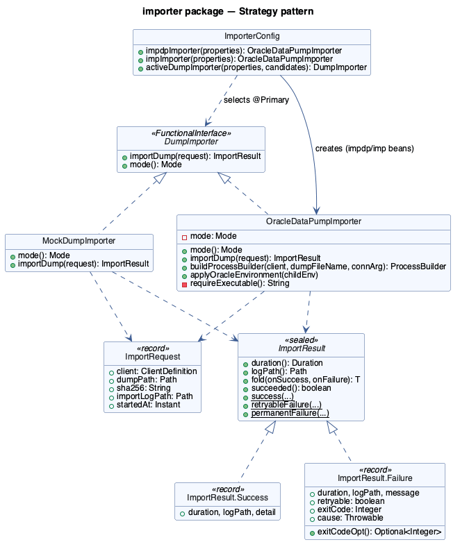
*A `@FunctionalInterface` strategy, two implementations, and the sealed `ImportResult` both arms
must handle. `ImporterConfig` is the only place that knows how the config `mode` maps to a bean.*

### 7.1 `DumpImporter` (interface)

**What it is.** `@FunctionalInterface ImportResult importDump(ImportRequest request)`, plus a
`default Mode mode() { return Mode.MOCK; }`. Being a functional interface means a test can supply
one as a one-line lambda:

```java
DumpImporter alwaysSucceeds = req ->
        ImportResult.success(Duration.ZERO, req.importLogPath(), "test stub");
```

### 7.2 `ImportRequest` (record)

**What it is.** `(ClientDefinition client, Path dumpPath, String sha256, Path importLogPath,
Instant startedAt)` — every piece of context an importer could need, assembled once by
`ProcessingSteps.completeChecksum` and handed down unchanged. Being a record makes it trivially
immutable and gives a free, readable `toString()` for logging.

### 7.3 `ImportResult` (sealed interface)

**What it is.** The outcome contract every `DumpImporter` must return — `sealed ... permits
Success, Failure` forces every consumer to handle both arms.

| Member | Detail |
|---|---|
| `duration()`, `logPath()` | Common to both arms. |
| `fold(Function<Success,T>, Function<Failure,T>)` | A `switch` expression wrapped as a method — lets a caller collapse both arms to one value inline (`DumpProcessor.runImport` uses this instead of an explicit `switch`). |
| `succeeded()` | `this instanceof Success`. |
| `success(duration, logPath, detail)` | Factory for `Success`. |
| `retryableFailure(duration, logPath, message, cause)` | Factory for `Failure` with `retryable=true`, `exitCode=null`. |
| `permanentFailure(duration, logPath, message, exitCode, cause)` | Factory for `Failure` with `retryable=false`. |

`Success(Duration duration, Path logPath, String detail)` and `Failure(Duration duration, Path
logPath, String message, boolean retryable, Integer exitCode, Throwable cause)` are both records;
`Failure` adds `exitCodeOpt()` (`Optional.ofNullable(exitCode)`) for callers that want to avoid a
null check.

```java
result.fold(
    success -> { steps.recordSuccess(recordId, success); return null; },
    failure -> { steps.recordFailure(recordId, failure); return null; });
```

### 7.4 `MockDumpImporter`

**What it is.** The default (`mode = MOCK`) and the **reference implementation of the log-file
contract** — any real importer's log output should look like this transcript's shape. See
`architecture.md` §1 for why mock is the safe out-of-the-box default.

| Method | Detail |
|---|---|
| `mode()` | Returns `Mode.MOCK`. |
| `importDump(ImportRequest)` | Checks `Files.isReadable(dump)` (retryable failure if not — the file could have been swept by AV between checksum and import); sleeps `mockDuration` to simulate real elapsed time; writes an `impdp`-shaped transcript (`header`, "Connected to...", "Master table...", byte count, "successfully completed") to the log file; returns `ImportResult.success`. Any `IOException` writing the log becomes a retryable failure. |
| `header(ImportRequest)`, `orDash(String)`, `elapsed(Instant)`, `writeLog(Path, List<String>)`, `sleepQuietly(Duration)` (all private) | Small formatting/IO helpers. `writeLog` always `createDirectories(parent)` first — the date-partitioned log directory tree may not exist yet for this month. |

```text
== MOCK impdp == client=client-a schema=CLIENT_A sha256=8247c7c8...afca6 dump=... started=2026-09-08T...
Connected to: MOCK Oracle Database
Master table "CLIENT_A"."SYS_IMPORT_SCHEMA_01" successfully loaded
Starting "CLIENT_A"."SYS_IMPORT_SCHEMA_01":  DIRECTORY=- DUMPFILE=clienta_2026_09.dmp REMAP_SCHEMA=-:CLIENT_A
Processing object type SCHEMA_EXPORT/TABLE/TABLE_DATA
Bytes processed: 8000
Job "CLIENT_A"."SYS_IMPORT_SCHEMA_01" successfully completed
MOCK import finished in PT2S
```

### 7.5 `OracleDataPumpImporter`

**What it is.** The real `impdp`/`imp` importer. **`importDump` is deliberately unimplemented** —
see `architecture.md` §17 and `CLAUDE.md` §10 — but the safe, testable parts (command construction,
environment setup) are fully built.

| Method | Detail |
|---|---|
| `mode()` | Returns whichever `Mode` (`IMPDP` or `IMP`) this instance was constructed with — see `ImporterConfig`, which creates **two** beans of this class from the same constructor with different `Mode` arguments. |
| `importDump(ImportRequest)` | Throws `UnsupportedOperationException("Oracle import (mode=" + mode + ") implementation pending — see CLAUDE.md §10")`. The method body is a six-step comment describing exactly what to implement (stage → resolve credentials → `ProcessBuilder` → `start()`/`waitFor(timeout)` → map exit code → never log the password). |
| `buildProcessBuilder(ClientDefinition client, String dumpFileName, String connectionArgument)` | **Implemented and unit-tested.** Builds `["impdp.exe", connectionArgument, "DIRECTORY=...", "DUMPFILE=...", "LOGFILE=....impdp.log", ("SCHEMAS=...", "REMAP_SCHEMA=src:tgt" if a source schema is configured)]` as discrete `ProcessBuilder` arguments — never a concatenated shell string, never `cmd.exe` (`CLAUDE.md` §11–§12). Calls `applyOracleEnvironment` on the resulting `ProcessBuilder`'s environment. |
| `applyOracleEnvironment(Map<String,String> childEnv)` | Sets `ORACLE_HOME`/`TNS_ADMIN` **only** on the map passed in (which is the child process's environment when called via `pb.environment()`) — never `System.setProperty` or any JVM/server-wide state (`CLAUDE.md` §14). |
| `requireExecutable()` (private) | Picks `impdpPath` or `impPath` based on `mode`; throws `IllegalStateException` if blank. |

```java
ProcessBuilder pb = oracleDataPumpImporter.buildProcessBuilder(
        clientA, "backup.dmp", "system@//db-host:1521/ORCLPDB1");
// pb.command() == ["C:/Oracle/.../impdp.exe",
//                  "system@//db-host:1521/ORCLPDB1",
//                  "DIRECTORY=CLIENT_A_IMPORT_DIR",
//                  "DUMPFILE=backup.dmp",
//                  "LOGFILE=backup.dmp.impdp.log",
//                  "SCHEMAS=APP", "REMAP_SCHEMA=APP:CLIENT_A"]
// pb.environment() now also has ORACLE_HOME / TNS_ADMIN set (child-only)
```

> **NOTE — credentials are never in this method.** `connectionArgument` is passed in by the
> (not-yet-written) caller, resolved from a secret store at call time. `buildProcessBuilder` never
> logs its arguments at anything above `DEBUG` for the *resolved path*, and never logs
> `connectionArgument` at all — see `architecture.md` §16 security notes.

### 7.6 `ImporterConfig`

**What it is.** The `@Configuration` class that turns `oracle-import.importer.mode` into exactly
one active `DumpImporter` bean.

| Method | Detail |
|---|---|
| `impdpImporter(OracleImportProperties)` | `@Bean` — `new OracleDataPumpImporter(properties, Mode.IMPDP)`. |
| `impImporter(OracleImportProperties)` | `@Bean` — same class, `Mode.IMP`. |
| `activeDumpImporter(OracleImportProperties properties, List<DumpImporter> candidates)` | `@Bean @Primary` — Spring injects **every** `DumpImporter` bean in the context (`MockDumpImporter` + the two `OracleDataPumpImporter`s) as `candidates`; this method picks the one whose `mode()` matches config, or throws `IllegalStateException` listing what *was* available. Everything downstream (`DumpProcessor`) depends on the plain `DumpImporter` type, so it always gets whichever one this method chose. |

> **NOTE — "fail fast on a typo" is a deliberate design choice.** An earlier, simpler design might
> have defaulted silently to mock if `mode` didn't match anything recognised. That would mean a
> production YAML with `mode: impdb` (typo) quietly runs mock forever, never importing anything for
> real, with no error anywhere. Throwing at startup instead turns that into an immediate, loud
> failure.

---

## 8. `staging` — future share-to-`DIRECTORY` bridge

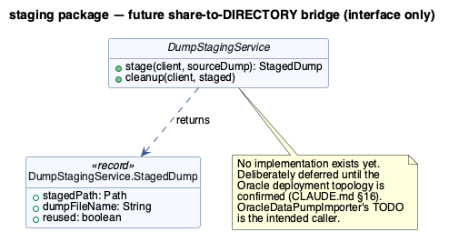
*One interface, no implementation — a deliberate seam, not an oversight.*

### 8.1 `DumpStagingService` (interface)

**What it is.** The bridge between "where Spring Boot sees the dump" (a share) and "where Oracle
Data Pump can read from" (a `DIRECTORY` object on the database server) — see `architecture.md` §2's
"two filesystem contexts" note and §16 of `CLAUDE.md`.

| Method | Contract |
|---|---|
| `stage(ClientDefinition client, Path sourceDump)` | Make `sourceDump` available to Data Pump for `client`; return a `StagedDump` describing where it landed. |
| `cleanup(ClientDefinition client, StagedDump staged)` | Remove a previously staged copy once its import is done and retention policy allows. |

`StagedDump` (nested record): `(Path stagedPath, String dumpFileName, boolean reused)` — `reused`
lets a future implementation report "skipped the copy, already staged" without a separate return
type.

> **NOTE — genuinely not implemented, and that's correct today.** Per `CLAUDE.md` §16, this waits
> until the real Oracle deployment topology (is the share reachable from the DB server directly? is
> a copy step even needed?) is confirmed. `OracleDataPumpImporter`'s `TODO` names this interface as
> step 1 of the real import — when it's time to implement `impdp` execution, this is the obvious
> place to plug in a staging step first if one turns out to be necessary. Don't implement this
> speculatively; there is currently no consumer and no chosen deployment topology to design against.

---

## 9. `oracle` — startup executable validation

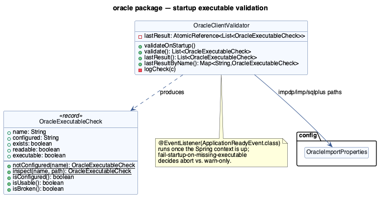
*Validates configured `.exe` paths once, at `ApplicationReadyEvent`, and caches the result for the
health indicator to read without re-touching the filesystem on every `/actuator/health` call.*

### 9.1 `OracleExecutableCheck` (record)

**What it is.** The result of inspecting one configured executable path:
`(String name, String configured, boolean exists, boolean readable, boolean executable)`.

| Method | Detail |
|---|---|
| `notConfigured(String name)` | All booleans `false`, `configured = null` — the path simply wasn't set in YAML. |
| `inspect(String name, String configuredPath)` | If blank, delegates to `notConfigured`. Else resolves to an absolute normalised `Path` and probes `Files.exists`/`isReadable`/`isExecutable` — `readable`/`executable` are only checked *if* `exists` is true, avoiding a confusing "readable=true" on a nonexistent file. |
| `isConfigured()` | `configured != null && !isBlank()`. |
| `isUsable()` | `exists && readable && executable`. |
| `isBroken()` | `isConfigured() && !isUsable()` — configured but unusable is the interesting failure case; "not configured at all" is not broken, just absent (e.g. `sqlplus` is optional). |

### 9.2 `OracleClientValidator`

**What it is.** Runs the three checks (`impdp`, `imp`, `sqlplus`) once on `ApplicationReadyEvent`,
logs the outcome, optionally aborts startup, and caches the result for later re-reads.

| Method | Detail |
|---|---|
| `validateOnStartup()` | `@EventListener(ApplicationReadyEvent.class)`. Skips entirely if `validateOnStartup=false`. Runs `validate()`, logs each check via `logCheck`. If any check `isBroken()` **and** the active mode is a real one (`IMPDP`/`IMP`) **and** `failStartupOnMissingExecutable=true`, throws `IllegalStateException` — which Spring Boot turns into a failed startup. Otherwise just warns. |
| `validate()` | Builds a fresh `List<OracleExecutableCheck>` via `OracleExecutableCheck.inspect(...)` for all three executables, stores it in `lastResult` (an `AtomicReference`), and returns it. Safe to call repeatedly — it's what `OracleClientHealthIndicator.health()` calls on every probe. |
| `lastResult()` / `lastResultByName()` | Read the cached list without re-touching the filesystem; `lastResultByName()` is a `Map<String, OracleExecutableCheck>` keyed by `name` for convenient lookup. |
| `logCheck(OracleExecutableCheck)` (private) | `INFO` for not-configured or usable, `WARN` (with the four booleans) for broken. |

> **NOTE — `mock` mode never fails startup, regardless of broken paths.** The `realMode` check in
> `validateOnStartup()` means a dev machine with no Oracle client installed at all can run the
> service in `mode: mock` (the default) without ever seeing a startup failure — the broken-path
> warning is purely informational until someone actually flips to `impdp`/`imp`.

---

## 10. `health` — Actuator indicators

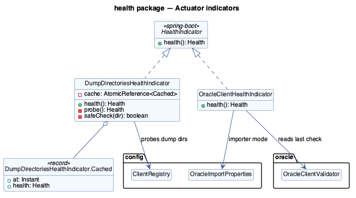
*Both indicators implement Spring Boot's `HealthIndicator`; both are deliberately cheap to call
repeatedly because Actuator can be polled by external monitoring every few seconds.*

### 10.1 `DumpDirectoriesHealthIndicator`

**What it is.** Registered under the bean name `dumpDirectories` (so it shows up as
`components.dumpDirectories` in `/actuator/health`), per-client reachability with a short cache.

| Method | Detail |
|---|---|
| `health()` | Checks the cache (`AtomicReference<Cached>`) first; if the cached value is younger than `CACHE_TTL` (10 seconds, a `private static final Duration`), returns it unchanged. Otherwise calls `probe()` and caches the fresh result with the current timestamp. |
| `probe()` (private) | For every `clients.enabled()` client, calls `safeCheck(dir)` and records `"UP (path)"`/`"DOWN (path)"` in a details map. If **no** clients are enabled, returns `Status.UNKNOWN`. If **any** client is down, returns `Status.OUT_OF_SERVICE` (not `DOWN`) — a temporarily unreachable share is expected and recoverable (`CLAUDE.md` §29), not a hard outage of the application itself. |
| `safeCheck(Path)` (private, static) | `Files.isDirectory(dir) && Files.isReadable(dir)`, wrapped in a `try/catch (RuntimeException)` returning `false` — a filesystem call throwing on a flaky UNC path must never make the health endpoint itself throw. |

`Cached` (private nested record): `(Instant at, Health health)` — the whole cache in one
allocation-free record, swapped atomically.

> **NOTE — the cache exists specifically so Actuator polling can't storm a UNC share.** Without it,
> an external monitor hitting `/actuator/health` every 2 seconds would mean `isDirectory`/`isReadable`
> round-trips to every configured share every 2 seconds, multiplied by however many monitoring
> systems are watching. 10 seconds is a deliberately short-but-nonzero balance.

### 10.2 `OracleClientHealthIndicator`

**What it is.** Registered under `oracleClient`, surfaces `OracleClientValidator`'s last check
result without re-touching the filesystem itself (it calls `validator.validate()`, which *does* hit
the filesystem — see the note below).

| Method | Detail |
|---|---|
| `health()` | Calls `validator.validate()` (re-runs the three `Files.exists/isReadable/isExecutable` checks fresh — cheap, local `stat`-style calls, unlike a UNC directory listing) and builds a details map: `importerMode`, then per-check either `"not-configured"`, `"OK (path)"`, or `"UNUSABLE (path) exists=... readable=... executable=..."`. Status is `OUT_OF_SERVICE` only if the mode is real **and** at least one check `isBroken()`; otherwise `UP`. |

> **NOTE — this indicator calls `validate()`, not `lastResult()`.** Unlike the directory indicator,
> there's no separate cache layer here — probing a local `.exe` path with `Files.exists` is cheap
> enough (no network round-trip) that re-checking on every health call is acceptable, and it means
> the health endpoint reflects an executable that was just installed/fixed without waiting for the
> next `@Scheduled` cycle (there isn't one for this check) or an app restart.

---

## 11. `api` — REST surface

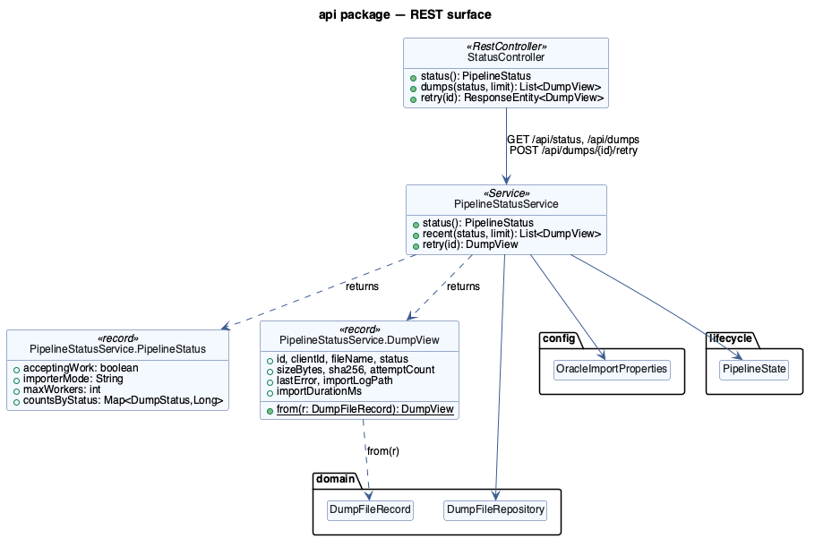
*A thin `@RestController` delegating every decision to `PipelineStatusService`, which is the only
class in this package that touches the repository directly.*

### 11.1 `PipelineStatusService`

**What it is.** The read model (plus one write action) over `DumpFileRecord`, exposed as two DTOs
so the REST layer never leaks JPA entities.

| Method | Detail |
|---|---|
| `status()` | `@Transactional(readOnly = true)`. Builds an `EnumMap<DumpStatus, Long>` by calling `repository.countByStatus(s)` for every enum constant, then wraps it with `pipelineState.isAcceptingWork()`, the configured importer mode, and `maxWorkers` into a `PipelineStatus`. |
| `recent(DumpStatus status, int limit)` | `@Transactional(readOnly = true)`. If `status == null`, uses `repository.findAll(PageRequest.of(0, limit, Sort.by("lastSeenAt").descending()))`; otherwise the more targeted `findByStatusOrderByLastSeenAtDesc(status, Limit.of(limit))`. Maps every result through `DumpView::from`. |
| `retry(long id)` | `@Transactional`. Loads with `findByIdForUpdate` (so a concurrent retry request or in-flight worker can't race this); throws `IllegalArgumentException` if missing, `IllegalStateException` if the record isn't `FAILED`/`MISSING`. On success: `attemptCount = 0`, `lastError = null`, `nextEligibleAt = now`, `transitionTo(PENDING_IMPORT)`. |

**`PipelineStatus` (nested record).** `(boolean acceptingWork, String importerMode, int maxWorkers,
Map<DumpStatus, Long> countsByStatus)` — exactly what `GET /api/status` returns as JSON.

**`DumpView` (nested record).** `(Long id, String clientId, String fileName, String status, long
sizeBytes, String sha256, int attemptCount, String lastError, String importLogPath, Long
importDurationMs)`, plus the static factory `from(DumpFileRecord r)` that does the entity → DTO
mapping in one line. Deliberately **excludes** `absolutePath` and `workerId` from the public view —
not secrets, but not useful to an API consumer either.

```java
// retry() — the exact reset an operator triggers via POST /api/dumps/{id}/retry
record.setAttemptCount(0);
record.setLastError(null);
record.setNextEligibleAt(Instant.now());
record.transitionTo(DumpStatus.PENDING_IMPORT);
```

### 11.2 `StatusController`

**What it is.** `@RestController @RequestMapping("/api")` — no business logic, purely HTTP
plumbing over `PipelineStatusService`.

| Endpoint | Method | Detail |
|---|---|---|
| `GET /api/status` | `status()` | Returns `PipelineStatusService.PipelineStatus` directly — Spring's Jackson message converter serialises the record to JSON. |
| `GET /api/dumps?status=&limit=` | `dumps(DumpStatus status, int limit)` | `status` is `@RequestParam(required = false)` (Spring binds the query string directly to the `DumpStatus` enum, 404-ing on garbage input); `limit` defaults to `50` and is clamped to `[1, 500]` with `Math.clamp` before being passed down — an API consumer cannot request an unbounded result set. |
| `POST /api/dumps/{id}/retry` | `retry(long id)` | Delegates to the service and wraps the result in `ResponseEntity.ok(...)`. Any exception the service throws propagates to Spring's default exception handling (400/500 depending on type) — there's no bespoke `@ExceptionHandler` in this class today. |

---

## 12. `io` — Windows-safe filesystem helpers

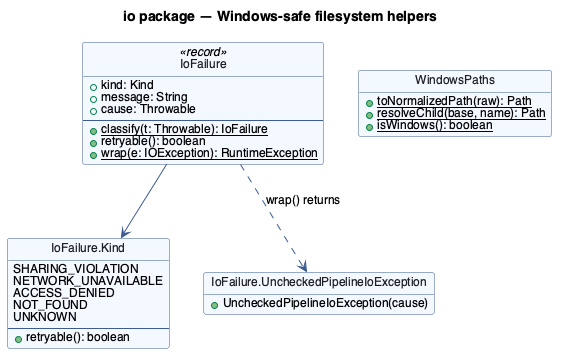
*Two independent utility types: one classifies exceptions, the other normalises paths. Neither
depends on any other package in this codebase.*

### 12.1 `WindowsPaths`

**What it is.** A `final` utility class (private constructor, all-static) — the single place path
strings from configuration get turned into `Path` objects, per `CLAUDE.md` §4/§8/§12.

| Method | Detail |
|---|---|
| `toNormalizedPath(String raw)` | Throws `IllegalArgumentException` on blank input. Detects a UNC root (`\\` or `//` prefix); for UNC, preserves exactly two leading backslashes and converts the rest to backslashes, normalising only if actually running on Windows (`Paths.get("\\\\server\\share").normalize()` behaves oddly on non-Windows JVMs, so it's skipped there — see the note below). For a non-UNC path, converts backslashes to forward slashes and calls `toAbsolutePath().normalize()`. |
| `resolveChild(Path baseDirectory, String childName)` | Thin wrapper over `baseDirectory.resolve(childName)` — exists so call sites read `WindowsPaths.resolveChild(dir, name)` consistently rather than mixing raw `.resolve(...)` calls with the rest of this class's conventions. |
| `isWindows()` | `System.getProperty("os.name").toLowerCase().contains("win")`. |

```java
WindowsPaths.toNormalizedPath("D:/OracleDumps/ClientA");
// -> D:\OracleDumps\ClientA  (absolute, normalized — on Windows)

WindowsPaths.toNormalizedPath("//nas01/oracle-dumps/client-a");
// -> \\nas01\oracle-dumps\client-a  (UNC root preserved)
```

> **NOTE — why UNC paths skip `.normalize()` on non-Windows JVMs.** The dev team runs this service
> on macOS during development (`CLAUDE.md`'s target is Windows Server, but tests/dev run
> cross-platform). `Paths.get("\\\\nas01\\share")` on a POSIX filesystem provider doesn't understand
> UNC semantics and `.normalize()` can mangle it. Keeping the UNC string verbatim on non-Windows
> lets configuration still *bind* and round-trip through `toString()` correctly for logging/tests,
> even though the path obviously can't be opened for real I/O on that machine.

### 12.2 `IoFailure` (record)

**What it is.** `(Kind kind, String message, Throwable cause)` — turns a raw Java IO exception into
one of five buckets the pipeline can make a retry decision from, per `CLAUDE.md` §24/§25.

| Member | Detail |
|---|---|
| `Kind` (nested enum) | `SHARING_VIOLATION(true)`, `NETWORK_UNAVAILABLE(true)`, `ACCESS_DENIED(true)`, `NOT_FOUND(false)`, `UNKNOWN(true)` — the boolean is each kind's default retryability, exposed via `retryable()`. |
| `Rule` (private nested record) | `(Predicate<Throwable> matches, Kind kind)` — one classification rule. |
| `RULES` (private static list) | An **ordered** list of six rules, first match wins: `NoSuchFileException`/"cannot find the file" → `NOT_FOUND`; `AccessDeniedException`/"access is denied" → `ACCESS_DENIED`; "being used by another process"/"sharing violation"/"lock violation" → `SHARING_VIOLATION`; "network path was not found"/"network name...no longer available"/"connection was lost" → `NETWORK_UNAVAILABLE`. |
| `classify(Throwable t)` (static) | Runs `t` through `RULES` in order, defaulting to `Kind.UNKNOWN` if nothing matches. |
| `retryable()` | Delegates to `kind.retryable()`. |
| `wrap(IOException e)` (static) | Returns a `RuntimeException` (specifically `UncheckedPipelineIoException`) wrapping the checked exception, for throwing out of a lambda body (e.g. inside `Files.newDirectoryStream`'s filter or `ChecksumService.hash`'s try-with-resources). |
| `UncheckedPipelineIoException` (nested, `public static final class`) | A marker type so a `catch` block elsewhere can specifically intercept "this came from `IoFailure.wrap`" and re-classify the original cause, distinct from an arbitrary unchecked exception. |
| `messageContains`, `fullMessage`, `describe` (private static) | Walk the full cause chain (capped at 4,000 characters) case-insensitively for the message substrings each rule checks. |

```java
try {
    Files.readAttributes(path, BasicFileAttributes.class);
} catch (IOException e) {
    IoFailure failure = IoFailure.classify(e);
    if (failure.kind() == IoFailure.Kind.NOT_FOUND) {
        // treat as genuinely gone — don't blindly retry
    } else if (failure.retryable()) {
        // schedule a retry — likely AV lock, transient network blip, etc.
    }
}
```

> **NOTE — an `AccessDeniedException` defaults to retryable, not fatal.** On Windows this is
> frequently a *temporary* antivirus or backup-software lock, not a genuine permissions problem
> (`CLAUDE.md` §24). A permanent ACL misconfiguration doesn't need special-casing here — it simply
> keeps failing until `RetryPolicy.canRetry` runs out of attempts and the record lands in `FAILED`
> with the real message preserved in `lastError`.

---

## 13. `lifecycle` — graceful start/stop

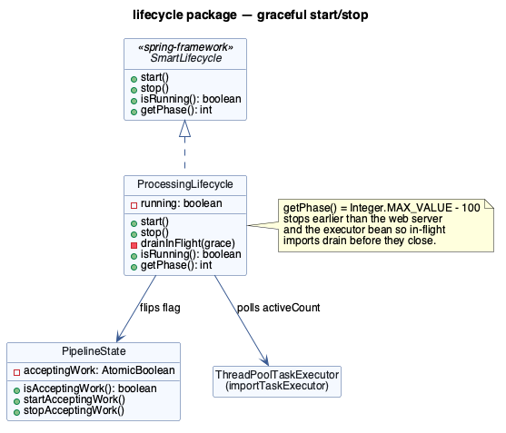
*`PipelineState` is a shared flag; `ProcessingLifecycle` is the only writer of it and the one class
that hooks into Spring's `SmartLifecycle` contract.*

### 13.1 `PipelineState`

**What it is.** One `AtomicBoolean acceptingWork`, defaulting to `true` — the single flag every
scheduler (`ScanScheduler`, `ImportDispatcher`) reads before doing anything.

| Method | Detail |
|---|---|
| `isAcceptingWork()` | `acceptingWork.get()`. |
| `startAcceptingWork()` | `acceptingWork.set(true)`. |
| `stopAcceptingWork()` | `acceptingWork.set(false)`. |

### 13.2 `ProcessingLifecycle`

**What it is.** Implements Spring's `SmartLifecycle` to hook the Windows Service stop signal into
an orderly drain — see `architecture.md` §8 "Graceful shutdown".

| Method | Detail |
|---|---|
| `start()` | Calls `pipelineState.startAcceptingWork()`, sets `running = true`, logs `maxWorkers`/importer mode. Called by Spring during application startup (or explicit `SmartLifecycle` start phase). |
| `stop()` | Logs intent, immediately calls `pipelineState.stopAcceptingWork()` (so the *next* scheduler tick of either scanner or dispatcher becomes a no-op), then blocks in `drainInFlight(shutdownGracePeriod)`, then sets `running = false`. |
| `drainInFlight(Duration grace)` (private) | Polls `importExecutor.getThreadPoolExecutor().getActiveCount()` once a second until it hits `0` or the `grace` deadline (computed once via `System.nanoTime()`) passes. Logs a `WARN` if imports are still running when the grace period elapses — those rows are **not lost**, `StaleRecordReaper.reclaimAll()` will pick them up on the next startup. |
| `isRunning()` | Returns the `volatile boolean running` field. |
| `getPhase()` | `Integer.MAX_VALUE - 100` — a very high phase number, meaning `stop()` is called **early** relative to lower-phase beans (Spring stops higher-phase beans first). This ensures the pipeline stops accepting/draining work *before* the web server and the executor bean itself are torn down. |

```java
// Windows sends a stop signal -> Spring Boot invokes SmartLifecycle.stop() on this bean
pipelineState.stopAcceptingWork();     // scanner/dispatcher next ticks become no-ops immediately
drainInFlight(Duration.ofMinutes(2));  // wait up to 2 minutes for active imports to finish
// anything still running after 2 minutes is simply abandoned here —
// StaleRecordReaper.reclaimAll() resets it to PENDING_IMPORT on the NEXT startup
```

---

## 14. `support` — generic in-call retry

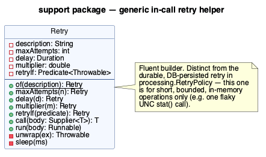
*A small fluent builder — deliberately unrelated to the durable, database-persisted retry in
`processing.RetryPolicy`.*

### 14.1 `Retry`

**What it is.** A generic helper for retrying a short, in-memory operation a few times with a
growing delay — e.g., one flaky `Files.readAttributes` call — **not** for anything that should
survive a process restart (that's what `RetryPolicy` + `DumpFileRecord.nextEligibleAt` are for).

| Method | Detail |
|---|---|
| `of(String description)` (static) | Starts a builder; `description` is only used in the debug log line, to say *what* is being retried. |
| `maxAttempts(int)` | Fluent setter, clamped to `>= 1`. Default `3`. |
| `delay(Duration)` | Fluent setter for the initial delay. Default `200ms`. |
| `multiplier(double)` | Fluent setter for the backoff growth factor. Default `2.0`. |
| `retryIf(Predicate<Throwable>)` | Fluent setter for which exceptions are worth retrying (tested against the **unwrapped** cause, see `unwrap`). Default: retry everything. |
| `call(Supplier<T> body)` | Runs `body.get()` up to `maxAttempts` times. On a `RuntimeException`, checks `attempt == maxAttempts \|\| !retryIf.test(unwrap(ex))` — if either holds, rethrows immediately; otherwise sleeps the current delay (multiplying it by `multiplier` for next time) and tries again. The final failure is rethrown, never swallowed. |
| `run(Runnable body)` | `call(() -> { body.run(); return null; })` — convenience for a body with no return value. |
| `unwrap(RuntimeException)` (private, static) | Returns `ex.getCause()` if present, else `ex` itself — lets `retryIf` test against, e.g., the real `IOException` inside an `IoFailure.UncheckedPipelineIoException` wrapper. |
| `sleep(long ms)` (private, static) | `Thread.sleep`, re-interrupting and **rethrowing** as `IllegalStateException` if interrupted — unlike most sleep-helpers elsewhere in this codebase (which just restore the interrupt flag and continue), an interrupted retry loop here deliberately aborts rather than silently pressing on. |

```java
BasicFileAttributes attrs = Retry.of("stat " + path)
        .maxAttempts(3)
        .delay(Duration.ofMillis(250))
        .retryIf(t -> IoFailure.classify(t).retryable())
        .call(() -> {
            try { return Files.readAttributes(path, BasicFileAttributes.class); }
            catch (IOException e) { throw IoFailure.wrap(e); }
        });
```

> **NOTE — not currently wired into the scanner/processor call sites.** `Retry` exists as a
> ready-to-use helper (and is exercised directly in its own unit tests) but the scanner today
> tolerates a single failed `stat()` by simply skipping that file for this cycle (it'll be picked
> up again next scan) rather than retrying in-call. Reach for `Retry` when a future call site needs
> to succeed *within the current method*, not just "try again next scheduled cycle".

---

## 15. Application entry point

**`OracleDumpApplication`** (package root, `com.demo.oracle_dump`):

```java
@SpringBootApplication
@ConfigurationPropertiesScan
public class OracleDumpApplication {
    public static void main(String[] args) {
        SpringApplication.run(OracleDumpApplication.class, args);
    }
}
```

- `@SpringBootApplication` = `@Configuration` + `@EnableAutoConfiguration` + `@ComponentScan` —
  every `@Component`/`@Service`/`@RestController` shown in this document is discovered by the
  implicit component scan rooted at this class's package.
- `@ConfigurationPropertiesScan` is what lets `OracleImportProperties` be picked up as a
  `@ConfigurationProperties` bean **without** an explicit `@Bean` method or `@EnableConfigurationProperties`
  annotation anywhere else in the codebase — it's discovered purely by being annotated
  `@ConfigurationProperties` and living under this package root.
- No other logic belongs here. If you're tempted to add a `CommandLineRunner` or startup logic to
  this class, it almost certainly belongs in a dedicated `@Component` reacting to
  `ApplicationReadyEvent` instead (see `DumpDirectoryBootstrap` and `OracleClientValidator` for the
  existing pattern).

---

## 16. End-to-end code walkthrough (one dump file)

Tying every package above together for a single file, `clienta_2026_09.dmp`, landing on
`client-a`'s share. Cross-reference with the sequence diagram in `architecture.md` §6
(`images/a03-pipeline.png`) for the visual version of the same flow.

```text
 1. ScanScheduler.scan()                                    [scanner]
      -> DirectoryScanner.scanAll()                          [scanner]
           -> ClientRegistry.enabled()                       [config]   — which clients to scan
           -> ClientDirectoryScanner.scan(clientA)            [scanner]
                -> listDumpFiles(...)  (NIO DirectoryStream)
                -> upsert(...)
                     -> DumpFileRepository.findByClientIdAndAbsolutePath  [domain]
                     -> new DumpFileRecord(...)                          [domain]
                     -> FileStabilityChecker.assess(...)                 [scanner]  — pure fn
                     -> record.transitionTo(STABILIZING | PENDING_IMPORT) [domain]

 2. ImportDispatcher.tick()                                  [processing]
      -> StaleRecordReaper.reclaimStale()                    [processing] — crash recovery, every tick
      -> dispatch()
           -> DumpFileRepository.findClaimable(...)          [domain]
           -> DumpFileRepository.claim(id, instanceId, now)  [domain]   — atomic, status-guarded UPDATE
           -> executor.execute(() -> DumpProcessor.process(id))         [processing.ProcessingConfig pool]

 3. DumpProcessor.process(id)                                [processing]  (worker thread)
      -> ProcessingSteps.beginChecksum(id)                   [processing]  [TX] -> CHECKSUMMING
      -> ChecksumService.hash(path)                          [processing]  [NO TX] — streaming SHA-256
      -> ProcessingSteps.completeChecksum(id, sha256)        [processing]  [TX]
           -> DumpFileRepository.findChecksumSiblings(...)   [domain]      — de-dup check
           -> ImportDecision.Proceed(ImportRequest)          [processing/importer]
      -> ClientRegistry.require("client-a").importPermits()  [config]      — per-client Semaphore
      -> DumpImporter.importDump(request)                    [importer]    [NO TX]
           (MockDumpImporter: writes a transcript, sleeps, returns ImportResult.Success)
      -> ProcessingSteps.recordSuccess(id, success)          [processing]  [TX] -> IMPORTED

 4. Meanwhile, always available:
      GET  /api/status              -> PipelineStatusService.status()     [api]
      GET  /api/dumps?status=FAILED -> PipelineStatusService.recent(...)  [api]
      POST /api/dumps/{id}/retry    -> PipelineStatusService.retry(id)    [api]
      GET  /actuator/health         -> DumpDirectoriesHealthIndicator,
                                        OracleClientHealthIndicator       [health]
```

`WindowsPaths` (io) normalises every path the moment it leaves configuration (§3.2); `IoFailure`
(io) classifies every filesystem exception thrown anywhere in steps 1 and 3; `PipelineState`
(lifecycle) is checked before both step 1 and step 2 run at all, and is flipped to `false` by
`ProcessingLifecycle.stop()` on a Windows Service stop signal.

---

## 17. References

**This project**

- [`architecture.md`](architecture.md) — system-level design: data flow, state machine, concurrency
  model, Windows deployment, security notes. Read this first.
- [`README.md`](README.md) — quick start.
- [`runbook.md`](runbook.md) — step-by-step execution guide with screenshots.
- `CLAUDE.md` — the Windows Server runtime contract that drove every design decision referenced
  above as "`CLAUDE.md` §N".
- Source: `src/main/java/com/demo/oracle_dump/` (this document mirrors its package structure
  exactly). Tests: `src/test/java/com/demo/oracle_dump/` — `PipelineIntegrationTest` exercises the
  full flow in §16 end to end against an in-memory database.

**Java language & platform**

- Records — <https://docs.oracle.com/en/java/javase/21/language/records.html>
- Sealed classes/interfaces (JEP 409) — <https://openjdk.org/jeps/409>
- Pattern matching for `switch` — <https://docs.oracle.com/en/java/javase/21/language/pattern-matching-switch-expressions-and-statements.html>
- `java.nio.file.Path` / `Files` — <https://docs.oracle.com/en/java/javase/21/docs/api/java.base/java/nio/file/Files.html>
- `java.nio.file.DirectoryStream` — <https://docs.oracle.com/en/java/javase/21/docs/api/java.base/java/nio/file/DirectoryStream.html>
- `MessageDigest` / `DigestInputStream` (SHA-256) — <https://docs.oracle.com/en/java/javase/21/docs/api/java.base/java/security/MessageDigest.html>
- `java.util.concurrent` (`Semaphore`, `ThreadPoolExecutor`, `AtomicBoolean`, `AtomicReference`) — <https://docs.oracle.com/en/java/javase/21/docs/api/java.base/java/util/concurrent/package-summary.html>
- `ProcessBuilder` — <https://docs.oracle.com/en/java/javase/21/docs/api/java.base/java/lang/ProcessBuilder.html>
- `HexFormat` — <https://docs.oracle.com/en/java/javase/21/docs/api/java.base/java/util/HexFormat.html>

**Spring / Spring Boot**

- Spring Boot reference — <https://docs.spring.io/spring-boot/index.html>
- `@ConfigurationProperties` / `@ConfigurationPropertiesScan` — <https://docs.spring.io/spring-boot/reference/features/external-config.html>
- Spring Data JPA (derived queries, `@Query`, `@Modifying`, `Limit`) — <https://docs.spring.io/spring-data/jpa/reference/>
- JPA optimistic locking (`@Version`) — <https://docs.spring.io/spring-data/jpa/reference/jpa/locking.html>
- `@Scheduled` / task scheduling — <https://docs.spring.io/spring-framework/reference/integration/scheduling.html>
- `ThreadPoolTaskExecutor` — <https://docs.spring.io/spring-framework/reference/integration/scheduling.html#scheduling-task-executor-types>
- `SmartLifecycle` — <https://docs.spring.io/spring-framework/reference/core/beans/factory-nature.html#beans-factory-lifecycle>
- `TransactionTemplate` (programmatic transactions) — <https://docs.spring.io/spring-framework/reference/data-access/transaction/programmatic.html>
- Spring Boot Actuator (`HealthIndicator`) — <https://docs.spring.io/spring-boot/reference/actuator/index.html>
- Spring MVC `@RestController` — <https://docs.spring.io/spring-framework/reference/web/webmvc/mvc-controller/ann-requestmapping.html>
- Bean Validation (`jakarta.validation`, `@NotBlank`/`@Min`/`@Positive`) — <https://beanvalidation.org/>

**Oracle**

- Oracle Data Pump Import (`impdp`) — <https://docs.oracle.com/en/database/oracle/oracle-database/19/sutil/oracle-data-pump.html>
- `CREATE DIRECTORY` — <https://docs.oracle.com/en/database/oracle/oracle-database/19/sqlrf/CREATE-DIRECTORY.html>
- Original `imp` import utility — <https://docs.oracle.com/en/database/oracle/oracle-database/19/sutil/original-export-and-import.html>

**Windows**

- UNC path formats — <https://learn.microsoft.com/en-us/dotnet/standard/io/file-path-formats>
- Mapped drives and Windows Services — <https://learn.microsoft.com/en-us/troubleshoot/windows-client/networking/mapped-drives-not-available-from-elevated-command>
- System Error Codes (the strings `IoFailure` matches on) — <https://learn.microsoft.com/en-us/windows/win32/debug/system-error-codes>

**Diagramming tools used to produce `images/cn-*.png`**

- PlantUML — <https://plantuml.com/>
- Graphviz (`dot`, PlantUML's rendering backend for these diagrams) — <https://graphviz.org/>
