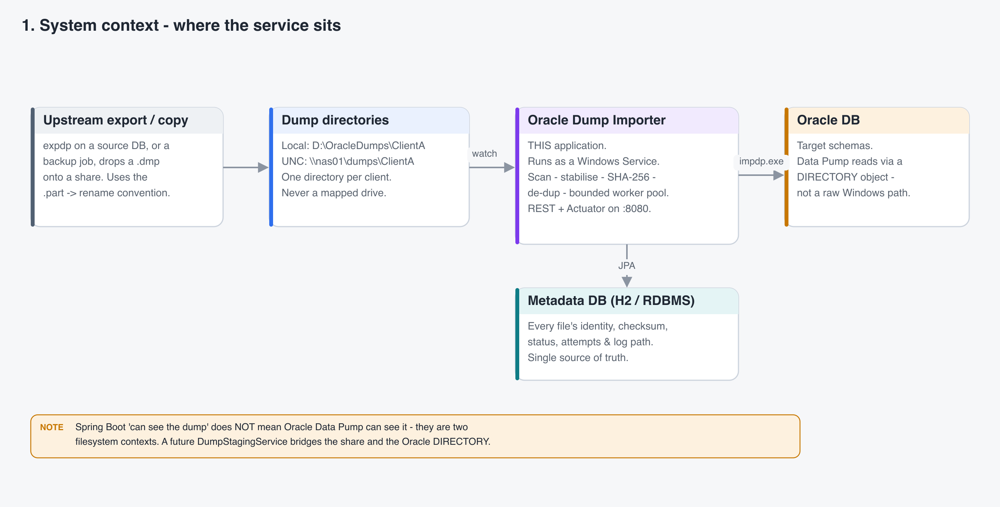
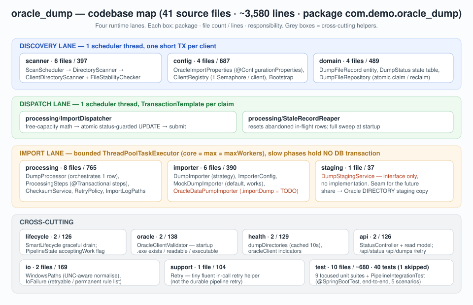
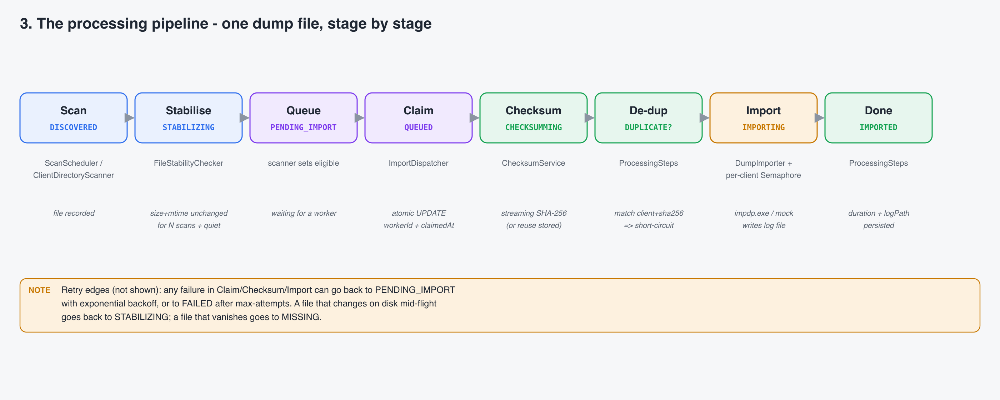
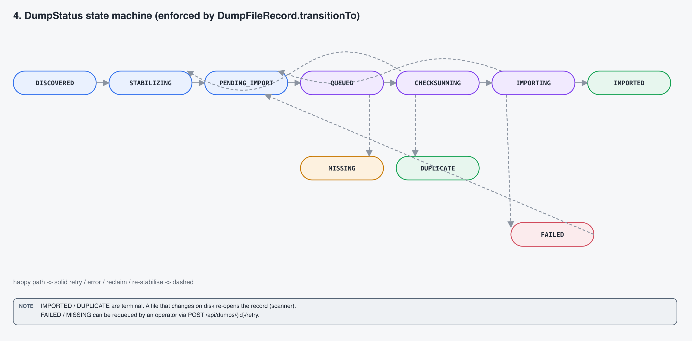
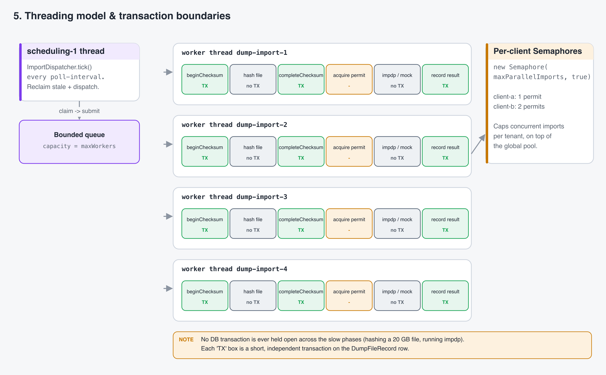
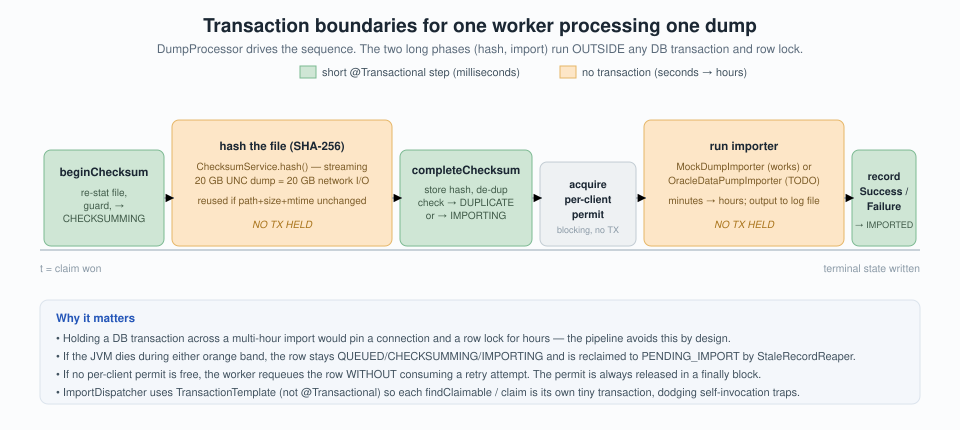
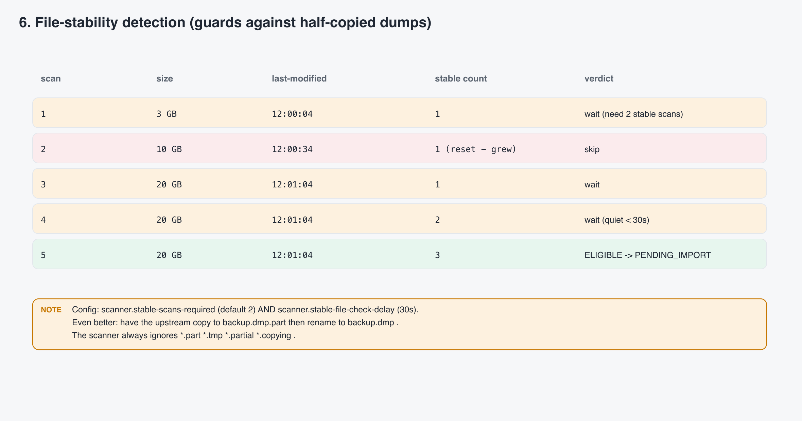
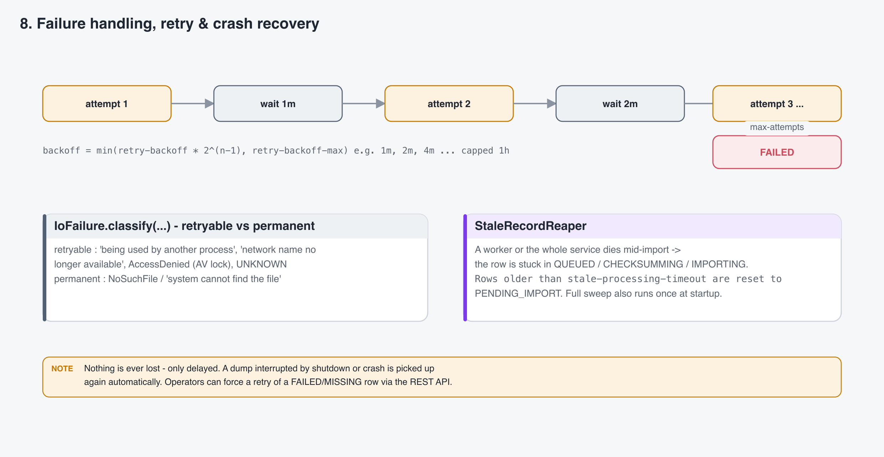
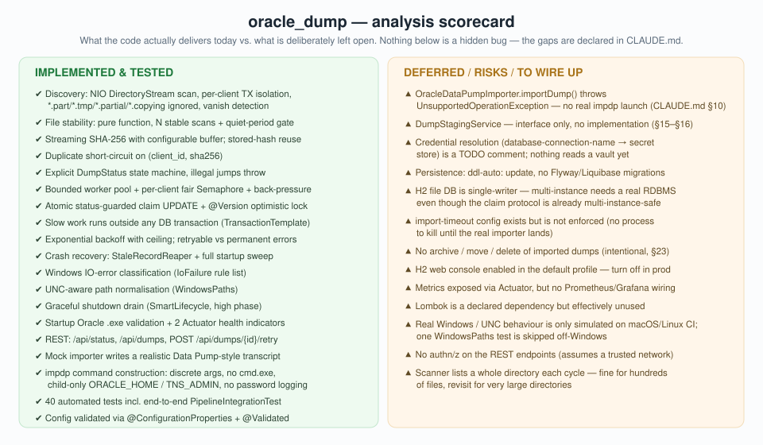

# Oracle Dump Importer — Project Explanation &amp; Code Analysis

> **File note:** the request asked for `oracle_dum.md`; this file is named **`oracle_dump.md`**
> (matching the project folder) so links and tooling resolve. Content is what was asked for.

This document explains, in detail, the code that lives under
[`oracle_dump/`](oracle_dump/) (the Maven project) and then **analyses** it: what it does, how it
is built, why it is built that way, what is proven by tests, and what is deliberately left open.

All diagrams are stored as images under [`images/`](images/) (light background PNG, plus a few
SVG). No diagram source is inlined — each picture is captioned with a short remark and the code it
describes.

---

## Table of contents

1. [What this project is](#1-what-this-project-is)
2. [The problem it solves — a beginner-friendly walkthrough](#2-the-problem-it-solves--a-beginner-friendly-walkthrough)
3. [System context](#3-system-context)
4. [Technology stack](#4-technology-stack)
5. [Codebase map — package by package](#5-codebase-map--package-by-package)
6. [Domain model &amp; metadata schema](#6-domain-model--metadata-schema)
7. [The processing pipeline, stage by stage](#7-the-processing-pipeline-stage-by-stage)
8. [State-machine analysis](#8-state-machine-analysis)
9. [Concurrency &amp; transaction model — analysis](#9-concurrency--transaction-model--analysis)
10. [File-stability detection — analysis](#10-file-stability-detection--analysis)
11. [Duplicate detection — analysis](#11-duplicate-detection--analysis)
12. [Failure handling, retry &amp; crash recovery — analysis](#12-failure-handling-retry--crash-recovery--analysis)
13. [The importer strategy — mock now, `impdp` later](#13-the-importer-strategy--mock-now-impdp-later)
14. [Windows-specific engineering](#14-windows-specific-engineering)
15. [Configuration reference](#15-configuration-reference)
16. [REST &amp; Actuator surface](#16-rest--actuator-surface)
17. [Testing analysis](#17-testing-analysis)
18. [Code-quality analysis — strengths, patterns, risks](#18-code-quality-analysis--strengths-patterns-risks)
19. [What is *not* implemented (and why)](#19-what-is-not-implemented-and-why)
20. [Recommendations &amp; roadmap](#20-recommendations--roadmap)
21. [How to build and run](#21-how-to-build-and-run)
22. [References](#22-references)

---

## 1. What this project is

**Oracle Dump Importer** is a single Spring Boot service that automates a chore normally done by
hand by a DBA: *"a customer dropped an Oracle export file on a share — load it into the right
schema, once, safely, and tell me what happened."*

It **watches one directory per client (tenant)**, and for every Oracle Data Pump `.dmp` file that
appears it:

1. **waits** until the file has finished being copied (a Windows/UNC copy exposes a half-written file);
2. **verifies** the bytes with a streaming **SHA-256**;
3. **de-duplicates** by `client + content hash`, so the same dump is never imported twice;
4. **imports** it through a **bounded pool of worker threads**, with a per-client concurrency cap;
5. records the outcome (`IMPORTED` / `DUPLICATE` / `FAILED` / `MISSING`) and the path to a
   per-import log file in a **metadata database**.

It is designed to run as a **Windows Service** against local drives (`D:\OracleDumps\...`) and UNC
shares (`\\nas01\oracle-dumps\...`). The complete Windows runtime contract that drove every design
decision is in [`oracle_dump/CLAUDE.md`](oracle_dump/CLAUDE.md); this document refers to it as
"`CLAUDE.md` §N".

> **NOTE — mock vs. real import.** Out of the box the importer runs in **`mock`** mode: it makes no
> Oracle contact, writes a realistic-looking log file, and reports success. Real `impdp.exe` /
> `imp.exe` execution is **intentionally unimplemented** until the Oracle deployment architecture
> is confirmed (`CLAUDE.md` §10). *Everything around the import* — discovery, stability, checksum,
> de-dup, threading, retry, lifecycle, health, REST — is fully implemented and tested.

Size at a glance: **41 Java source files, ~3,580 lines** of main code, **~680 lines** of tests,
**40 automated tests** (1 skipped off-Windows).

---

## 2. The problem it solves — a beginner-friendly walkthrough

Imagine you run a SaaS product. Each customer occasionally sends you a database export — a big
binary file called a **dump** (`.dmp`) — and you have to load it into your database so your support
team can investigate. Today a person does this:

- copies the file off a network share,
- waits (how long? who knows) until the copy looks "done",
- runs an Oracle command-line tool to load it,
- checks it didn't already get loaded last week,
- writes the result in a spreadsheet.

Every one of those steps has a failure mode:

| Manual step | What goes wrong | What this service does instead |
|---|---|---|
| "wait until the copy is done" | starts loading a 3 GB slice of a 20 GB file | requires the file's **size + timestamp to stay identical across several scans** *and* be quiet for a grace period |
| "did we already load this?" | same dump loaded twice, data duplicated | computes a **SHA-256** of the content and refuses a second import of the same `client + hash` |
| "run the load tool" | the tool crashes halfway; nobody notices | tracks a **status** per file; a crash is detected and the file is retried automatically |
| "do 5 at once to go faster" | the database server melts | a **bounded thread pool** and a **per-client limit** cap how many run at once |
| "write it in a spreadsheet" | the spreadsheet is stale | every file is a **row in a database** with timestamps, attempt count, error text, and a log-file path |

**A concrete run** (values taken from the project's own test/runbook):

```
t+0s    client drops  clienta_2026_09.dmp  (copied as .dmp.part, then renamed to .dmp)
t+3s    scan #1   -> status STABILIZING     (row created, stable_scan_count = 1)
t+13s   scan #2   -> status STABILIZING     (size+mtime unchanged, count = 2, but file too "fresh")
t+33s   scan #3   -> status PENDING_IMPORT  (2 stable scans AND quiet >= 30s -> eligible)
t+38s   dispatcher claims it -> status QUEUED  (atomic UPDATE, worker_id + claimed_at set)
t+38s   worker: beginChecksum -> CHECKSUMMING (re-checks the file is still there and unchanged)
t+38s   worker: hash the file  (8 000 bytes -> sha256 = 8247c7c8…, ~4 ms; NO DB transaction held)
t+38s   worker: completeChecksum -> IMPORTING (no duplicate found; log path assigned; attempt = 1)
t+38s   worker: acquire the "client-a" permit (max 1)
t+41s   MockDumpImporter returns success  (log file written, simulated PT3S)
t+41s   worker: recordSuccess -> IMPORTED  (import_duration_ms = 3007; permit released)
```

If the service is killed at `t+40s`, the row is left in `IMPORTING`; on next start the
`StaleRecordReaper` resets it to `PENDING_IMPORT` and it runs again. Nothing is lost.

---

## 3. System context



*Where the service sits. An upstream job copies dumps into a folder per client; the service polls
those folders, tracks each file in its own metadata database, and (in a real deployment) calls
Oracle Data Pump. Operators read status and health over HTTP. The service is a **pull** system —
nothing pushes work to it; it polls directories and the database on fixed delays.*

> **NOTE — two filesystem contexts.** "Spring Boot can see the dump file" is **not** the same as
> "Oracle Data Pump can see the dump file." Data Pump reads through an Oracle `DIRECTORY` object on
> the **database server** — often a different machine with a different account. The code keeps
> *source dump directory* and *Oracle `DIRECTORY`* as separate configuration values on purpose
> (`CLAUDE.md` §15, §27, "Important Oracle Rule"). A future `DumpStagingService` bridges them.

---

## 4. Technology stack

| Layer | Choice | Notes |
|---|---|---|
| Language / runtime | **Java 25** | records, sealed interfaces, pattern-matching `switch`, `HexFormat`, text blocks |
| Framework | **Spring Boot 4.1.1** | starters: `web`, `data-jpa`, `actuator`, `validation`, `h2console` |
| Persistence | **Spring Data JPA / Hibernate** | H2 file DB by default; swap the datasource for PostgreSQL / Oracle / SQL Server |
| Scheduling | `@Scheduled` **fixed-delay** | one scheduler thread; heavy work runs on a separate bounded pool |
| Concurrency | `ThreadPoolTaskExecutor` + `java.util.concurrent.Semaphore` | bounded, back-pressured, per-tenant capped |
| Build | **Maven** via the wrapper (`./mvnw`) | `spring-boot-maven-plugin` produces a runnable jar |
| Tests | JUnit 5, AssertJ, Awaitility, `@SpringBootTest` | 40 tests incl. an end-to-end pipeline test |

> **NOTE — why not virtual threads for imports?** A Data Pump import is heavy, long-running,
> mostly *out-of-process* work. Running an unbounded number at once would overwhelm the Oracle
> target and the network. The pool is deliberately **bounded** (`maxWorkers`); virtual threads are
> not used for the import stage. (They would be a reasonable future choice for the *scan* stage if
> the client count grew into the hundreds.)

---

## 5. Codebase map — package by package



*The whole of `src/main/java/com/demo/oracle_dump` at a glance. The four coloured bands are the
runtime lanes; grey boxes are cross-cutting helpers. Line counts are approximate.*

| Package | Files / lines | Responsibility |
|---|---|---|
| `config` | 4 / 687 | `OracleImportProperties` (all `oracle-import.*` config, `@Validated`), `ClientDefinition`, `ClientRegistry` (resolve clients once, one fair `Semaphore` per client), `DumpDirectoryBootstrap` (dev: create missing *local* dirs) |
| `domain` | 4 / 489 | `DumpFileRecord` (the one JPA entity + `transitionTo`), `DumpStatus` (state table), `DumpFileRepository` (claim / reclaim / de-dup queries), `IllegalStateTransitionException` |
| `scanner` | 6 / 397 | `ScanScheduler` → `DirectoryScanner` (per-client failure isolation) → `ClientDirectoryScanner` (NIO `DirectoryStream`, own TX, upsert, vanish-sweep) → `FileStabilityChecker` (pure function); `ScannedFile`, `ScanSummary` records |
| `processing` | 8 / 765 | `ImportDispatcher` (capacity math + atomic claim + submit), `DumpProcessor` (drives one row), `ProcessingSteps` (the short `@Transactional` steps), `ChecksumService` (streaming SHA-256), `RetryPolicy` (exp. backoff), `StaleRecordReaper` (crash recovery), `ImportLogPaths`, `ProcessingConfig` (the pool bean) |
| `importer` | 6 / 390 | `DumpImporter` (`@FunctionalInterface` strategy), `ImporterConfig` (picks the `@Primary` by mode), `MockDumpImporter` (**default, works**), `OracleDataPumpImporter` (**`.importDump` = TODO**), `ImportRequest` / `ImportResult` records |
| `staging` | 1 / 37 | `DumpStagingService` — **interface only, no implementation.** The declared seam for share → Oracle `DIRECTORY` staging |
| `oracle` | 2 / 138 | `OracleClientValidator` (startup: does `impdp.exe` exist / readable / executable?), `OracleExecutableCheck` result record |
| `health` | 2 / 129 | `DumpDirectoriesHealthIndicator` (lightweight, cached 10 s), `OracleClientHealthIndicator` |
| `api` | 2 / 126 | `StatusController` + `PipelineStatusService` — `GET /api/status`, `GET /api/dumps`, `POST /api/dumps/{id}/retry` |
| `io` | 2 / 169 | `WindowsPaths` (UNC-aware normalise, no string concat), `IoFailure` (classify Windows IO errors into retryable / permanent) |
| `support` | 1 / 104 | `Retry` — a tiny fluent in-call retry helper (explicitly *not* the durable pipeline retry) |
| `lifecycle` | 2 / 126 | `ProcessingLifecycle` (`SmartLifecycle` graceful drain), `PipelineState` (`AtomicBoolean acceptingWork`) |

**Reading order for a newcomer:** `DumpStatus` → `DumpFileRecord` → `ClientDirectoryScanner` →
`ImportDispatcher` → `DumpProcessor` → `ProcessingSteps` → `MockDumpImporter`. Then
`PipelineIntegrationTest` ties them together.

---

## 6. Domain model &amp; metadata schema

There is exactly **one JPA entity**, `DumpFileRecord`, mapped to table `dump_file`. It is the
**single source of truth** for what has been seen, hashed and imported.

| Column group | Columns | Purpose |
|---|---|---|
| identity | `id`, `version` (`@Version`), `client_id`, `file_name`, `absolute_path` | PK + optimistic lock; **unique** `(client_id, absolute_path)` |
| on-disk identity | `size_bytes`, `last_modified_epoch_ms` | the **checksum-reuse key** — if these are unchanged the stored hash is trusted |
| content | `sha256` | verified hash, `null` until computed |
| lifecycle | `status` (`DumpStatus` as `VARCHAR`) | see §8 |
| stability | `stable_scan_count`, `first_seen_at`, `last_seen_at`, `present_on_disk` | multi-scan stability + vanish detection |
| dispatch / retry | `next_eligible_at`, `attempt_count`, `worker_id`, `claimed_at` | claim + backoff bookkeeping |
| result | `import_started_at`, `import_finished_at`, `import_duration_ms`, `import_log_path`, `duplicate_of_id` | outcome; **only the log-file *path* is stored, never the log body** |
| error | `last_error` (`@Lob`, truncated to 8 000 chars), `last_error_at` | last failure reason |

Indexes are chosen for the three hot queries:
`(status, next_eligible_at)` for the claim scan, `(client_id, sha256)` for de-dup,
`(status, claimed_at)` for the reaper.

> **NOTE — the `impdp` output is not in the database.** A real Data Pump log can be huge. Only
> `import_log_path` is stored; the transcript goes to
> `logs/imports/<client>/<yyyy>/<MM>/<uuid>.log` (`CLAUDE.md` §22, built by `ImportLogPaths`).

> **NOTE — schema management.** `ddl-auto: update` is used (Hibernate creates/evolves the table).
> That is fine for a single node and development. For production, generate a Flyway/Liquibase
> migration from the entity and switch to `ddl-auto: validate`.

---

## 7. The processing pipeline, stage by stage



*One dump file, left to right. Each stage shows the `DumpStatus` it writes and the class that runs
it. Retry edges are not drawn: any failure in Claim / Checksum / Import can return the row to
`PENDING_IMPORT` (with backoff) or, after `max-attempts`, to `FAILED`; a file that changes on disk
mid-flight returns to `STABILIZING`; a file that vanishes goes to `MISSING`.*

The pipeline is split across **three scheduling contexts**:

1. **Discovery** — `ScanScheduler` fires every `scanner.interval` (fixed-delay, so a slow scan over
   a laggy share never overlaps the next). `DirectoryScanner` loops enabled clients; each client is
   scanned by `ClientDirectoryScanner` **in its own `REQUIRES_NEW` transaction**, so one dead share
   cannot roll back progress for the others. Files are `upsert`-ed into `dump_file`; files that
   were tracked but are no longer on disk are marked (and, if not yet imported, moved to `MISSING`).

2. **Dispatch** — `ImportDispatcher` fires every `processing.poll-interval`. It computes how much
   free worker capacity exists, reads up to that many `PENDING_IMPORT` rows, and **claims each with
   an atomic status-guarded `UPDATE`** (§9). Won rows are submitted to the pool. It also drives the
   `StaleRecordReaper` (a full sweep on the first tick after startup, then only aged rows).

3. **Processing** — `DumpProcessor.process(id)` runs on a pool thread:
   `beginChecksum` (short TX) → hash the file (**no TX**) → `completeChecksum` (short TX, de-dup
   check) → acquire the per-client permit → run the importer (**no TX**) →
   `recordSuccess` / `recordFailure` (short TX). The permit is released in a `finally`.

> **NOTE — the "hash" and "impdp" phases hold no database transaction.** A 20 GB dump on a UNC
> share is 20 GB of network I/O for the checksum, and a real import can run for hours. Holding a DB
> transaction (and row lock) across that would be catastrophic. See §9.

---

## 8. State-machine analysis



*Solid = happy path. Dashed = retry / error / reclaim / re-stabilise. The allowed transitions are
declared **once**, as an `EnumMap<DumpStatus, EnumSet<DumpStatus>>` in `DumpStatus`, and enforced
centrally by `DumpFileRecord.transitionTo(target)` — an illegal jump throws
`IllegalStateTransitionException` rather than silently corrupting a row.*

| State | Meaning | Can move to |
|---|---|---|
| `DISCOVERED` | first seen this scan | `STABILIZING`, `MISSING` |
| `STABILIZING` | size/mtime still moving, or not enough stable scans | `PENDING_IMPORT`, `DISCOVERED`, `MISSING` |
| `PENDING_IMPORT` | eligible; waiting for a worker. **Also the retry re-entry state** | `QUEUED`, `STABILIZING`, `MISSING` |
| `QUEUED` | claimed by the dispatcher, handed to the pool | `CHECKSUMMING`, `STABILIZING`, `PENDING_IMPORT`, `MISSING`, `FAILED` |
| `CHECKSUMMING` | computing / reusing SHA-256 | `IMPORTING`, `DUPLICATE`, `STABILIZING`, `PENDING_IMPORT`, `MISSING`, `FAILED` |
| `IMPORTING` | importer running | `IMPORTED`, `PENDING_IMPORT`, `FAILED`, `MISSING` |
| `IMPORTED` | success — terminal | `DISCOVERED` (only if the file changes on disk) |
| `DUPLICATE` | identical content already imported for this client — terminal | `DISCOVERED` (only if the file changes) |
| `FAILED` | retries exhausted | `PENDING_IMPORT` (operator retry), `DISCOVERED` |
| `MISSING` | file vanished before import completed | `DISCOVERED`, `STABILIZING`, `PENDING_IMPORT` |

**Analysis — what is good here:**

- **Central enforcement.** No component sets `status` directly; they all call `transitionTo`. The
  legal set is one lookup table, easy to audit.
- **Nothing is silently lost.** Every non-terminal state has a path back to `PENDING_IMPORT`. A
  crash or shutdown mid-import is reclaimed; a `FAILED`/`MISSING` row can be requeued by an operator.
- **The table is a real guard-rail, and has caught a regression.** `QUEUED → STABILIZING` was
  originally disallowed; it is needed when a claimed file is restored on disk with a *new* mtime
  (see `PipelineIntegrationTest.vanishedThenRestoredFileRecoversToImported`, and the dedicated unit
  test `DumpStatusTest.claimedRecordCanFallBackToStabilizingWhenFileChangesUnderUs`). The edge was
  added and both tests lock it in.
- `canTransitionTo` treats **self-transitions as always legal** (`this == target`), which is what
  lets the scanner re-`STABILIZING` a row every quiet scan without special-casing.

**Minor observations:** `DumpStatus.isTerminal()` returns `true` only for `IMPORTED`/`DUPLICATE`;
`FAILED` is deliberately *not* terminal (it can be retried). That is a defensible choice but worth
knowing when reading `PipelineStatusService`.

---

## 9. Concurrency &amp; transaction model — analysis



*One scheduler thread feeds a bounded queue; `maxWorkers` threads each run the same six segments;
per-client semaphores add a second, tenant-level cap.*

### Three independent limits

1. **Global pool** — `ProcessingConfig` builds a `ThreadPoolTaskExecutor` with
   `core = max = maxWorkers`, `queueCapacity = maxWorkers`, and `AbortPolicy`. This is the hard
   ceiling on concurrent imports on one node.
2. **Back-pressure at claim time** — `ImportDispatcher.freeCapacity()` computes
   `ceiling − (activeCount + queueSize)` and claims **at most that many** rows per tick. Under
   normal operation the pool is therefore never asked to reject work; `AbortPolicy` is a loud
   safety net, and a rejected row is put straight back to `PENDING_IMPORT` (`steps.requeue`).
3. **Per-client semaphore** — `new Semaphore(maxParallelImports, true)` (fair), created once in
   `ClientRegistry`. A worker calls `tryAcquire(pollInterval seconds)` *before* the import; if no
   permit is free it **requeues without consuming a retry attempt**. Released in a `finally`.

### The claim protocol (safe across threads *and* processes)

```
UPDATE dump_file
   SET status = 'QUEUED', worker_id = :id, claimed_at = :now, version = version + 1
 WHERE id = :id AND status = 'PENDING_IMPORT'
```

Exactly one caller gets `rowcount = 1`; everyone else gets `0` and moves on
(`DumpFileRepository.claim`). Combined with `@Version` optimistic locking on later updates, this
makes running **multiple service instances** against a shared database safe.

> **NOTE — H2 is single-instance.** The claim protocol is *correct* for multi-instance, but H2 file
> mode is not a multi-writer database. For active/active, point `spring.datasource` at PostgreSQL,
> Oracle or SQL Server first (`CLAUDE.md` §19).

### Transaction boundaries



*The two long phases hold no DB transaction and no row lock. `ProcessingSteps` contains only the
short `@Transactional` methods; the slow work happens **between** those calls in `DumpProcessor`.*

| Segment | Transaction? | Why |
|---|---|---|
| `beginChecksum` — re-stat, guard, → `CHECKSUMMING` | short TX | consistent read + state change |
| hash the file | **no TX** | seconds to hours of I/O |
| `completeChecksum` — store hash, de-dup, → `IMPORTING` | short TX | |
| acquire per-client permit | no TX | blocking wait |
| run importer | **no TX** | minutes to hours |
| `recordSuccess` / `recordFailure` | short TX | write outcome |

`ImportDispatcher` uses a `TransactionTemplate` (**not** `@Transactional`) so each `findClaimable`
and each `claim` is its own tiny transaction. This is deliberate: a `@Transactional` method calling
another method *on the same bean* bypasses the Spring proxy, so the annotation would be silently
ignored. Using `TransactionTemplate` sidesteps that trap.

### Graceful shutdown

`ProcessingLifecycle` is a `SmartLifecycle` with a very high phase (`Integer.MAX_VALUE - 100`) so
it stops **before** the web server and the executor bean. On `stop()`:
`PipelineState.stopAcceptingWork()` → scanner and dispatcher skip their next ticks → poll the
executor's active count (logging) for up to `shutdown-grace-period` → return. Anything still
running is reclaimed to `PENDING_IMPORT` by the reaper on the next startup, so a dump is never
lost — only delayed.

**Analysis — verdict:** this is the strongest part of the codebase. The separation of "short DB
step" from "long unsafe work", the double capacity limit, the DB-level claim, and the
crash-recovery sweep together make the pipeline genuinely robust against the failure modes
`CLAUDE.md` calls out. The one caveat is the H2-single-writer limitation, which is documented, not
hidden.

---

## 10. File-stability detection — analysis



*`FileStabilityChecker.assess(record, scanned, now)` is a **pure function** returning
`(stableScanCount, changed, eligible)` — no I/O, no mocking needed to test it.*

```
changed = record.size != scanned.size  OR  record.mtime != scanned.mtime
if changed:                 -> count = 1, eligible = false        (copy still in progress)
else:
    count    = record.count + 1
    quietFor = now - scanned.mtime
    eligible = count >= stable-scans-required  AND  quietFor >= stable-file-check-delay
```

Two independent gates must both pass: **N consecutive unchanged scans** *and* **the file has been
quiet for a grace period**. Files ending `.part` / `.tmp` / `.partial` / `.copying`
(case-insensitive) are filtered out by the `DirectoryStream` filter before they are ever recorded.

**Analysis:**

- Making this a pure function is the right call — `FileStabilityCheckerTest` has four cases
  (size change resets the count; N stable scans + old mtime → eligible; fresh mtime → not eligible;
  one stable scan even if old → not eligible) with **zero mocking**.
- The heuristic is a *fallback*. `CLAUDE.md` §7 recommends the upstream copy to `name.dmp.part`
  and **rename** to `name.dmp` on completion (rename is atomic on one volume); then the scanner
  never sees a partial `.dmp` at all. The code supports both.
- **Edge case handled:** `quietFor.isNegative()` is checked, so a file whose mtime is slightly in
  the future (clock skew between the app host and a file server) does not instantly qualify.
- **Windows filename case:** NTFS is case-insensitive, so `Backup.dmp` and `backup.dmp` are the
  same file. Uniqueness is by `client_id + sha256`, never by filename case (`CLAUDE.md` §5).

---

## 11. Duplicate detection — analysis


*Order of elimination — cheapest first:*

1. **client id** — which tenant owns this path;
2. **path / name** — is there already a `(client_id, absolute_path)` row? (the `UNIQUE` constraint);
3. **file size** vs. the stored size;
4. **last-modified** vs. the stored mtime;
5. **stored metadata** — already `IMPORTED` and unchanged → nothing to do;
6. **SHA-256 (full read)** — only here, and only when a fresh hash is genuinely required.

`ChecksumService` **reuses** a stored hash while `path + size + mtime` are unchanged
(`DumpFileRecord.hasReusableChecksum`). During `completeChecksum`,
`findChecksumSiblings(clientId, sha256, selfId)` looks for another row for the same client with the
same hash in `IMPORTED` / `IMPORTING` / `CHECKSUMMING`; if found, this row becomes `DUPLICATE` with
`duplicate_of_id` set — **no importer run, no log file.**

**Worked example** (`PipelineIntegrationTest.identicalContentForSameClientIsMarkedDuplicate`):
`first.dmp` imports; `second.dmp` has identical bytes but a different name — it is hashed, matches
`first.dmp` on `(client-a, <sha256>)`, and is marked `DUPLICATE` with `duplicateOfId = firstId`.

**Analysis:** the funnel is exactly what `CLAUDE.md` §18 asks for. One subtlety worth noting: the
sibling query includes `IMPORTING` and `CHECKSUMMING`, so **two identical dumps that arrive close
together** don't both import — whichever reaches `completeChecksum` second sees the first as a
sibling and defers to it. De-dup is **per client**: the same bytes for two different tenants are
two legitimate imports.

---

## 12. Failure handling, retry &amp; crash recovery — analysis



### Classifying the error — `IoFailure.classify(Throwable)`

An **ordered list of rules** (`Predicate<Throwable>` + `Kind`); the first match wins; the message
check walks the whole cause chain (up to 4 000 chars).

| Kind | Retryable | Triggers |
|---|---|---|
| `SHARING_VIOLATION` | yes | "being used by another process", "sharing violation", "lock violation" |
| `NETWORK_UNAVAILABLE` | yes | "network name is no longer available", "network path was not found", "connection was lost", "unreachable network" |
| `ACCESS_DENIED` | yes | `AccessDeniedException`, "access is denied" (often a transient AV / backup lock) |
| `NOT_FOUND` | **no** | `NoSuchFileException`, "system cannot find the file/path" |
| `UNKNOWN` | yes | anything unmatched — retried once by the policy |

> **NOTE — an `AccessDeniedException` is not automatically fatal.** On Windows it is frequently a
> temporary lock held by antivirus or backup software (`CLAUDE.md` §24). It is treated as
> retryable; a genuinely permanent ACL problem simply exhausts `max-attempts` and lands in
> `FAILED` with the reason recorded.

### Backoff — `RetryPolicy`

`delayFor(n) = min(retry-backoff · 2^(n−1), retry-backoff-max)` → e.g. `1m, 2m, 4m, 8m, … capped
1h`. The shift is clamped to `[0, 30]` so `1L << shift` cannot overflow. After `max-attempts` a
retryable failure becomes `FAILED`. `next_eligible_at` carries the backoff; the claim query
respects it (`RetryPolicyTest` covers doubling, the cap, the attempt limit, and `nextAttemptAt`).

### Crash recovery — `StaleRecordReaper`

A worker thread or the whole service can die mid-import, leaving a row stuck in
`QUEUED` / `CHECKSUMMING` / `IMPORTING`. `reclaimStale()` (every dispatcher tick) resets rows whose
`claimed_at` is older than `stale-processing-timeout` back to `PENDING_IMPORT`. `reclaimAll()`
runs **once on the first tick after startup** and resets *every* in-flight row regardless of age —
because if the process just started, any in-flight row is by definition abandoned.

### Operator retry

`POST /api/dumps/{id}/retry` on a `FAILED` or `MISSING` row: `attempt_count → 0`,
`last_error → null`, `status → PENDING_IMPORT`, `next_eligible_at → now`. In `impdp` mode a retry
just fails again until `impdp.exe` is reachable — fix the root cause first.

**Analysis — verdict:** the retry story is complete and layered correctly: transient in-call
blips can be absorbed by the `support/Retry` helper; import-level failures use the durable,
persisted backoff on the row; whole-process death is caught by the reaper. `DumpProcessor` also
wraps the importer call so that an unexpected `RuntimeException`, an `UnsupportedOperationException`
(the real importer's TODO), and a wrapped `IOException` are each turned into a sensible
`ImportResult.Failure` rather than killing the worker.

---

## 13. The importer strategy — mock now, `impdp` later

`DumpImporter` is a `@FunctionalInterface`: `ImportRequest → ImportResult`, plus a
`Mode mode()` default. `ImporterConfig` registers every implementation and exposes the one whose
`mode()` matches `oracle-import.importer.mode` as `@Primary`; it **fails fast** if none matches, so
a typo in config cannot silently fall back to mock in production. The rest of the pipeline depends
only on the `@Primary DumpImporter`, so switching modes is a **config-only** change.

`ImportResult` is a **sealed interface** (`Success` | `Failure`) with a `fold(onSuccess, onFailure)`
helper — callers must handle both arms; `DumpProcessor` pattern-matches it with a `switch`.

### `MockDumpImporter` (default — fully working)

Checks the dump is readable, sleeps `mock-duration` to mimic real work, and writes a
realistic Data Pump-style transcript:

```
== MOCK impdp == client=client-a schema=CLIENT_A sha256=… dump=… started=…
Connected to: MOCK Oracle Database
Master table "CLIENT_A"."SYS_IMPORT_SCHEMA_01" successfully loaded
Starting "CLIENT_A"."SYS_IMPORT_SCHEMA_01":  DIRECTORY=CLIENT_A_IMPORT_DIR DUMPFILE=backup.dmp REMAP_SCHEMA=APP:CLIENT_A
Processing object type SCHEMA_EXPORT/TABLE/TABLE_DATA
Bytes processed: 8000
Job "CLIENT_A"."SYS_IMPORT_SCHEMA_01" successfully completed
```

It is also the **reference for the log-file contract** a real importer must honour, and its test
asserts the log never contains the word "password".

### `OracleDataPumpImporter` (`mode: impdp` / `imp` — execution is a TODO)

**What *is* implemented and unit-tested** (`OracleDataPumpImporterTest`, 4 cases):

- `buildProcessBuilder(client, dumpFileName, connectionArgument)` builds the command as
  **discrete `ProcessBuilder` arguments** — `impdp.exe`, `<connect>`, `DIRECTORY=…`,
  `DUMPFILE=…`, `LOGFILE=…`, and (when a source schema is set) `SCHEMAS=…` + `REMAP_SCHEMA=A:B`.
  No `cmd.exe`, no concatenated shell string (`CLAUDE.md` §11–§12).
- `applyOracleEnvironment(childEnv)` sets `ORACLE_HOME` / `TNS_ADMIN` **on the child process
  environment only**, never on the JVM or the server (`CLAUDE.md` §14).
- `mode()` reports `IMPDP` or `IMP` correctly; `requireExecutable()` picks the right configured path.

**What is *not* implemented:** `importDump(...)` throws
`UnsupportedOperationException("… implementation pending — see CLAUDE.md §10")`. The method body is
a numbered TODO describing the intended `pb.start()` → `waitFor(timeout)` → exit-code mapping →
`destroyForcibly()` on timeout → "never log the password" sequence. `DumpProcessor` already treats
that exception as a **retryable** failure, so selecting a real mode today parks dumps in retry
rather than crashing anything.

---

## 14. Windows-specific engineering


The whole project is written to the Windows Server contract in `CLAUDE.md`. Concrete places that
shows up in the code:

| Concern | Code |
|---|---|
| Local **and** UNC paths, forward slashes in YAML | `WindowsPaths.toNormalizedPath` preserves a `\\server\share` root, converts `/` ↔ `\`, normalises to absolute; `WindowsPathsTest` covers both forms |
| Never string-concatenate paths | everything goes through `Path` / `Files` / `DirectoryStream` (`CLAUDE.md` §4, §8) |
| No mapped drives (`Z:`) for a service | `ClientDefinition` docs say so; config examples use UNC |
| Partial-copy files | ignore-suffix filter + multi-scan stability (§10) |
| Windows IO error strings | `IoFailure` rule list maps them to retryable / permanent (§12) |
| Antivirus / backup locks | `ACCESS_DENIED` and `SHARING_VIOLATION` are retryable |
| Missing share at boot | `ClientDirectoryScanner` logs and returns `unavailable()`; the app still starts; `DumpDirectoriesHealthIndicator` reports `OUT_OF_SERVICE`, not `DOWN` (`CLAUDE.md` §29) |
| Oracle CLI may be absent | `OracleClientValidator` checks at startup, not at first 20 GB import (`CLAUDE.md` §13) |
| `impdp` reads via a `DIRECTORY` object, not a path | `oracle-directory-name` is a separate config value; `OracleDataPumpImporter` puts `DIRECTORY=<name>` in the command |
| H2 not on a share | comment in `application.yaml`; `DumpDirectoryBootstrap` never creates UNC dirs |
| Deployable as a service | `SmartLifecycle` drain; no dependency on WinSW/NSSM specifically (`CLAUDE.md` §20) |
| Don't delete the dump after import | there is simply no delete/move code — the original is left untouched (`CLAUDE.md` §23) |

> **NOTE — running on macOS/Linux for development.** On a non-Windows JVM the `oracle-client` paths
> (`C:\Oracle\...`) obviously don't exist; in `mock` mode that is a harmless `WARN` at startup and
> nothing else. One `WindowsPaths` test is `@DisabledOnOs(WINDOWS)` / its pair is
> `@EnabledOnOs(WINDOWS)`, which is why the suite reports "1 skipped" off Windows.

---

## 15. Configuration reference

Everything lives under the `oracle-import.*` prefix, bound to `OracleImportProperties`
(`@ConfigurationProperties` + `@Validated`, with `@Min` / `@NotNull` / `@NotBlank` constraints).
Durations accept `30s`, `2h`, or ISO-8601 `PT30S`.

```yaml
oracle-import:

  scanner:
    enabled: true
    interval: 30s                 # delay between scan cycles (fixed-delay; never overlaps)
    stable-file-check-delay: 30s  # file mtime must be at least this old to be eligible
    stable-scans-required: 2      # consecutive unchanged scans required (min 2)
    ignore-suffixes: [".part", ".tmp", ".partial", ".copying"]
    dump-suffixes: [".dmp"]
    create-missing-directories: false   # dev only; local dirs only, never UNC

  processing:
    enabled: true
    max-workers: 4                # global bounded import pool
    poll-interval: 10s            # dispatcher tick
    stale-processing-timeout: 2h  # reaper threshold for abandoned in-flight rows
    max-attempts: 5
    retry-backoff: 1m
    retry-backoff-max: 1h
    dispatch-batch-size: 50
    shutdown-grace-period: 2m     # drain window for in-flight imports on stop

  checksum:
    algorithm: SHA-256
    buffer-size-mb: 8             # larger helps on high-latency UNC shares

  oracle-client:                  # Windows .exe paths — forward slashes are fine in YAML
    impdp-path:  "C:/Oracle/product/19c/client_1/bin/impdp.exe"
    imp-path:    "C:/Oracle/product/19c/client_1/bin/imp.exe"
    sqlplus-path:"C:/Oracle/product/19c/client_1/bin/sqlplus.exe"
    oracle-home: "C:/Oracle/product/19c/client_1"
    tns-admin:   "C:/Oracle/network/admin"
    validate-on-startup: true
    fail-startup-on-missing-executable: false   # true => real mode aborts startup on a bad path

  importer:
    mode: mock                    # mock | impdp | imp   (impdp/imp execution is a TODO)
    mock-duration: 2s
    import-log-root: "./logs/imports"   # keep on LOCAL disk, not a share
    import-timeout: 6h            # declared; enforced only once the real importer lands

  clients:
    - client-id: client-a
      enabled: true
      dump-directory: "//nas01/oracle-dumps/client-a"   # UNC or local; NEVER a mapped drive
      source-schema: APP                                 # REMAP_SCHEMA source (optional)
      target-schema: CLIENT_A
      oracle-directory-name: CLIENT_A_IMPORT_DIR         # Oracle DIRECTORY object, not a path
      database-connection-name: production-oracle        # resolved later, from a secret store
      max-parallel-imports: 1
```

**Profiles shipped:**

| Profile | Datasource | Clients | Use |
|---|---|---|---|
| default (`application.yaml`) | file H2 `./data/oracle-import` | none | safe baseline; mock |
| `dev` (`application-dev.yaml`) | in-memory H2 | `client-a`, `client-b` under `./var/oracle-dumps/*` (auto-created) | local runs; fast timings; `DEBUG` logging |
| test (`src/test/resources`) | in-memory H2 | none | schedulers **disabled** so tests drive `scanAll()` / `dispatch()` deterministically |

> **NOTE — `dump-directory` vs `oracle-directory-name`.** The first is where **Spring Boot** looks
> for files. The second names an Oracle `DIRECTORY` object the **database** reads through. They are
> modelled separately on purpose (`CLAUDE.md` §27) — do not assume they are equal.

---

## 16. REST &amp; Actuator surface

| Method &amp; path | Purpose |
|---|---|
| `GET /api/status` | counts by `DumpStatus`, importer `mode`, `maxWorkers`, `acceptingWork` flag |
| `GET /api/dumps?status=FAILED&limit=50` | recent rows (all, or filtered by status; `limit` clamped 1–500) |
| `POST /api/dumps/{id}/retry` | requeue a `FAILED` / `MISSING` row (rejects any other status) |
| `GET /actuator/health` | overall + `db`, `diskSpace`, `dumpDirectories`, `oracleClient` |
| `GET /actuator/metrics`, `/loggers`, `/info` | JVM &amp; pool metrics; runtime log-level changes |
| `GET /h2-console` | H2 web console (default profile only — **disable in production**) |

`dumpDirectories` reports `OUT_OF_SERVICE` (not `DOWN`) when a share is unreachable — a
temporarily missing share is expected and recoverable. `oracleClient` is `UP` (informational) in
`mock` mode and `OUT_OF_SERVICE` in a real mode with a broken executable path.

**Analysis:** the API is intentionally tiny — a read model plus one operator action. There is **no
authentication** on it; the design assumes a trusted internal network / a Windows Service on a
locked-down host. If it is ever exposed more widely, put Spring Security in front of `/api/**`.

---

## 17. Testing analysis

**40 tests, 1 skipped off-Windows.** `./mvnw test` runs them all; the end-to-end suite takes
~26 s (it uses real `Thread.sleep`-style waits via Awaitility), the rest are sub-second.

| Suite | Tests | What it proves |
|---|---|---|
| `PipelineIntegrationTest` (`@SpringBootTest`) | 5 | end-to-end: stable file → `IMPORTED`; a still-growing file stays `STABILIZING`; `*.part`/`*.tmp` ignored; vanish → `MISSING` → restore → retry → `STABILIZING` → `IMPORTED`; identical bytes → `DUPLICATE` |
| `DumpStatusTest` | 6 | legal vs illegal transitions; retry edges; the `QUEUED → STABILIZING` regression edge; `transitionTo` throws; `isInFlight` / `isTerminal` |
| `FileStabilityCheckerTest` | 4 | size change resets count; N stable + old mtime → eligible; fresh mtime → not; one scan → not |
| `IoFailureTest` | 6 | each Windows error string → correct `Kind` + retryable flag; cause-chain walk; unknown → retryable |
| `RetryPolicyTest` | 4 | exponential doubling; cap at max; attempt limit; `nextAttemptAt` |
| `ChecksumServiceTest` | 2 | known SHA-256 of "hello world"; multi-buffer read of a 2.5 MB file |
| `MockDumpImporterTest` | 2 | writes a log with `REMAP_SCHEMA=APP:CLIENT_A` and "successfully completed", never "password"; missing dump → retryable failure |
| `OracleDataPumpImporterTest` | 4 | `importDump` throws (TODO); discrete args, no `cmd.exe`; `ORACLE_HOME`/`TNS_ADMIN` on child only; `mode()` correct |
| `WindowsPathsTest` | 6 (1 skipped) | blank rejected; local path absolute+normalised; UNC preserved (`//` and `\\`); `resolveChild` uses NIO |
| `OracleDumpApplicationTests` | 1 | the Spring context loads |

**Analysis — what is well covered:** the pure logic (stability, retry, IO classification, checksum,
state table) is exhaustively unit-tested with no mocking; the integration test exercises the real
scheduler-free path including the two nastiest cases (mid-flight vanish/restore, and content
de-dup). **What is thin:** there is no test for the dispatcher's *capacity math* under contention,
no multi-client concurrency test, and (unavoidably) no test of real `impdp` execution or of true
Windows/UNC semantics — CI runs on macOS/Linux. The `PipelineIntegrationTest` disables the
`@Scheduled` triggers and calls `scanner.scanAll()` / `dispatcher.dispatch()` directly, which is
the right way to keep an async pipeline test deterministic.

---

## 18. Code-quality analysis — strengths, patterns, risks



### Design patterns &amp; Java techniques actually used

| Pattern / technique | Where | Payoff |
|---|---|---|
| **Strategy** (functional interface) | `DumpImporter`, chosen by `ImporterConfig` | mock ↔ real `impdp` is a config flag; a test importer is a one-line lambda |
| **Sealed types + exhaustive `switch`** | `ImportResult.{Success,Failure}`, `ProcessingSteps.ImportDecision.{Proceed,Duplicate,Aborted}` | the compiler forces every outcome to be handled |
| **Explicit state machine** | `DumpStatus` table + `DumpFileRecord.transitionTo` | illegal lifecycle jumps throw, not corrupt data |
| **Rule list of predicates** | `IoFailure` — `List<Rule(Predicate<Throwable>, Kind)>` | a new Windows error string is one line |
| **Pure function** | `FileStabilityChecker.assess` | unit-testable with zero mocking |
| **Builder / fluent API** | `Retry.of(...).maxAttempts(n).delay(d).retryIf(pred).call(supplier)` | readable in-call retry |
| **Template method via `TransactionTemplate`** | `ImportDispatcher` | short explicit transactions, no self-invocation proxy trap |
| **Registry** | `ClientRegistry` | resolve config once; owns the per-client semaphores |
| **Records for DTOs** | `ImportRequest`, `ScannedFile`, `ScanSummary`, `ChecksumWork`, all API views | immutable, no boilerplate |
| **Lifecycle hook** | `ProcessingLifecycle implements SmartLifecycle` | deterministic graceful drain |

### Strengths

- **Clear separation of concerns** — 12 small packages, each with one job; the four runtime lanes
  are visible in the package layout.
- **The hard parts are the well-built parts** — concurrency, transactions, crash recovery, and the
  state machine are careful and tested.
- **Every risky assumption is documented** — the code cites `CLAUDE.md §N` inline where a Windows
  or Oracle constraint drove a decision.
- **Fails fast on misconfiguration** — unknown importer mode, duplicate `client-id`, blank path,
  invalid durations all throw at startup.
- **Security hygiene in the importer** — discrete process args, no `cmd.exe`, child-only env, an
  explicit "never log the password" rule, and a test that asserts the mock log has no "password".

### Risks / weaknesses (all documented, none hidden)

- **The headline feature — real `impdp` execution — is a TODO** (§13, §19). In `mock` mode the
  service is fully functional; in a real mode it parks every dump in retry.
- **`DumpStagingService` is an empty interface.** Bridging the "Spring sees it" / "Oracle sees it"
  filesystem gap is unimplemented by design (`CLAUDE.md` §16).
- **Persistence is dev-grade**: H2 file DB, `ddl-auto: update`, no migrations. Multi-instance needs
  a real RDBMS first (the claim protocol is already safe for it).
- **`import-timeout` is declared but not enforced** — there is no child process to kill yet.
- **No auth on `/api/**`**; **H2 console on** in the default profile.
- **Lombok** is a declared dependency and annotation-processor path but is effectively unused —
  dead weight in the build.
- **CI cannot exercise real Windows/UNC behaviour** — those paths are simulated on macOS/Linux.
- Minor: the directory scan lists the whole folder each cycle — fine for hundreds of files, worth
  revisiting for very large directories.

---

## 19. What is *not* implemented (and why)

| Item | Status | Reason |
|---|---|---|
| Real `impdp.exe` / `imp.exe` execution | **TODO** — command construction done &amp; tested; `.start()` + exit handling pending | Oracle deployment architecture (DIRECTORY, staging, credentials) not confirmed (`CLAUDE.md` §10) |
| `DumpStagingService` (share → Oracle `DIRECTORY` copy) | **interface only** | must wait for the real topology (`CLAUDE.md` §16) |
| Credential resolution (`database-connection-name` → secret store) | **TODO comment** | wire to the platform's secret manager, not `application.yml` |
| DB migrations (Flyway / Liquibase) | not present; `ddl-auto: update` | acceptable for single-node / dev |
| Multi-instance (active/active) | claim protocol is safe; needs a real RDBMS | H2 file mode is single-writer (`CLAUDE.md` §19) |
| Archive / delete of imported dumps | intentionally **not** done | leave the original untouched, record `IMPORTED` (`CLAUDE.md` §23) |
| `import-timeout` enforcement | declared, not wired | nothing to time out until the real importer exists |
| Auth on REST endpoints | none | assumes a trusted network / locked-down host |
| Metrics dashboards / alerting | Actuator metrics exposed; no Prometheus/Grafana wiring | left to the platform |

---

## 20. Recommendations &amp; roadmap

**To make it production-ready, in order:**

1. **Move off H2** — point `spring.datasource` at PostgreSQL / Oracle / SQL Server; add
   Flyway; set `ddl-auto: validate`.
2. **Implement `OracleDataPumpImporter.importDump`** following the numbered TODO: `pb.start()` →
   `waitFor(import-timeout)` → map exit code to `success` / `retryableFailure` / `permanentFailure`
   → `destroyForcibly()` on timeout. Redirect stdout+stderr to `request.importLogPath()`. Add an
   integration test with a fake `impdp` script.
3. **Resolve credentials** from a secret store keyed by `database-connection-name`; never log them.
4. **Decide the staging architecture** and implement `DumpStagingService` (or confirm the dump
   already lives on an Oracle-reachable share and skip it).
5. **Harden the edges** — Spring Security on `/api/**`, `spring.h2.console.enabled: false` in prod,
   drop the unused Lombok dependency, wire Actuator metrics to your monitoring.
6. **Add concurrency tests** — dispatcher capacity math under contention; two clients importing in
   parallel; the reaper reclaiming a genuinely stuck row.
7. **Run the test suite on a Windows runner** so UNC and `.exe` behaviour is actually exercised.

**Nice-to-haves:** configurable post-import archive/move; a small status UI over `/api/status`;
virtual threads for the *scan* stage if the client count grows large.

---

## 21. How to build and run

The Maven project is the **`oracle_dump/` subfolder** of this repo (it contains `pom.xml`).

```bash
cd oracle_dump

# run all 40 tests
./mvnw test                     # mvnw.cmd on Windows

# dev profile: in-memory H2, ./var/oracle-dumps/client-a & client-b auto-created, mock importer
./mvnw spring-boot:run -Dspring-boot.run.profiles=dev
#   then drop a .dmp into ./var/oracle-dumps/client-a and watch the logs / GET /api/status

# default profile: file-based H2, no clients configured (safe baseline)
./mvnw spring-boot:run
```

Requirements: **JDK 25**, port **8080** free. An Oracle client is needed **only** for
`importer.mode: impdp` / `imp` — not for the default `mock` mode. Full step-by-step build / run /
feed / verify / recover instructions with screenshots are in
[`oracle_dump/runbook.md`](oracle_dump/runbook.md); the deep architecture write-up is
[`oracle_dump/architecture.md`](oracle_dump/architecture.md).

---

## 22. References

### This project

- [`oracle_dump/CLAUDE.md`](oracle_dump/CLAUDE.md) — the Windows Server runtime contract that drove
  every design decision (cited inline as "`CLAUDE.md` §N").
- [`oracle_dump/architecture.md`](oracle_dump/architecture.md) — full architecture, design
  rationale, config reference, Windows deployment.
- [`oracle_dump/runbook.md`](oracle_dump/runbook.md) — step-by-step operator guide with
  screenshots, including how to inspect the H2 metadata database.
- [`oracle_dump/README.md`](oracle_dump/README.md) — quick start and a condensed feature table.
- Source: `oracle_dump/src/main/java/com/demo/oracle_dump/` — packages `config`, `domain`,
  `scanner`, `processing`, `importer`, `staging`, `oracle`, `health`, `api`, `io`, `support`,
  `lifecycle`.
- Tests: `oracle_dump/src/test/java/com/demo/oracle_dump/` — `PipelineIntegrationTest` is the
  end-to-end reference.
- Diagrams in this document: [`images/od-*.png`](images/) (copied from the project's own
  `architecture.md` figures) and [`images/od-*.svg`](images/) (code map, transaction timeline,
  analysis scorecard, authored for this write-up).

### Oracle

- Oracle Data Pump (`impdp`) — <https://docs.oracle.com/en/database/oracle/oracle-database/19/sutil/oracle-data-pump.html>
- `CREATE DIRECTORY` — <https://docs.oracle.com/en/database/oracle/oracle-database/19/sqlrf/CREATE-DIRECTORY.html>
- Original `imp` import utility — <https://docs.oracle.com/en/database/oracle/oracle-database/19/sutil/original-export-and-import.html>

### Spring / Java

- Spring Boot reference — <https://docs.spring.io/spring-boot/index.html>
- `@ConfigurationProperties` — <https://docs.spring.io/spring-boot/reference/features/external-config.html>
- Spring Framework `SmartLifecycle` — <https://docs.spring.io/spring-framework/reference/core/beans/factory-nature.html#beans-factory-lifecycle>
- Task scheduling (`@Scheduled`) — <https://docs.spring.io/spring-framework/reference/integration/scheduling.html>
- Spring Data JPA — <https://docs.spring.io/spring-data/jpa/reference/>
- Spring Boot Actuator — <https://docs.spring.io/spring-boot/reference/actuator/index.html>
- `java.util.concurrent` (Executors, Semaphore) — <https://docs.oracle.com/en/java/javase/21/docs/api/java.base/java/util/concurrent/package-summary.html>
- Java NIO `Files` / `Path` — <https://docs.oracle.com/en/java/javase/21/docs/api/java.base/java/nio/file/Files.html>
- `MessageDigest` (SHA-256) — <https://docs.oracle.com/en/java/javase/21/docs/api/java.base/java/security/MessageDigest.html>
- `ProcessBuilder` — <https://docs.oracle.com/en/java/javase/21/docs/api/java.base/java/lang/ProcessBuilder.html>
- JEP 409 — Sealed Classes — <https://openjdk.org/jeps/409>

### Windows

- UNC / file path formats — <https://learn.microsoft.com/en-us/dotnet/standard/io/file-path-formats>
- Services and mapped drives — <https://learn.microsoft.com/en-us/troubleshoot/windows-client/networking/mapped-drives-not-available-from-elevated-command>
- System Error Codes — <https://learn.microsoft.com/en-us/windows/win32/debug/system-error-codes>
- WinSW — <https://github.com/winsw/winsw> · NSSM — <https://nssm.cc/>
