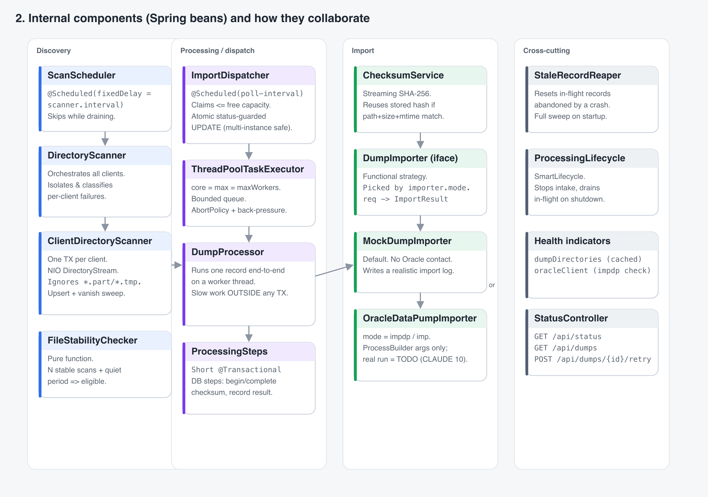
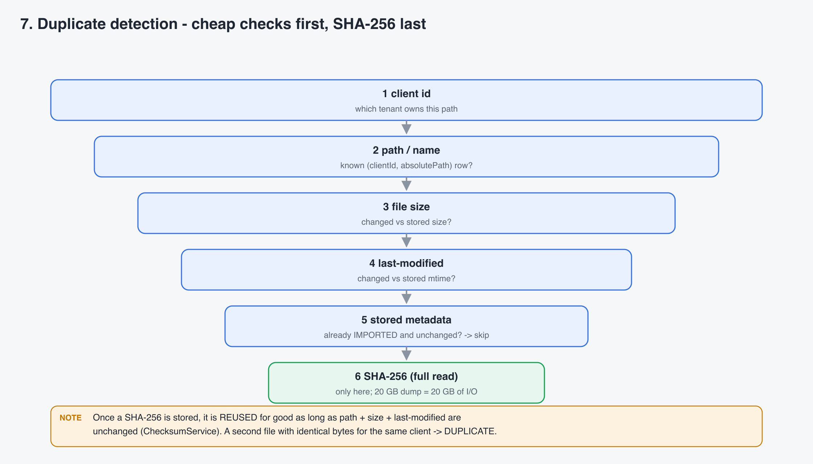
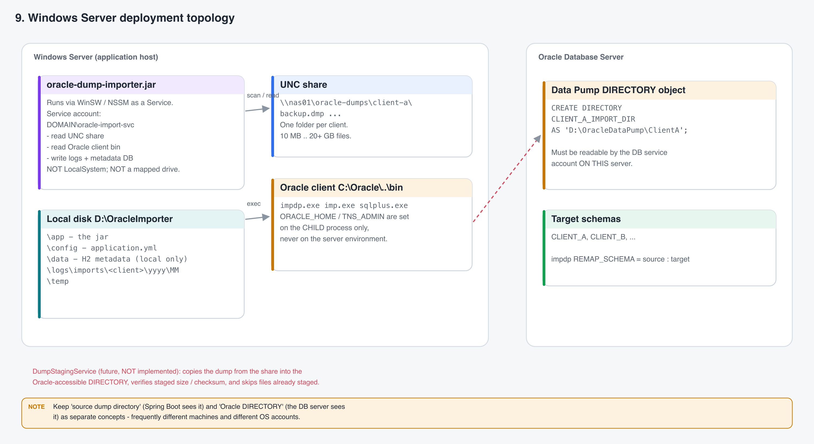

# Architecture — Oracle Dump Importer

> File name note: the request asked for `architech.md`; this file is named `architecture.md`
> (correct spelling) so tooling and readers can find it. Content is identical to what was asked for.

**Audience:** engineers and operators who need to understand *how* the service works, *why* it is
built this way, and *where* to extend it.
**Scope:** the whole application as it stands today (mock importer live, real `impdp` execution
deliberately left as a `TODO` per `CLAUDE.md` §10).

All diagrams are stored as PNG (light background) under [`images/`](images/). Each is captioned with
the source component so you can jump straight to the code.

---

## Table of contents

1. [What the service does](#1-what-the-service-does)
2. [System context](#2-system-context)
3. [Technology stack](#3-technology-stack)
4. [Component architecture](#4-component-architecture)
5. [Domain model & metadata schema](#5-domain-model--metadata-schema)
6. [The processing pipeline, stage by stage](#6-the-processing-pipeline-stage-by-stage)
7. [State machine](#7-state-machine)
8. [Concurrency & transaction model](#8-concurrency--transaction-model)
9. [File-stability detection](#9-file-stability-detection)
10. [Duplicate detection](#10-duplicate-detection)
11. [Failure handling, retry & crash recovery](#11-failure-handling-retry--crash-recovery)
12. [Configuration reference](#12-configuration-reference)
13. [REST & Actuator surface](#13-rest--actuator-surface)
14. [Windows Server deployment](#14-windows-server-deployment)
15. [Design patterns & Java techniques](#15-design-patterns--java-techniques)
16. [Security notes](#16-security-notes)
17. [Known limitations & roadmap](#17-known-limitations--roadmap)
18. [References](#18-references)

---

## 1. What the service does

The service continuously watches one directory per **client** (tenant), and for every Oracle
Data Pump `.dmp` file that lands there it:

1. **waits** until the file has finished being copied (Windows/UNC copies expose a partial file);
2. **verifies** it with a streaming **SHA-256**;
3. **de-duplicates** by `client + content hash` so the same dump is never imported twice;
4. **imports** it through a **bounded pool of worker threads**, with a per-client concurrency cap;
5. records the outcome (`IMPORTED` / `DUPLICATE` / `FAILED` / `MISSING`) and the path to a
   per-import log file in a **metadata database**.

It is designed to run as a **Windows Service** against local drives (`D:\OracleDumps\...`) and UNC
shares (`\\nas01\oracle-dumps\...`). See `CLAUDE.md` for the full Windows runtime contract.

> **NOTE — mock vs. real import.** Out of the box the importer is `mock`: it performs no Oracle
> contact, writes a realistic-looking log, and reports success. Real `impdp.exe` / `imp.exe`
> execution is intentionally unimplemented until the Oracle deployment architecture is confirmed
> (`CLAUDE.md` §10). Everything *around* the import — discovery, stability, checksum, de-dup,
> threading, retry, lifecycle — is fully implemented and tested.

---

## 2. System context


*Where the service sits. Components: upstream export/copy → dump directories → this application →
Oracle DB; metadata DB attached via JPA.*

The service is a **pull** system: nothing pushes work to it. It polls the configured directories and
the metadata DB on fixed delays.

> **NOTE — two filesystem contexts.** "Spring Boot can see the dump file" is **not** the same as
> "Oracle Data Pump can see the dump file." Data Pump reads through an Oracle `DIRECTORY` object on
> the **database server**, which is frequently a different machine with a different service account.
> The architecture keeps *source dump directory* and *Oracle DIRECTORY* as separate concepts; a
> future `DumpStagingService` (interface only today) bridges them. See §14.

---

## 3. Technology stack

| Layer | Choice | Notes |
|---|---|---|
| Language / runtime | **Java 25** | records, sealed types, pattern-matching `switch`, `HexFormat` |
| Framework | **Spring Boot 4.1** | `spring-boot-starter-web`, `-data-jpa`, `-actuator`, `-validation` |
| Persistence | **Spring Data JPA / Hibernate** | H2 file DB by default; swap the datasource for PostgreSQL/Oracle/SQL Server |
| Scheduling | `@Scheduled` fixed-delay | one scheduler thread; work runs on a separate bounded pool |
| Concurrency | `ThreadPoolTaskExecutor` + `java.util.concurrent.Semaphore` | bounded, back-pressured |
| Build | **Maven** (`./mvnw`) | `spring-boot-maven-plugin` produces a runnable jar |
| Tests | JUnit 5, AssertJ, Awaitility, `@SpringBootTest` | 40 tests incl. an end-to-end pipeline test |

> **NOTE — why not virtual threads for imports?** A Data Pump import is heavy, long-running,
> largely out-of-process work. Running an unbounded number concurrently would overwhelm the Oracle
> target and the network. The pool is deliberately **bounded** (`maxWorkers`), and virtual threads
> are not used for the import stage. Virtual threads would be a fine future choice for the *scan*
> stage if the number of clients grew large.

---

## 4. Component architecture


*Spring beans grouped into four lanes: Discovery, Processing/dispatch, Import, Cross-cutting.*

### Discovery lane

| Bean | Responsibility |
|---|---|
| `ScanScheduler` | `@Scheduled(fixedDelay = scanner.interval)` trigger. Skips a cycle while the pipeline is draining. |
| `DirectoryScanner` | Orchestrates a scan across **all** enabled clients. Catches, classifies and isolates per-client failures so one dead share never stops the others. |
| `ClientDirectoryScanner` | Scans **one** client inside **its own transaction**. NIO `DirectoryStream` with a filter; ignores `*.part/*.tmp/*.partial/*.copying`; upserts metadata rows; sweeps rows whose file has vanished. |
| `FileStabilityChecker` | **Pure function** — given the stored row + the current on-disk `size`/`mtime`, decides "still copying" / "needs more scans" / "eligible". |

### Processing / dispatch lane

| Bean | Responsibility |
|---|---|
| `ImportDispatcher` | `@Scheduled(fixedDelay = processing.poll-interval)`. Measures free worker capacity, **claims only that many** `PENDING_IMPORT` rows with an atomic status-guarded `UPDATE`, and submits each to the pool. Also triggers the reaper. |
| `ThreadPoolTaskExecutor` (`importTaskExecutor`) | `core = max = maxWorkers`, bounded queue, `AbortPolicy`. The hard ceiling on concurrent imports. |
| `DumpProcessor` | Runs one claimed row end-to-end **on a worker thread**. Owns the orchestration; the slow phases run **outside any transaction**. |
| `ProcessingSteps` | The short, `@Transactional` database steps: `beginChecksum`, `completeChecksum`, `recordSuccess`, `recordFailure`, `requeue`, `abort`. |
| `RetryPolicy` | Exponential backoff with a ceiling; "can we retry attempt *n*?" |
| `StaleRecordReaper` | Resets rows stuck in an in-flight state past `stale-processing-timeout` (crash recovery), plus a full sweep at startup. |

### Import lane

| Bean | Responsibility |
|---|---|
| `DumpImporter` (interface) | Functional strategy: `ImportRequest → ImportResult`. |
| `MockDumpImporter` | Default. Verifies the file is readable, writes a realistic import log, sleeps `mock-duration`, reports success. The reference for the log-file contract. |
| `OracleDataPumpImporter` | `mode = impdp` / `imp`. **Command construction** (`ProcessBuilder` discrete args, child-only `ORACLE_HOME`/`TNS_ADMIN`) is implemented and unit-tested; the actual process launch throws `UnsupportedOperationException` (`CLAUDE.md` §10). |
| `ImporterConfig` | Picks the `@Primary DumpImporter` whose `mode()` matches `importer.mode`. Switching modes is a config-only change. |
| `ChecksumService` | Streaming SHA-256 with a configurable buffer; reuses a stored hash when `path + size + mtime` are unchanged. |

### Cross-cutting lane

| Bean | Responsibility |
|---|---|
| `ProcessingLifecycle` | `SmartLifecycle`. On stop: stop accepting work, drain in-flight imports within `shutdown-grace-period`. |
| `PipelineState` | Shared `AtomicBoolean acceptingWork` flag read by the scanner and dispatcher. |
| `OracleClientValidator` | On `ApplicationReadyEvent`, checks the configured `impdp.exe` / `imp.exe` / `sqlplus.exe` exist / are readable / executable. Warns (mock) or aborts startup (real mode + `fail-startup-on-missing-executable`). |
| `DumpDirectoriesHealthIndicator` | Actuator `dumpDirectories` health — lightweight `isDirectory + isReadable` per client, cached 10 s. |
| `OracleClientHealthIndicator` | Actuator `oracleClient` health from the validator's last result. |
| `StatusController` / `PipelineStatusService` | `GET /api/status`, `GET /api/dumps`, `POST /api/dumps/{id}/retry`. |
| `ClientRegistry` | Resolves the configured clients once: unique-ID check, UNC-aware path normalisation, one fair `Semaphore` per client sized to `maxParallelImports`. |
| `DumpDirectoryBootstrap` | Dev convenience: creates missing **local** directories + the log root (never UNC). |
| `WindowsPaths` / `IoFailure` / `Retry` | Helpers: UNC-aware path handling; Windows IO-error classification; a small functional in-call retry. |

---

## 5. Domain model & metadata schema

One JPA entity, `DumpFileRecord`, table `dump_file`. It is the **single source of truth**.

| Column | Purpose |
|---|---|
| `id`, `version` | PK; `@Version` optimistic lock |
| `client_id`, `file_name`, `absolute_path` | identity; **unique** `(client_id, absolute_path)` |
| `size_bytes`, `last_modified_epoch_ms` | on-disk identity — the checksum-reuse key |
| `sha256` | verified content hash (nullable until computed) |
| `status` | `DumpStatus` enum as `VARCHAR` |
| `stable_scan_count`, `first_seen_at`, `last_seen_at`, `present_on_disk` | stability tracking + vanish detection |
| `next_eligible_at`, `attempt_count`, `worker_id`, `claimed_at` | dispatch + retry bookkeeping |
| `import_started_at`, `import_finished_at`, `import_duration_ms`, `import_log_path` | import result |
| `duplicate_of_id` | set when `status = DUPLICATE` |
| `last_error`, `last_error_at` | truncated to 8 000 chars |

Indexes: `(status, next_eligible_at)` for the claim query, `(client_id, sha256)` for de-dup,
`(status, claimed_at)` for the reaper.

> **NOTE — the impdp output is not in the database.** Only `import_log_path` is stored. The
> (potentially huge) `impdp` stdout/stderr goes to a file under
> `logs/imports/<client>/<yyyy>/<MM>/<uuid>.log` (`CLAUDE.md` §22).

`ddl-auto: update` is fine for a single node and dev. For production, generate a migration
(Flyway/Liquibase) from the entity and set `ddl-auto: validate`.

---

## 6. The processing pipeline, stage by stage


*Each stage, the `DumpStatus` it sets, the component that runs it, and what it does.*

Worked example (values from the dev run in the runbook):

| Time | Event | Status | Detail |
|---|---|---|---|
| `t+0` | `clienta_2026_09.dmp` (8 000 B) appears | — | copied as `.dmp.part` then renamed |
| `t+3s` | scan #1 | `STABILIZING` | row created, `stable_scan_count = 1` |
| `t+13s` | scan #2 | `STABILIZING` | size+mtime unchanged → `count = 2`, but `mtime` age < `stable-file-check-delay` |
| `t+33s` | scan #3 | `PENDING_IMPORT` | 2 stable scans **and** quiet ≥ 30 s → eligible, `next_eligible_at = now` |
| `t+38s` | dispatcher tick | `QUEUED` | atomic `UPDATE ... SET status=QUEUED, worker_id=?, claimed_at=? WHERE id=? AND status=PENDING_IMPORT` |
| `t+38s` | worker: `beginChecksum` | `CHECKSUMMING` | re-stat: file still present & unchanged |
| `t+38s` | worker: hash (no TX) | — | `sha256 = 8247c7c8…afca6`, 8 000 B in ~4 ms |
| `t+38s` | worker: `completeChecksum` | `IMPORTING` | no `(client, sha256)` sibling → proceed; `import_log_path` assigned; `attempt_count = 1` |
| `t+38s` | acquire `client-a` permit (1) | — | per-client cap |
| `t+41s` | `MockDumpImporter` returns success | — | log file written, `PT3S` |
| `t+41s` | worker: `recordSuccess` | `IMPORTED` | `import_duration_ms = 3007`, permit released |

> **NOTE — the "hash" and "impdp" phases hold no database transaction.** A 20 GB dump on a UNC
> share is 20 GB of network I/O for the checksum, and an import can run for hours. Holding a DB
> transaction (and row lock) across that would be catastrophic. See §8.

---

## 7. State machine


*Solid = happy path. Dashed = retry / error / reclaim / re-stabilise. Enforced centrally by
`DumpFileRecord.transitionTo(...)`.*

| State | Meaning | Leaves to |
|---|---|---|
| `DISCOVERED` | first seen this scan | `STABILIZING`, `MISSING` |
| `STABILIZING` | size/mtime still moving, or not enough stable scans | `PENDING_IMPORT`, `DISCOVERED`, `MISSING` |
| `PENDING_IMPORT` | eligible, waiting for a worker (also the **retry re-entry** state) | `QUEUED`, `STABILIZING`, `MISSING` |
| `QUEUED` | claimed by the dispatcher, handed to the pool | `CHECKSUMMING`, `STABILIZING`, `PENDING_IMPORT`, `MISSING`, `FAILED` |
| `CHECKSUMMING` | computing / reusing SHA-256 | `IMPORTING`, `DUPLICATE`, `STABILIZING`, `PENDING_IMPORT`, `MISSING`, `FAILED` |
| `IMPORTING` | `impdp` / mock running | `IMPORTED`, `PENDING_IMPORT`, `FAILED`, `MISSING` |
| `IMPORTED` | success — **terminal** | `DISCOVERED` (only if the file changes on disk) |
| `DUPLICATE` | same content already imported for this client — **terminal** | `DISCOVERED` (only if the file changes) |
| `FAILED` | retries exhausted | `PENDING_IMPORT` (operator retry), `DISCOVERED` |
| `MISSING` | the file vanished before import completed | `DISCOVERED`, `STABILIZING`, `PENDING_IMPORT` |

Illegal jumps throw `IllegalStateTransitionException`. This is a real guard-rail — a regression
where `QUEUED → STABILIZING` was disallowed (needed when a restored file has a new `mtime`) was
caught by a test and fixed.

> **NOTE — nothing is ever silently lost.** Every non-terminal state has a path back to
> `PENDING_IMPORT`. A dump interrupted by a crash or shutdown is reclaimed and retried; a `FAILED`
> or `MISSING` one can be requeued by an operator via `POST /api/dumps/{id}/retry`.

---

## 8. Concurrency & transaction model


*One scheduler thread claims work into a bounded queue; N worker threads each run the same
6-segment sequence; per-client semaphores cap concurrency per tenant.*

### Three levels of concurrency control

1. **Global pool** — `importTaskExecutor` with `core = max = maxWorkers` and a bounded queue.
   The absolute ceiling on concurrent imports on this node.
2. **Back-pressure at claim time** — `ImportDispatcher` computes
   `free = (poolMax + queueCapacity) − (active + queued)` and claims **at most `free`** rows per
   tick. The pool is therefore never asked to reject work under normal operation; `AbortPolicy` is
   a loud safety net, and a rejected row is put straight back to `PENDING_IMPORT`.
3. **Per-client semaphore** — `new Semaphore(maxParallelImports, true)` (fair). A worker calls
   `tryAcquire(pollInterval)` before the import; if no permit is free it **requeues without
   consuming an attempt**. Released in a `finally`.

### The claim protocol (safe across threads *and* processes)

```sql
UPDATE dump_file
   SET status = 'QUEUED', worker_id = :id, claimed_at = :now, version = version + 1
 WHERE id = :id AND status = 'PENDING_IMPORT'
```

Exactly one caller gets `rowcount = 1`; everyone else gets `0` and moves on. Combined with
`@Version` optimistic locking on subsequent updates, this makes running **multiple service
instances** against a shared database safe.

> **NOTE — H2 is single-instance.** The claim protocol is correct, but H2 file mode is not a
> multi-writer database. For an active/active deployment, point `spring.datasource` at PostgreSQL,
> Oracle or SQL Server (`CLAUDE.md` §19).

### Transaction boundaries per worker

| Segment | TX? | Why |
|---|---|---|
| `beginChecksum` — re-stat, guard, → `CHECKSUMMING` | **short TX** | consistent read + state change |
| hash the file | **no TX** | seconds to hours of I/O |
| `completeChecksum` — store hash, de-dup check, → `IMPORTING` | **short TX** | |
| acquire per-client permit | no TX | blocking wait |
| run `impdp` / mock | **no TX** | minutes to hours |
| `recordSuccess` / `recordFailure` | **short TX** | write outcome |

`ImportDispatcher` uses a `TransactionTemplate` (not `@Transactional`, to avoid Spring
self-invocation pitfalls) so each `findClaimable` and each `claim` is its own short transaction.

### Graceful shutdown

`ProcessingLifecycle` (a `SmartLifecycle` with a high phase) on `stop()`:
`PipelineState.stopAcceptingWork()` → scanner and dispatcher skip their next ticks → poll the
executor's active count, logging, for up to `shutdown-grace-period` → return. Anything still
running is reclaimed to `PENDING_IMPORT` by the reaper on next startup.

---

## 9. File-stability detection


*A 20 GB copy over five scans: it is only eligible once size **and** mtime hold steady across
`stable-scans-required` scans **and** the mtime is at least `stable-file-check-delay` in the past.*

`FileStabilityChecker.assess(record, scanned, now)` is a pure function returning
`(stableScanCount, changed, eligible)`:

```text
changed  = record.size != scanned.size  ||  record.mtime != scanned.mtime
if changed:                        -> count = 1, eligible = false          (copy still in progress)
else:
    count = record.count + 1
    quietFor = now - scanned.mtime
    eligible = count >= stable-scans-required  &&  quietFor >= stable-file-check-delay
```

Files matching `*.part`, `*.tmp`, `*.partial`, `*.copying` (case-insensitive) are ignored
entirely by the directory filter.

> **NOTE — the safest option is an upload convention.** If you control the upstream, have it copy
> to `backup.dmp.part` and **rename** to `backup.dmp` on completion (rename is atomic on the same
> volume). The scanner then never sees a partial `.dmp` at all (`CLAUDE.md` §7). The multi-scan
> heuristic is the fallback for when you don't control the upstream.

> **NOTE — Windows filename case.** NTFS is case-insensitive; `Backup.dmp` and `backup.dmp` are the
> same file. Uniqueness is by `client_id + sha256`, never by filename case (`CLAUDE.md` §5).

---

## 10. Duplicate detection


*Cheap checks first, the full-file SHA-256 last — because on a 20 GB UNC dump the hash is 20 GB of
network I/O.*

Order of elimination:

1. **client id** — which tenant owns this path;
2. **path / name** — is there already a `(client_id, absolute_path)` row? (the `UNIQUE` constraint);
3. **file size** — changed vs. the stored size?
4. **last-modified** — changed vs. the stored mtime?
5. **stored metadata** — already `IMPORTED` and unchanged → nothing to do;
6. **SHA-256 (full read)** — only here, and only when a fresh hash is genuinely required.

`ChecksumService` **reuses** a stored hash for as long as `path + size + mtime` are unchanged.
During `completeChecksum`, `findChecksumSiblings(clientId, sha256, selfId)` looks for another row
for the same client with the same hash in `IMPORTED` / `IMPORTING` / `CHECKSUMMING`; if found, this
row becomes `DUPLICATE` with `duplicate_of_id` set — **no `impdp` run, no log file**.

Worked example (from the runbook): `dupe_first.dmp` imports; `dupe_second.dmp` (identical bytes,
different name) is hashed, matches `dupe_first` on `(client-a, 4cd7993c…bb74)`, and is marked
`DUPLICATE`.

---

## 11. Failure handling, retry & crash recovery


*Exponential backoff to a ceiling, `retryable` vs `permanent` classification, and the stale-record
reaper for crashes.*

### Classification — `IoFailure.classify(Throwable)`

Ordered `Predicate<Throwable>` rules over the exception type and (recursively) its message:

| Kind | Retryable | Triggers |
|---|---|---|
| `SHARING_VIOLATION` | yes | "being used by another process", "sharing violation" (AV / backup scan) |
| `NETWORK_UNAVAILABLE` | yes | "network name is no longer available", "network path was not found", "connection was lost" |
| `ACCESS_DENIED` | yes | `AccessDeniedException`, "access is denied" (often a transient AV lock) |
| `NOT_FOUND` | **no** | `NoSuchFileException`, "system cannot find the file" |
| `UNKNOWN` | yes (once) | anything else |

> **NOTE — an `AccessDeniedException` is not automatically fatal.** On Windows it is frequently a
> temporary lock held by antivirus or backup software (`CLAUDE.md` §24). It is treated as
> retryable; a genuinely permanent ACL problem simply exhausts `max-attempts` and lands in
> `FAILED` with the error recorded.

### Backoff — `RetryPolicy`

`delay(n) = min(retry-backoff · 2^(n−1), retry-backoff-max)` → e.g. `1m, 2m, 4m, 8m, … capped 1h`.
After `max-attempts` a retryable failure becomes `FAILED`. `next_eligible_at` carries the backoff;
the dispatcher's claim query respects it.

### Crash recovery — `StaleRecordReaper`

A worker thread or the whole service can die mid-import, leaving a row stuck in
`QUEUED` / `CHECKSUMMING` / `IMPORTING`. The reaper (run every dispatcher tick) resets rows whose
`claimed_at` is older than `stale-processing-timeout` back to `PENDING_IMPORT`. A **full sweep**
(regardless of age) runs once on the first tick after startup.

### Operator retry

`POST /api/dumps/{id}/retry` on a `FAILED` or `MISSING` row: `attempt_count → 0`, `last_error →
null`, `status → PENDING_IMPORT`, `next_eligible_at → now`. Fix the root cause first — in `impdp`
mode a retry will just fail again until `impdp.exe` is reachable.

---

## 12. Configuration reference

Everything is under the `oracle-import.*` prefix, bound to `OracleImportProperties`
(`@ConfigurationProperties`, `@Validated`). Durations accept `30s`, `2h`, `PT30S`.

```yaml
oracle-import:

  scanner:
    enabled: true
    interval: 30s                 # delay between scan cycles (fixed-delay, never overlaps)
    stable-file-check-delay: 30s  # file mtime must be at least this old to be eligible
    stable-scans-required: 2      # consecutive unchanged scans required
    ignore-suffixes: [".part", ".tmp", ".partial", ".copying"]
    dump-suffixes: [".dmp"]
    create-missing-directories: false   # dev only; local dirs only, never UNC

  processing:
    enabled: true
    max-workers: 4                # global bounded import pool
    poll-interval: 10s            # dispatcher tick
    stale-processing-timeout: 2h  # reaper threshold for abandoned in-flight rows
    max-attempts: 5
    retry-backoff: 1m
    retry-backoff-max: 1h
    dispatch-batch-size: 50
    shutdown-grace-period: 2m     # drain window for in-flight imports on stop

  checksum:
    algorithm: SHA-256
    buffer-size-mb: 8             # larger helps on high-latency UNC shares

  oracle-client:                  # Windows .exe paths — forward slashes are fine in YAML
    impdp-path: "C:/Oracle/product/19c/client_1/bin/impdp.exe"
    imp-path:   "C:/Oracle/product/19c/client_1/bin/imp.exe"
    sqlplus-path: "C:/Oracle/product/19c/client_1/bin/sqlplus.exe"
    oracle-home: "C:/Oracle/product/19c/client_1"
    tns-admin:  "C:/Oracle/network/admin"
    validate-on-startup: true
    fail-startup-on-missing-executable: false   # true => real mode aborts startup on a bad path

  importer:
    mode: mock                    # mock | impdp | imp
    mock-duration: 2s
    import-log-root: "./logs/imports"   # keep on LOCAL disk, not a share
    import-timeout: 6h

  clients:
    - client-id: client-a
      enabled: true
      dump-directory: "//nas01/oracle-dumps/client-a"   # UNC or local; NEVER a mapped drive
      source-schema: APP                                 # REMAP_SCHEMA source (optional)
      target-schema: CLIENT_A
      oracle-directory-name: CLIENT_A_IMPORT_DIR         # Oracle DIRECTORY object, not a path
      database-connection-name: production-oracle        # resolved later, when real imports land
      max-parallel-imports: 1
    - client-id: client-b
      enabled: true
      dump-directory: "D:/OracleDumps/ClientB"
      target-schema: CLIENT_B
      oracle-directory-name: CLIENT_B_IMPORT_DIR
      max-parallel-imports: 2
```

> **NOTE — `dump-directory` vs `oracle-directory-name`.** The first is where **Spring Boot** looks
> for files. The second is the name of an Oracle `DIRECTORY` object the **database** reads through.
> They are modelled separately on purpose (`CLAUDE.md` §27) — do not assume they are the same.

> **NOTE — mapped drives.** A Windows Service does not inherit a logged-in user's `Z:` mapping.
> Always configure a UNC path (`\\server\share\...`) for production (`CLAUDE.md` §2).

Profiles: `application.yaml` (file-based H2, no clients, mock) is the safe default;
`application-dev.yaml` (in-memory H2, two local clients auto-created, fast timings) is for local
runs; `src/test/resources/application.yaml` disables the schedulers so tests drive the pipeline
deterministically.

---

## 13. REST & Actuator surface

| Method & path | Purpose | Example |
|---|---|---|
| `GET /api/status` | counts by `DumpStatus`, importer mode, `maxWorkers`, `acceptingWork` | see runbook step 4 |
| `GET /api/dumps?status=FAILED&limit=50` | recent rows (all, or filtered by status) | see runbook step 6 |
| `POST /api/dumps/{id}/retry` | requeue a `FAILED` / `MISSING` row | see runbook step 9 |
| `GET /actuator/health` | overall + `db`, `diskSpace`, `dumpDirectories`, `oracleClient` | see runbook step 3 |
| `GET /actuator/metrics`, `/loggers` | JVM & pool metrics; runtime log-level changes | |
| `GET /h2-console` | H2 web console (dev; disable in prod) | |

`dumpDirectories` reports `OUT_OF_SERVICE` (not `DOWN`) when a share is unreachable — a temporarily
missing share is expected and recoverable (`CLAUDE.md` §29). `oracleClient` is informational (`UP`)
in `mock` mode and `OUT_OF_SERVICE` in a real mode with a broken executable path.

---

## 14. Windows Server deployment


*Application host (Service + local disk + UNC share + Oracle client) and the separate Oracle
Database Server with its `DIRECTORY` object. The dashed line is the future `DumpStagingService`.*

Recommended layout (`CLAUDE.md` §21):

```text
D:\OracleImporter
├── app     → oracle-dump-importer.jar
├── config  → application.yml
├── data    → H2 metadata  (LOCAL disk only — never a share)
├── logs
│   ├── application.log
│   └── imports\<client>\<yyyy>\<MM>\<uuid>.log
└── temp
```

**Run as a service** with WinSW / NSSM / the Java Service Wrapper — the application does not depend
on any particular wrapper. Lifecycle: Windows starts the service → Spring Boot starts → scanner &
workers start → … → Windows sends stop → intake stops → in-flight imports drain → JVM exits.

**Service account** — a dedicated domain account (`DOMAIN\oracle-import-svc`), **not**
`LocalSystem`, granted exactly: read the UNC share, read the Oracle client bin, execute
`impdp.exe`/`imp.exe`, write logs + the metadata DB, access `%TEMP%`.

**Oracle Data Pump** — `impdp` imports through a `DIRECTORY` object, not an arbitrary path:

```sql
CREATE DIRECTORY CLIENT_A_IMPORT_DIR AS 'D:\OracleDataPump\ClientA';
-- then: impdp ... DIRECTORY=CLIENT_A_IMPORT_DIR DUMPFILE=backup.dmp REMAP_SCHEMA=APP:CLIENT_A
```

The `DIRECTORY` path must be readable by the **database** service account on the **database**
server. If the dump lives on a share the DB server can't reach, a staging copy is required — that
is what `DumpStagingService` (interface only today, `CLAUDE.md` §16) will do: copy into the
Oracle-accessible directory, verify staged size/checksum, skip files already staged, clean up per a
retention policy. It is deliberately not implemented until the real topology is confirmed.

> **NOTE — the real import is a `ProcessBuilder`, never `cmd.exe`.** `OracleDataPumpImporter`
> already builds the command as **discrete arguments** (`impdp`, `<connect>`, `DIRECTORY=…`,
> `DUMPFILE=…`, `REMAP_SCHEMA=…`), sets `ORACLE_HOME`/`TNS_ADMIN` on the **child process only**,
> and never concatenates a shell string or logs a password (`CLAUDE.md` §11–§14). Only the
> `.start()` + exit-code handling is left to implement.

---

## 15. Design patterns & Java techniques

| Pattern / technique | Where | Why |
|---|---|---|
| **Strategy** (functional interface) | `DumpImporter` (`@FunctionalInterface`), selected by `ImporterConfig` | swap mock ↔ real `impdp` with a config flag; trivial to stub in tests as a lambda |
| **Sealed types + exhaustive `switch`** | `ImportResult.{Success,Failure}`, `ProcessingSteps.ImportDecision.{Proceed,Duplicate,Aborted}` | the compiler forces every outcome to be handled; `ImportResult.fold(onSuccess, onFailure)` |
| **State pattern / explicit state machine** | `DumpStatus` transition table + `DumpFileRecord.transitionTo` | illegal lifecycle jumps throw, not corrupt data |
| **Rule list of predicates** | `IoFailure` — `List<Rule(Predicate<Throwable>, Kind)>` | add a new Windows error string in one line |
| **Builder / fluent API** | `Retry.of(...).maxAttempts(n).delay(d).retryIf(pred).call(supplier)` | readable in-call retry for transient stat failures |
| **Template method via `TransactionTemplate`** | `ImportDispatcher` | short, explicit transactions without self-invocation proxy traps |
| **Pure function** | `FileStabilityChecker.assess(...)` | unit-testable stability logic with zero mocking |
| **Records for DTOs** | `ImportRequest`, `ScannedFile`, `ScanSummary`, `ChecksumWork`, all API views | immutable, boilerplate-free |
| **Registry** | `ClientRegistry` | resolve config once; own the per-client semaphores |
| **Lifecycle hook** | `ProcessingLifecycle implements SmartLifecycle` | deterministic graceful drain |
| **Streams & lambdas** | scanner vanish-sweep, dispatcher capacity math, `IoFailure` classification, health details | declarative aggregation |

---

## 16. Security notes

- **No passwords in logs.** The mock importer never emits one; `OracleDataPumpImporter` takes the
  connect string as a discrete argument and its `TODO` explicitly forbids logging credentials.
- **No `cmd.exe`.** Direct `.exe` execution with separated arguments removes shell-quoting and
  command-injection surface (`CLAUDE.md` §11–§12).
- **Child-scoped environment.** `ORACLE_HOME` / `TNS_ADMIN` are set on the `ProcessBuilder`
  environment only, never on the JVM or the server (`CLAUDE.md` §14).
- **Least privilege.** Run under a dedicated service account with only the rights listed in §14.
- **H2 console** is enabled in the default profile for convenience — disable it (`spring.h2.console.enabled: false`) in production.
- Credential resolution for real imports (`database-connection-name` → secret store) is a
  deliberate `TODO`; wire it to your platform's secret manager, not to `application.yml`.

---

## 17. Known limitations & roadmap

| Item | Status |
|---|---|
| Real `impdp.exe` / `imp.exe` execution | **TODO** (`CLAUDE.md` §10) — command construction done & tested; `.start()` + exit handling pending |
| `DumpStagingService` (share → Oracle `DIRECTORY`) | interface only (`CLAUDE.md` §16); implement once topology is confirmed |
| Credential resolution from a secret store | **TODO** |
| DB migrations (Flyway/Liquibase) | not present; `ddl-auto: update` today |
| Multi-instance | claim protocol is safe, but move off H2 to a real RDBMS first (`CLAUDE.md` §19) |
| Archive/delete of imported dumps | intentionally **not** done — leaves the original untouched, records `IMPORTED` (`CLAUDE.md` §23) |
| Metrics dashboards / alerting | Actuator metrics are exposed; wiring to Prometheus/Grafana is left to the platform |

---

## 18. References

**This project**

- `CLAUDE.md` — the Windows Server runtime contract that drove every design decision here (sections referenced inline as "`CLAUDE.md` §N").
- [`README.md`](README.md) — quick start and a condensed feature table.
- [`runbook.md`](runbook.md) — step-by-step execution guide with screenshots.
- Source: `src/main/java/com/demo/oracle_dump/` — packages `config`, `domain`, `scanner`, `processing`, `importer`, `staging`, `oracle`, `health`, `api`, `io`, `support`, `lifecycle`.
- Tests: `src/test/java/com/demo/oracle_dump/` — `PipelineIntegrationTest` is the end-to-end reference.

**Oracle**

- Oracle Data Pump (`impdp`) — <https://docs.oracle.com/en/database/oracle/oracle-database/19/sutil/oracle-data-pump.html>
- `CREATE DIRECTORY` — <https://docs.oracle.com/en/database/oracle/oracle-database/19/sqlrf/CREATE-DIRECTORY.html>
- Original `imp` import utility — <https://docs.oracle.com/en/database/oracle/oracle-database/19/sutil/original-export-and-import.html>

**Spring / Java**

- Spring Boot reference — <https://docs.spring.io/spring-boot/index.html>
- `@ConfigurationProperties` — <https://docs.spring.io/spring-boot/reference/features/external-config.html>
- Spring Framework `SmartLifecycle` — <https://docs.spring.io/spring-framework/reference/core/beans/factory-nature.html#beans-factory-lifecycle>
- Task scheduling (`@Scheduled`) — <https://docs.spring.io/spring-framework/reference/integration/scheduling.html>
- Spring Data JPA — <https://docs.spring.io/spring-data/jpa/reference/>
- Spring Boot Actuator — <https://docs.spring.io/spring-boot/reference/actuator/index.html>
- `java.util.concurrent` (Executors, Semaphore) — <https://docs.oracle.com/en/java/javase/21/docs/api/java.base/java/util/concurrent/package-summary.html>
- Java NIO `Files` / `Path` — <https://docs.oracle.com/en/java/javase/21/docs/api/java.base/java/nio/file/Files.html>
- `MessageDigest` (SHA-256) — <https://docs.oracle.com/en/java/javase/21/docs/api/java.base/java/security/MessageDigest.html>
- JEP 409 Sealed Classes — <https://openjdk.org/jeps/409>
- `ProcessBuilder` — <https://docs.oracle.com/en/java/javase/21/docs/api/java.base/java/lang/ProcessBuilder.html>

**Windows**

- UNC paths — <https://learn.microsoft.com/en-us/dotnet/standard/io/file-path-formats>
- Services and mapped drives — <https://learn.microsoft.com/en-us/troubleshoot/windows-client/networking/mapped-drives-not-available-from-elevated-command>
- WinSW — <https://github.com/winsw/winsw> · NSSM — <https://nssm.cc/>
- System Error Codes — <https://learn.microsoft.com/en-us/windows/win32/debug/system-error-codes>
