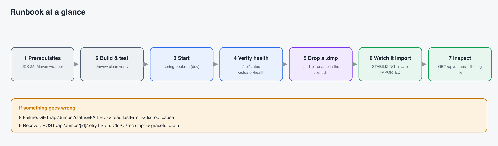
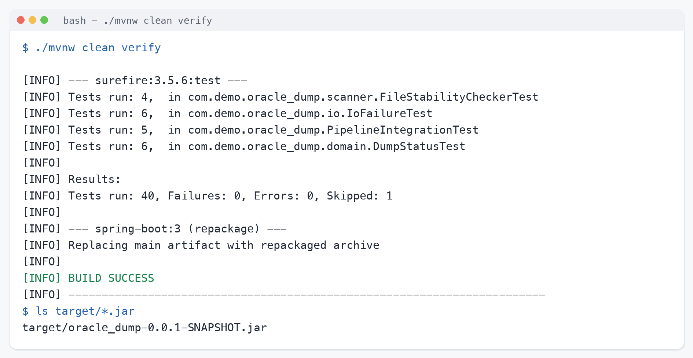
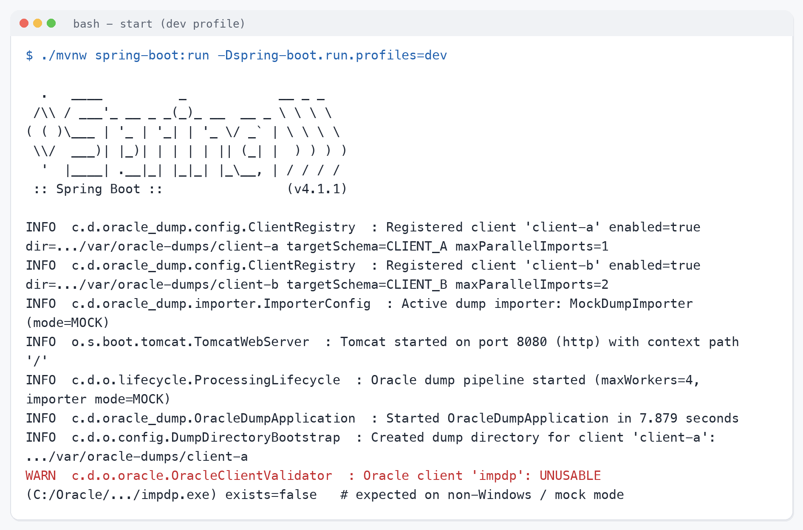
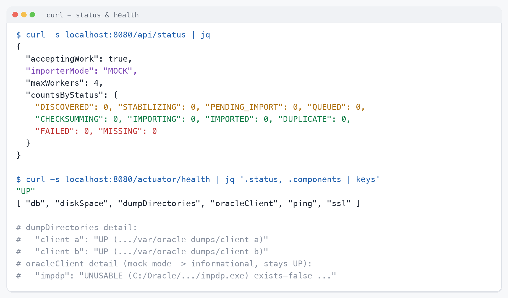
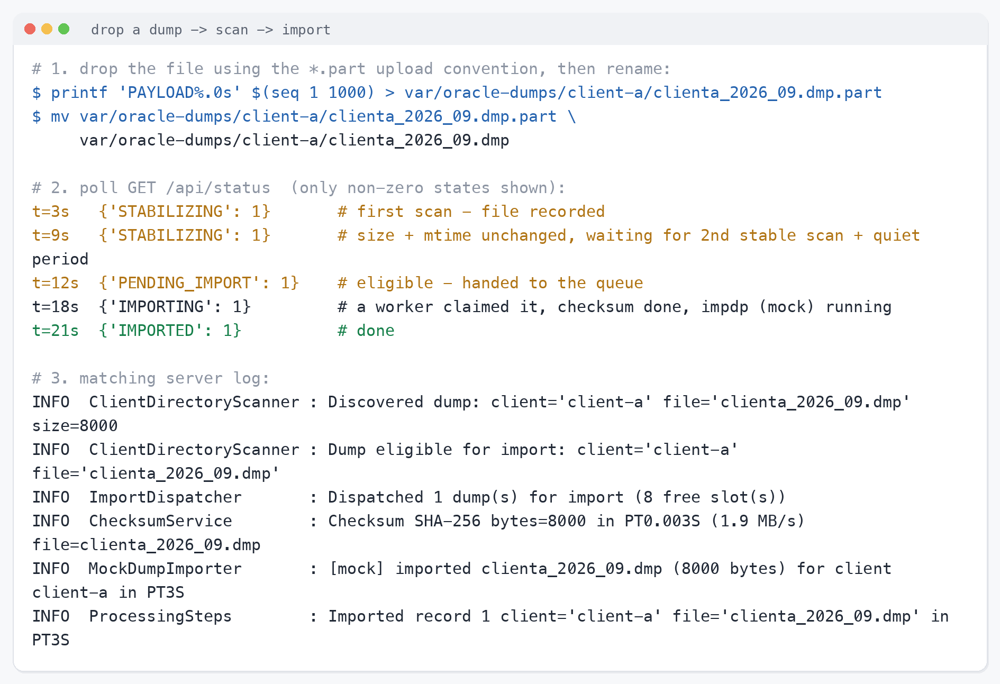
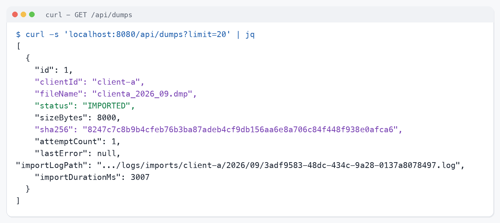
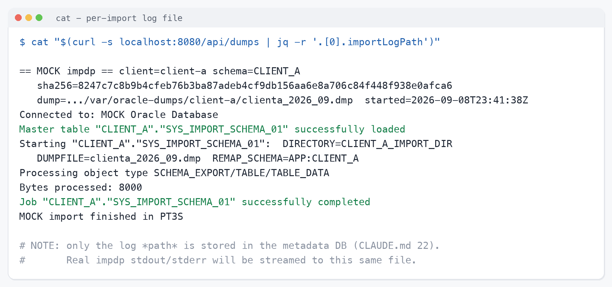
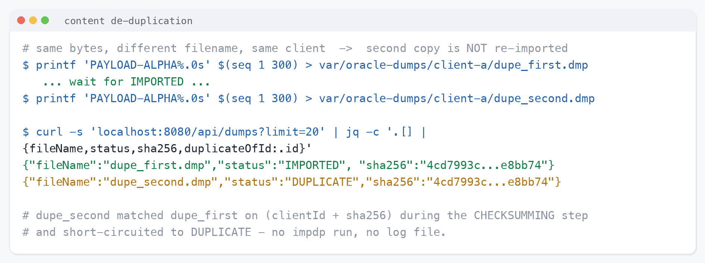
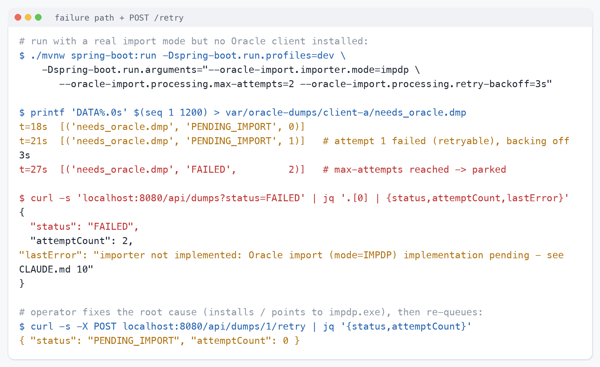
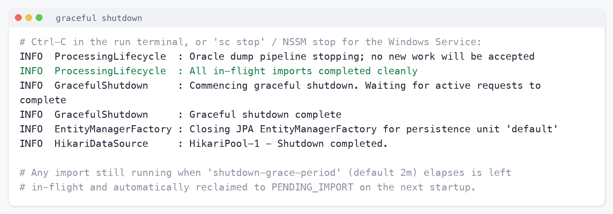

# Runbook — Oracle Dump Importer

A step-by-step guide to **build, run, feed, verify and recover** the service. Every step has a
screenshot from a real run. Images live in [`images/`](images/).

> **Who this is for:** an operator or developer running the service locally or on a server. No
> knowledge of the internals is required. For the "how it works" version, see
> [`architecture.md`](architecture.md).


*The nine steps below, at a glance. Steps 1–7 are the normal path; 8–9 are recovery.*

---

## Contents

- [Step 0 — Prerequisites](#step-0--prerequisites)
- [Step 1 — Get the code](#step-1--get-the-code)
- [Step 2 — Build and run the tests](#step-2--build-and-run-the-tests)
- [Step 3 — Start the service](#step-3--start-the-service)
- [Step 4 — Verify it is healthy](#step-4--verify-it-is-healthy)
- [Step 5 — Drop a dump file](#step-5--drop-a-dump-file)
- [Step 6 — Watch it get imported](#step-6--watch-it-get-imported)
- [Step 7 — Inspect the result and the import log](#step-7--inspect-the-result-and-the-import-log)
- [Step 8 — Duplicate files](#step-8--duplicate-files)
- [Step 9 — When an import fails, and how to retry](#step-9--when-an-import-fails-and-how-to-retry)
- [Step 10 — Stop the service gracefully](#step-10--stop-the-service-gracefully)
- [Running as a Windows Service](#running-as-a-windows-service)
- [Troubleshooting](#troubleshooting)
- [Quick command reference](#quick-command-reference)
- [References](#references)

---

## Step 0 — Prerequisites

| Requirement | Version | Check |
|---|---|---|
| JDK | **25** (Temurin/OpenJDK) | `java -version` |
| Maven | not required — use the wrapper `./mvnw` (`mvnw.cmd` on Windows) | `./mvnw -v` |
| Disk | space for the metadata DB (`./data`) and import logs (`./logs`) | — |
| Ports | **8080** free (REST + Actuator) | — |
| Oracle client | **only for `importer.mode: impdp`/`imp`** — not needed for the default `mock` mode | `impdp -help` |

> **NOTE:** On macOS/Linux the `oracle-client` paths in the config point at `C:\Oracle\...`, which
> obviously don't exist. In `mock` mode that produces a harmless `WARN` at startup and nothing
> else. It is not an error.

---

## Step 1 — Get the code

```bash
cd <your workspace>
# the Maven project is in the oracle_dump/ subfolder of the repo
cd oracle_dump/oracle_dump
ls    # you should see: pom.xml  src/  mvnw  application*.yaml under src/main/resources
```

---

## Step 2 — Build and run the tests

**Goal of this step:** turn the source code into a runnable program (`.jar`) and prove it works by
running the automated tests. You do this once now, and again any time you change the code.

### 2.1 — Open a terminal in the right folder

You must be in the folder that contains `pom.xml` — the same folder from
[Step 1](#step-1--get-the-code) (`.../oracle_dump/oracle_dump`). Check first:

```bash
pwd     # shows where you are   (on Windows: cd)
ls      # you must see: pom.xml  mvnw  mvnw.cmd  src/   (on Windows: dir)
```

If you don't see `pom.xml`, `cd` into the correct folder before continuing.

### 2.2 — Run the build

Copy this line exactly and press Enter:

```bash
./mvnw clean verify
```

On **Windows** use the `.cmd` version instead:

```bat
mvnw.cmd clean verify
```

What the parts mean, so it isn't magic:

| Part | What it does |
|---|---|
| `./mvnw` | The **Maven wrapper** — a small script included in the repo. It auto-downloads the exact build tool version needed, so you do **not** have to install Maven yourself. `./` means "run the script in *this* folder". |
| `clean` | Deletes the previous build output (the `target/` folder) so you start fresh. |
| `verify` | Compiles the code, runs **all the tests**, and packages the `.jar`. If any test fails, the build stops here. |

### 2.3 — First run is slow — that's normal

The **first** time, Maven downloads all the libraries the project depends on. This needs an
internet connection and can take several minutes. You'll see many `Downloading...` /
`Downloaded...` lines. Later runs reuse the downloads and take well under a minute.

### 2.4 — What a successful run looks like

Near the bottom of the output you should see the test summary followed by `BUILD SUCCESS`:

```text
Tests run: 40, Failures: 0, Errors: 0, Skipped: 1
...
BUILD SUCCESS
```

`Skipped: 1` is **expected** on macOS/Linux — that one test only checks Windows-style network
paths, so it deliberately doesn't run here. `Failures: 0, Errors: 0` is what matters.


*Expected tail: `Tests run: 40, Failures: 0, Errors: 0, Skipped: 1` then `BUILD SUCCESS`.*

### 2.5 — What you now have

A runnable program at:

```text
target/oracle_dump-0.0.1-SNAPSHOT.jar
```

This is the file [Step 3](#step-3--start-the-service) starts. You do not need to understand its
contents — just know the build produced it.

### 2.6 — If it fails

| You see | What it means | What to do |
|---|---|---|
| `BUILD FAILURE` with `Could not resolve dependencies` / errors mentioning `spring-boot-h2console` | Maven couldn't download libraries — usually no internet, or you passed `-o` (offline) | Connect to the internet and run `./mvnw clean verify` again **without** `-o` |
| `BUILD FAILURE` mentioning `release version 25` / `invalid target release` / `UnsupportedClassVersionError` | Wrong Java version — this project needs **JDK 25** | Run `java -version`; install JDK 25 (see [Step 0](#step-0--prerequisites)) and retry |
| `bash: ./mvnw: Permission denied` | The wrapper script isn't marked executable | Run `chmod +x mvnw` once, then retry |
| `BUILD FAILURE` with `Tests run: … Failures: 1` (or more) and a test class name | A genuine test failure | Re-read the named test's output; this is a real code/environment problem, not a setup quirk |

> **TIP:** To build without running the tests (faster, but skips the safety check), use
> `./mvnw clean package -DskipTests`. For a first run, prefer the full `verify` so you know the
> project is healthy.

---

## Step 3 — Start the service

### Option A — local development (recommended for a first run)

```bash
./mvnw spring-boot:run -Dspring-boot.run.profiles=dev
```

The `dev` profile uses an **in-memory** database, fast timings, the **mock** importer, and
**auto-creates** two local client directories so you have somewhere to drop files:

```text
./var/oracle-dumps/client-a     (max-parallel-imports: 1)
./var/oracle-dumps/client-b     (max-parallel-imports: 2)
```


*Look for `Registered client 'client-a' …`, `Active dump importer: MockDumpImporter (mode=MOCK)`,
`Oracle dump pipeline started`, and `Started OracleDumpApplication`. The `impdp UNUSABLE` WARN is
expected in mock mode.*

### Option B — run the built jar (closer to production)

```bash
java -jar target/oracle_dump-0.0.1-SNAPSHOT.jar \
     --spring.config.additional-location=file:./config/application.yml
```

With the default profile the datasource is a **file** H2 DB at `./data/oracle-import` and
`clients: []` — so nothing is scanned until you add clients to your config (see
[architecture.md §12](architecture.md#12-configuration-reference)).

---

## Step 4 — Verify it is healthy

```bash
curl -s localhost:8080/api/status         | jq
curl -s localhost:8080/actuator/health    | jq
```


*`/api/status` shows every `DumpStatus` at `0` on a fresh start, `importerMode: MOCK`,
`acceptingWork: true`. `/actuator/health` is `UP`, with per-client `dumpDirectories` details.*

| Health component | Meaning |
|---|---|
| `dumpDirectories` | `UP` = every enabled client's directory is readable. `OUT_OF_SERVICE` = at least one share is unreachable (temporary; the scanner will retry). |
| `oracleClient` | In `mock` mode this stays `UP` even if `impdp.exe` is missing (informational). In a real mode a bad path makes it `OUT_OF_SERVICE`. |

---

## Step 5 — Drop a dump file

**Use the upload convention:** write the file with a temporary suffix, then rename it into place.
The scanner ignores `*.part`, `*.tmp`, `*.partial`, `*.copying`, so a half-copied file is never
picked up.

```bash
# simulate a copy, then make it visible atomically
printf 'PAYLOAD%.0s' $(seq 1 1000) \
  > var/oracle-dumps/client-a/clienta_2026_09.dmp.part
mv var/oracle-dumps/client-a/clienta_2026_09.dmp.part \
   var/oracle-dumps/client-a/clienta_2026_09.dmp
```

> **NOTE — real uploads.** Point your export/backup job at
> `\\nas01\oracle-dumps\client-a\<name>.dmp.part` and have it rename to `.dmp` when the copy
> completes. If you cannot control the upstream, just drop the `.dmp` directly — the scanner will
> wait for `stable-scans-required` unchanged scans **and** a quiet period
> (`stable-file-check-delay`) before touching it. On a large file that means a few scan cycles of
> `STABILIZING` first, which is expected.

---

## Step 6 — Watch it get imported

Poll `/api/status` (or watch the server log). The row moves
`STABILIZING → PENDING_IMPORT → (QUEUED → CHECKSUMMING →) IMPORTING → IMPORTED`.


*Top: the drop commands. Middle: `/api/status` over ~20 s. Bottom: the matching server log —
`Discovered dump` → `Dump eligible for import` → `Dispatched 1 dump(s)` → `Checksum SHA-256 …` →
`[mock] imported …` → `Imported record 1 …`.*

Timings in the `dev` profile: ~10–20 s of `STABILIZING`, then import within one `poll-interval`
(5 s). The mock import itself takes `mock-duration` (3 s in `dev`).

---

## Step 7 — Inspect the result and the import log

```bash
curl -s 'localhost:8080/api/dumps?limit=20' | jq
```


*Each row: `status`, `sizeBytes`, the `sha256`, `attemptCount`, `importDurationMs`, and
`importLogPath`.*

Open the per-import log (its **path** is stored in the DB; the content is on disk):

```bash
cat "$(curl -s localhost:8080/api/dumps | jq -r '.[0].importLogPath')"
```


*The mock importer writes a realistic transcript: `REMAP_SCHEMA=APP:CLIENT_A`,
`DIRECTORY=CLIENT_A_IMPORT_DIR`, `Bytes processed`, `successfully completed`. A real `impdp` run
will stream its stdout/stderr to this same file.*

Log files are organised as `logs/imports/<client>/<yyyy>/<MM>/<uuid>.log`.

> **NOTE:** The original `.dmp` is **left untouched** after import. The service never deletes or
> moves dump files; it only records `IMPORTED` in the metadata DB.

---

## Step 8 — Duplicate files

If the same **content** appears again for the same **client** (any filename), it is **not**
re-imported — it is marked `DUPLICATE`.

```bash
printf 'PAYLOAD-ALPHA%.0s' $(seq 1 300) > var/oracle-dumps/client-a/dupe_first.dmp
#   ... wait for IMPORTED ...
printf 'PAYLOAD-ALPHA%.0s' $(seq 1 300) > var/oracle-dumps/client-a/dupe_second.dmp
```


*`dupe_second.dmp` matches `dupe_first.dmp` on `(clientId + sha256)` during the checksum step and
short-circuits to `DUPLICATE` — no `impdp` run, no log file.*

---

## Step 9 — When an import fails, and how to retry

An import can fail (Oracle error, IO error, or — in a real mode with no Oracle client — the
"not implemented" `TODO`). **Retryable** failures back off and retry up to `max-attempts`; then the
row is parked in `FAILED`.

```bash
# reproduce a failure: real import mode with no Oracle client installed
./mvnw spring-boot:run -Dspring-boot.run.profiles=dev \
  -Dspring-boot.run.arguments="--oracle-import.importer.mode=impdp \
     --oracle-import.processing.max-attempts=2 --oracle-import.processing.retry-backoff=3s"

printf 'DATA%.0s' $(seq 1 1200) > var/oracle-dumps/client-a/needs_oracle.dmp
```


*`PENDING_IMPORT (0)` → `PENDING_IMPORT (1)` (attempt 1 failed, backing off) → `FAILED (2)`.
`GET /api/dumps?status=FAILED` shows `lastError`. After fixing the root cause,
`POST /api/dumps/1/retry` resets it to `PENDING_IMPORT` with `attemptCount = 0`.*

```bash
curl -s 'localhost:8080/api/dumps?status=FAILED' | jq '.[0] | {status,attemptCount,lastError}'
curl -s -X POST localhost:8080/api/dumps/1/retry | jq
```

> **NOTE — fix the cause first.** `retry` only re-queues the row. In `impdp` mode it will fail
> again until `impdp.exe` is actually reachable. `retry` works on `FAILED` and `MISSING` rows only;
> anything else returns `409`.

> **NOTE — crash recovery is automatic.** If a worker or the whole service dies mid-import, the row
> is left in an in-flight state and is reset to `PENDING_IMPORT` by the `StaleRecordReaper` — after
> `stale-processing-timeout`, and always with a full sweep on the next startup. You do not need to
> retry those manually.

---

## Step 10 — Stop the service gracefully

Press **Ctrl-C** in the run terminal (or `sc stop` / your service wrapper's stop command).


*`pipeline stopping; no new work will be accepted` → in-flight imports are given up to
`shutdown-grace-period` (default 2 min) to finish → `All in-flight imports completed cleanly` →
Tomcat and the datasource close.*

> **NOTE:** An import still running when the grace period elapses is **not** killed abruptly at the
> DB level — its row is simply reclaimed to `PENDING_IMPORT` on the next startup and retried. No
> dump is lost, only delayed.

---

## Running as a Windows Service

The application does not depend on any particular wrapper — use **WinSW**, **NSSM**, or the
**Java Service Wrapper**.

1. **Layout** (recommended, `CLAUDE.md` §21):

   ```text
   D:\OracleImporter\
     app\oracle-dump-importer.jar
     config\application.yml
     data\           (H2 metadata — LOCAL disk, never a share)
     logs\
     temp\
   ```

2. **Service account** — a dedicated domain account (`DOMAIN\oracle-import-svc`), **not**
   `LocalSystem`, granted: read the UNC share, read + execute the Oracle client bin, write `logs\`
   and `data\`, access `%TEMP%`.

3. **Example WinSW `oracle-dump-importer.xml`:**

   ```xml
   <service>
     <id>oracle-dump-importer</id>
     <name>Oracle Dump Importer</name>
     <executable>java</executable>
     <arguments>-jar "D:\OracleImporter\app\oracle-dump-importer.jar"
       --spring.config.additional-location=file:D:/OracleImporter/config/application.yml</arguments>
     <logpath>D:\OracleImporter\logs</logpath>
     <onfailure action="restart" delay="10 sec"/>
     <stoptimeout>150 sec</stoptimeout>   <!-- >= shutdown-grace-period -->
   </service>
   ```

4. **Config essentials** for production (`application.yml`):

   ```yaml
   spring:
     datasource:
       url: jdbc:h2:file:D:/OracleImporter/data/oracle-import;AUTO_SERVER=TRUE
     h2:
       console:
         enabled: false
   oracle-import:
     importer:
       mode: mock          # switch to impdp only once the Oracle client + DIRECTORY are ready
       import-log-root: "D:/OracleImporter/logs/imports"
     oracle-client:
       impdp-path: "C:/Oracle/product/19c/client_1/bin/impdp.exe"
       oracle-home: "C:/Oracle/product/19c/client_1"
       tns-admin:  "C:/Oracle/network/admin"
     clients:
       - client-id: client-a
         dump-directory: "//nas01/oracle-dumps/client-a"   # UNC, NOT a mapped drive
         target-schema: CLIENT_A
         oracle-directory-name: CLIENT_A_IMPORT_DIR
         max-parallel-imports: 1
   ```

5. Install & start:

   ```bat
   winsw install oracle-dump-importer.xml
   winsw start   oracle-dump-importer.xml
   sc query oracle-dump-importer
   ```

> **NOTE — mapped drives don't work for services.** A Windows Service does not see a logged-in
> user's `Z:` mapping. Always use `\\server\share\...` (`CLAUDE.md` §2, "Important Windows Rule").

---

## Troubleshooting

| Symptom | Likely cause | Action |
|---|---|---|
| File dropped but no row in `/api/dumps` | Filename ends in `.part/.tmp/.partial/.copying`, or the client directory is not readable | Rename to `.dmp`; check `/actuator/health` → `dumpDirectories` |
| Row stuck in `STABILIZING` | File still being written, or `mtime` younger than `stable-file-check-delay`, or fewer than `stable-scans-required` scans so far | Wait a few scan cycles; confirm the copy has finished |
| Row stuck in `PENDING_IMPORT` | `processing.enabled: false`; no free worker; `next_eligible_at` in the future (backoff) | Check config; `/api/status` worker counts; `lastError` on the row |
| `dumpDirectories` health `OUT_OF_SERVICE` | A UNC share is unreachable right now | Fix the share; the scanner retries automatically — no restart needed |
| Import → `FAILED` with `importer not implemented` | `importer.mode` is `impdp`/`imp` (real execution is a `TODO`) | Set `mode: mock`, or wait for the real importer; then `POST /retry` |
| Import → `FAILED` with `The process cannot access the file…` | Antivirus/backup holding a lock | Usually transient — it will have retried; add an AV exclusion for the dump dirs |
| Startup aborts: "Oracle client executable(s) unusable" | Real mode + `fail-startup-on-missing-executable: true` + bad `impdp-path` | Fix the path, or set the flag to `false` |
| `Duplicate oracle-import client-id` at startup | Two client blocks share a `client-id` | Make client IDs unique |
| Port 8080 in use | Another process | `server.port: 0` (random) or set a free port |
| Everything works but nothing is scanned (default profile) | `clients: []` | Add client blocks to your config |

Turn up logging at runtime without a restart:

```bash
curl -s -X POST localhost:8080/actuator/loggers/com.demo.oracle_dump \
  -H 'Content-Type: application/json' -d '{"configuredLevel":"DEBUG"}'
```

---

## Quick command reference

```bash
# build + test
./mvnw clean verify

# run (dev: in-memory DB, local dirs auto-created, mock importer)
./mvnw spring-boot:run -Dspring-boot.run.profiles=dev

# run the jar
java -jar target/oracle_dump-0.0.1-SNAPSHOT.jar

# status / inventory
curl -s localhost:8080/api/status | jq
curl -s 'localhost:8080/api/dumps?limit=50' | jq
curl -s 'localhost:8080/api/dumps?status=FAILED' | jq

# recover a FAILED / MISSING row
curl -s -X POST localhost:8080/api/dumps/<id>/retry | jq

# health
curl -s localhost:8080/actuator/health | jq

# feed a file (upload convention)
printf 'DATA%.0s' $(seq 1 1000) > <dir>/<name>.dmp.part && mv <dir>/<name>.dmp.part <dir>/<name>.dmp
```

---

## References

- [`architecture.md`](architecture.md) — full architecture, diagrams, and design rationale.
- [`README.md`](README.md) — condensed feature overview.
- `CLAUDE.md` — the Windows Server runtime contract (sections cited inline as "`CLAUDE.md` §N").
- Spring Boot — running your application: <https://docs.spring.io/spring-boot/reference/using/running-your-application.html>
- Spring Boot Maven plugin (`spring-boot:run`, `repackage`): <https://docs.spring.io/spring-boot/maven-plugin/index.html>
- Spring Boot Actuator (`/actuator/health`, `/actuator/loggers`): <https://docs.spring.io/spring-boot/reference/actuator/index.html>
- Graceful shutdown: <https://docs.spring.io/spring-boot/reference/web/graceful-shutdown.html>
- Oracle Data Pump `impdp`: <https://docs.oracle.com/en/database/oracle/oracle-database/19/sutil/oracle-data-pump-import-utility.html>
- Oracle `CREATE DIRECTORY`: <https://docs.oracle.com/en/database/oracle/oracle-database/19/sqlrf/CREATE-DIRECTORY.html>
- WinSW: <https://github.com/winsw/winsw> · NSSM: <https://nssm.cc/>
- Windows file path formats (UNC): <https://learn.microsoft.com/en-us/dotnet/standard/io/file-path-formats>
- `jq` (used in the examples): <https://jqlang.github.io/jq/>
