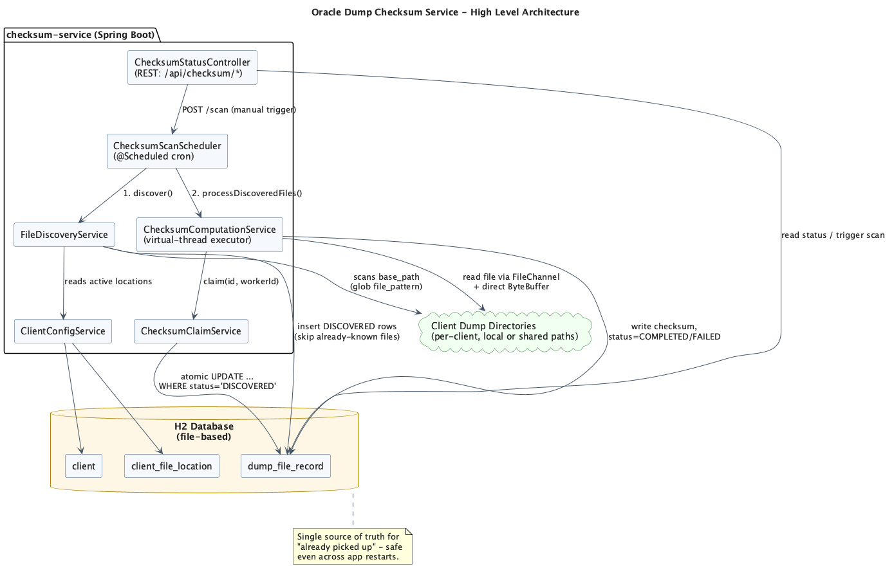
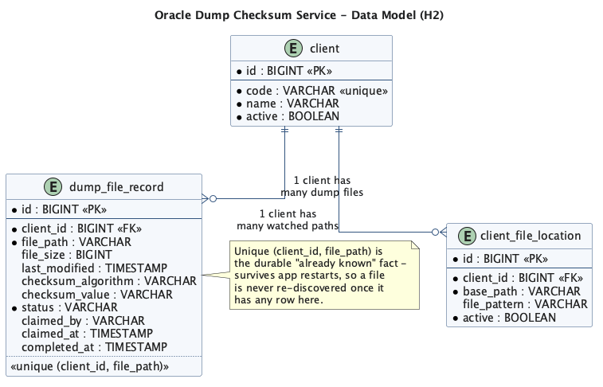
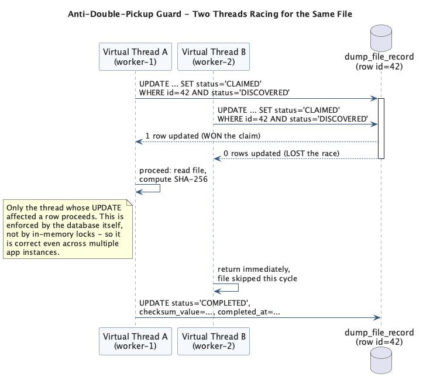
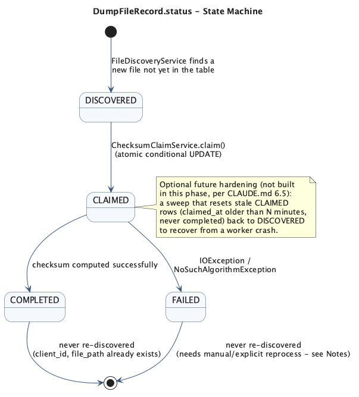
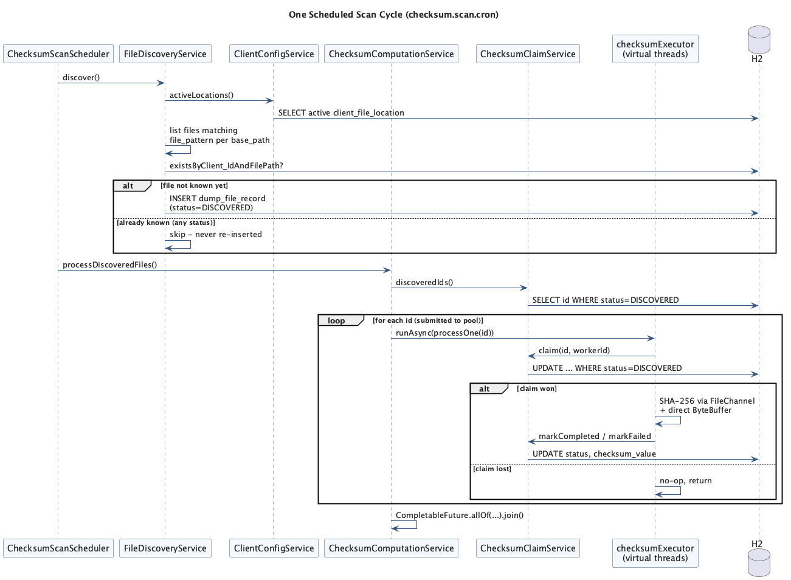
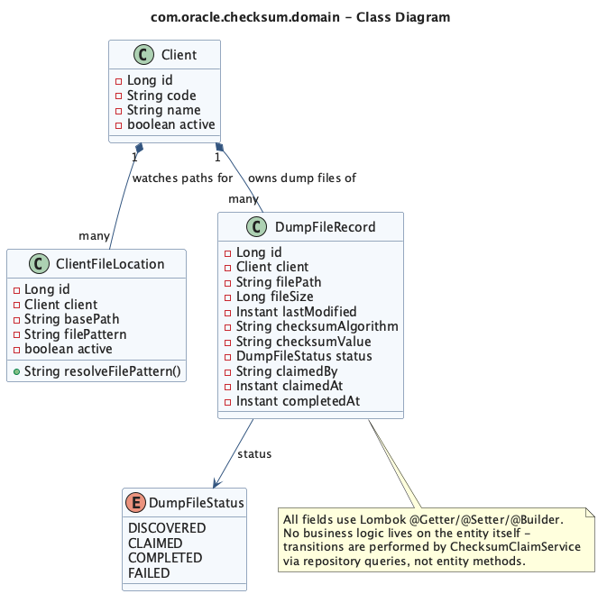

# Analysis — Oracle Dump Checksum Service

This document analyzes the design implemented from [`claude.md`](./claude.md): a Spring Boot service that scans per-client Oracle dump directories, checksums every file it finds using multiple threads, and guarantees a file is never picked up twice. Diagrams referenced below are pre-rendered PNGs in [`images/`](./images) — no diagram source is embedded inline in this file.

## Table of Contents

1. [Objectives Recap](#1-objectives-recap)
2. [High-Level Architecture](#2-high-level-architecture)
3. [Data Model Analysis](#3-data-model-analysis)
4. [Concurrency Model — Parallel Checksumming](#4-concurrency-model--parallel-checksumming)
5. [The Anti-Double-Pickup Guard](#5-the-anti-double-pickup-guard)
6. [DumpFileRecord State Machine](#6-dumpfilerecord-state-machine)
7. [One Full Scan Cycle, End to End](#7-one-full-scan-cycle-end-to-end)
8. [Package-by-Package Notes](#8-package-by-package-notes)
9. [Configuration Analysis](#9-configuration-analysis)
10. [Trade-offs and Known Limitations](#10-trade-offs-and-known-limitations)
11. [Production Datastore Migration — H2 to SQL Server](#11-production-datastore-migration--h2-to-sql-server)
12. [References](#12-references)

---

## 1. Objectives Recap

From `claude.md` §2, the service must, in order of importance:

1. Support **multiple clients**, each with **multiple dump files**, possibly in different locations.
2. Checksum files **as fast as possible** using multithreading.
3. **Never re-pick a file** that is already claimed or already processed — this is the hard constraint, not an optimization detail.
4. Keep client → path mapping as **data** (H2 rows), not YAML or code, so it changes at runtime.
5. Run on Java 21 / Spring Boot 4.1.1 / Lombok, package `com.oracle.checksum`, one `application.yaml`.

Everything below explains *how* the implementation satisfies each of these, and *why* the specific mechanism was chosen over the obvious alternatives.

## 2. High-Level Architecture


*Light-background component diagram. Rendered from PlantUML source, not embedded as code — see [References](#11-references) for the generator.*

**Reading the diagram:** the scheduler is the only thing that runs on a timer; everything else is a plain Spring bean invoked either by the scheduler or by the REST controller. There is intentionally **no direct dependency from `FileDiscoveryService` or `ChecksumComputationService` on each other** — they are composed by `ChecksumScanScheduler.scan()`, which just calls `discover()` then `processDiscoveredFiles()` in sequence. That separation is what let us test discovery and computation independently (see §8) and is why the two REST endpoints (`/status`, `/records`) can be added without touching the domain services at all.

**Example — why the H2 database sits at the center of the diagram, not the file system:** it would be tempting to treat the file system as the source of truth ("if the file exists, check if we've hashed it"). Instead the *rows* in `dump_file_record` are the source of truth for "have we seen this file". This is deliberate: a dump file can be deleted after processing (e.g. moved to archival storage) and we still must never rediscover a same-named replacement without an explicit reprocess decision (§10).

## 3. Data Model Analysis


*Three tables, two foreign-key relationships, one composite unique constraint.*

**`client` / `client_file_location` (requirement 5 — paths are data):**
Adding a third client, say `INITECH`, at runtime is:
```sql
INSERT INTO client (code, name, active) VALUES ('INITECH', 'Initech LLC', TRUE);
INSERT INTO client_file_location (client_id, base_path, file_pattern, active)
  SELECT id, '/mnt/dumps/initech', '*.dmp', TRUE FROM client WHERE code = 'INITECH';
```
No redeploy, no YAML edit — `ClientConfigService.activeLocations()` picks it up on the next scheduled scan because it queries the table directly (no caching layer was added; see §10 for why that's an explicit simplification for this phase, not an oversight).

**`dump_file_record` — the load-bearing table:**
The **`(client_id, file_path)` unique constraint** is not a data-integrity nicety here; it is *the mechanism* that satisfies requirement 3 across restarts. Two independent facts are captured per row that a purely in-memory "seen set" could never give you:
- **Note:** if the app crashes mid-scan and restarts, a purely in-memory `Set<Path>` of processed files would be lost and every file would be rediscovered and re-hashed. Because the fact lives in H2 (file-based, not in-memory — `jdbc:h2:file:./data/checksum-db`), a restart changes nothing: `FileDiscoveryService` re-queries `existsByClient_IdAndFilePath` and finds the row already there.
- **Example:** client `ACME` has `sample1.dmp` and `sample2.dmp` under the same `base_path`. Both get independent rows because the natural key is `(client_id, file_path)`, not `(client_id, base_path)` — the location table only tells discovery *where to look*, it plays no role in de-duplication.

## 4. Concurrency Model — Parallel Checksumming

`ChecksumComputationService` fans out one task per `DISCOVERED` row using `CompletableFuture.runAsync(..., checksumExecutor)`. Two implementation notes matter more than the code itself:

- **Executor choice (`AsyncExecutorConfig`):** default is `Executors.newVirtualThreadPerTaskExecutor()`. The reasoning: checksumming a dump file is dominated by *blocking I/O* (reading potentially gigabyte-sized files off disk or a network share), not CPU. Virtual threads let hundreds of files be "in flight" (mostly parked on I/O) without needing hundreds of OS threads. The `checksum.executor.type: fixed` toggle exists for the one scenario where this assumption breaks: if profiling on real hardware shows the SHA-256 computation itself (not the disk read) is the bottleneck, a platform-thread pool sized to `availableProcessors()` avoids oversubscribing the CPU with virtual threads that are actually CPU-bound, not I/O-bound.
- **Per-task `MessageDigest`:** `MessageDigest` is explicitly *not* thread-safe (per the JDK spec — a single shared instance corrupted across two files' hash state would produce wrong checksums for both). `computeChecksum()` calls `MessageDigest.getInstance(algorithm)` fresh inside each task rather than sharing one field on the service — this is a correctness requirement, not a style choice.
- **Chunked reads via `FileChannel` + direct `ByteBuffer`:** an 8 MB `ByteBuffer.allocateDirect` chunk is reused across `channel.read()` calls in a loop, rather than `Files.readAllBytes()`. **Example:** a 10 GB dump file read via `readAllBytes()` would need a 10 GB heap allocation (and fail past `Integer.MAX_VALUE` bytes); the chunked approach uses a constant ~8 MB off-heap buffer regardless of file size.

**Note on ordering:** parallelism is applied *after* claiming, not before. A task is submitted for every `DISCOVERED` id, but the actual file read only happens if `ChecksumClaimService.claim()` succeeds inside that task (§5) — so "many threads" never means "many threads touching the same file."

## 5. The Anti-Double-Pickup Guard

This is the requirement the whole design pivots around, so it gets two diagrams.


*Two virtual threads race for the same row; the database — not a Java lock — decides the winner.*

The claim is one SQL statement (`DumpFileRecordRepository.claim`, backing `ChecksumClaimService.claim`):

```sql
UPDATE dump_file_record
SET status = 'CLAIMED', claimed_by = :claimedBy, claimed_at = :claimedAt
WHERE id = :id AND status = 'DISCOVERED'
```

**Why this is correct and a `synchronized` block or in-memory `ConcurrentHashMap` guard would not be enough:** a lock in the JVM only protects threads *inside that one JVM instance*. The spec (§6 non-goals) explicitly leaves the door open to multiple app instances later; an atomic conditional UPDATE is safe under that scenario for free, because the guarantee comes from the database transaction, not from process memory. The row count returned by the update (`0` or `1`) is the only signal a worker trusts — there is deliberately no separate "check status, then act" step, because that gap is exactly where a race would slip in (classic TOCTOU — time-of-check to time-of-use).

**Example walkthrough (matches the diagram):** worker A and worker B both pick up id `42` from the same `discoveredIds()` snapshot (harmless — the list is just candidates, not a lock). Both fire the UPDATE. H2's row-level locking during the UPDATE serializes them: whichever commits first gets `1` row affected and proceeds to hash the file; the second gets `0` rows affected (because by the time its `WHERE status = 'DISCOVERED'` predicate is evaluated, the row is already `'CLAIMED'`) and returns immediately without touching the file system at all.

## 6. DumpFileRecord State Machine



Four states, three real transitions (`DISCOVERED → CLAIMED`, `CLAIMED → COMPLETED`, `CLAIMED → FAILED`), no transition back to `DISCOVERED` in this phase. On the `CLAIMED → COMPLETED` transition, `ChecksumClaimService.markCompleted()` also derives `checksum_duration_minutes` as `completed_at - claimed_at`, stored as `BigDecimal`/`DECIMAL(20,8)` rather than a `double` — H2's web console prints small `DOUBLE` values in scientific notation (e.g. `2.0E-5`), which defeats the point of a human-readable duration column when inspecting the table during a demo. **Note:** this last point is deliberate, not an accident — `claude.md` §6 step 5 explicitly calls the stale-`CLAIMED` sweep (recovering from a worker crash mid-hash) an *optional future hardening*, not something built now. Practically, that means: if the process is killed mid-checksum, that file's row stays `CLAIMED` forever until someone manually resets it — it will **not** silently retry itself, and it will **not** be picked up again by discovery either, since discovery only cares whether *any* row exists for that `(client_id, file_path)`.

**Example of the currently-accepted gap:** kill `-9` the JVM while a 5 GB file is mid-hash. On restart, that row is still `status = 'CLAIMED'`. `FileDiscoveryService` sees the file already has a row and skips it; `ChecksumClaimService.discoveredIds()` only looks for `DISCOVERED` rows, so it's also skipped there. The file is effectively stuck until someone runs a manual `UPDATE ... SET status = 'DISCOVERED' WHERE id = ...`. This is the cost paid for keeping this phase simple — see §10.

## 7. One Full Scan Cycle, End to End


*Everything that happens between one `@Scheduled` firing of `ChecksumScanScheduler.scan()` and the next.*

**Worked example** (matches the demo seed data in `data.sql`): on first boot, `client_file_location` has `ACME → /Users/<you>/temp/oracle-dumps/acme` and `GLOBEX → /Users/<you>/temp/oracle-dumps/globex` — `data.sql` now seeds an absolute, developer-machine-specific path rather than the repo-relative `./demo-data/...` directories, so it must be edited (or updated via SQL after boot) to point at a directory that actually exists on whichever machine runs the demo. First scan cycle:
1. `discover()` lists `<base_path>/*.dmp` (e.g. `.../acme/*.dmp`) → finds `sample1.dmp`, `sample2.dmp`; neither exists in `dump_file_record` yet → two `INSERT ... status=DISCOVERED` rows. Same for `globex/sample1.dmp`.
2. `processDiscoveredFiles()` fetches those 3 ids, submits 3 tasks to the virtual-thread executor.
3. Each task claims its own id (no contention here, since there's exactly one candidate thread per id in this example), hashes the file, and writes `status=COMPLETED` + `checksum_value`.

Second scan cycle, seconds later: `discover()` re-lists the same directories, but `existsByClient_IdAndFilePath` returns `true` for all three paths, so **zero** new rows are inserted, and `discoveredIds()` returns an **empty list** — `processDiscoveredFiles()` short-circuits without submitting any tasks. This was verified against the running service: triggering `/api/checksum/scan` twice produced `{"COMPLETED": 3}` both times, with the same 3 record ids.

## 8. Package-by-Package Notes

| Package | Responsibility | Key note |
|---|---|---|
| `config` | `AsyncExecutorConfig` (executor bean), `SchedulingConfig` (`@EnableScheduling`), `ChecksumProperties` (`@ConfigurationProperties(prefix="checksum")`) | The executor bean has `destroyMethod = "close"` so `ExecutorService.close()` runs on context shutdown — without it, in-flight virtual-thread tasks could be abandoned ungracefully on redeploy. |
| `domain` | JPA entities + `DumpFileStatus` enum | See [Class Diagram](images/domain-class-diagram.png) — entities are intentionally anemic (Lombok getters/setters/builder only); all state-transition logic lives in `ChecksumClaimService`, not on the entity, so the atomic-UPDATE claim pattern in §5 can't be accidentally bypassed by someone calling `record.setStatus(CLAIMED)` directly in application code. |
| `repository` | Spring Data interfaces | `DumpFileRecordRepository.claim` is the one hand-written `@Modifying @Query` in the codebase — everything else is derived-query or `JpaRepository` defaults. |
| `service` | `ClientConfigService`, `FileDiscoveryService`, `ChecksumClaimService`, `ChecksumComputationService` | Each maps 1:1 to a stage in the [scan cycle diagram](images/scan-cycle-sequence.png) — this was a deliberate choice so the pipeline reads as a sequence of single-purpose services rather than one large orchestrator class. |
| `scheduler` | `ChecksumScanScheduler` | The only class with a `@Scheduled` annotation; also directly callable from the REST layer for manual triggering, so "scheduled" and "on-demand" runs share one code path. |
| `web` | `ChecksumStatusController` | Exposes `POST /api/checksum/scan`, `GET /api/checksum/records`, `GET /api/checksum/status`. No auth (non-goal, §8 of `claude.md`) — acceptable for the H2 demo phase, not for production. |



## 9. Configuration Analysis

`application.yaml` deliberately mixes two different *kinds* of configuration, and it's worth naming the distinction explicitly:

- **Application configuration** (belongs in YAML): datasource URL, `checksum.algorithm`, `checksum.executor.type`/`fixed-pool-size`, `checksum.scan.cron`. These describe *how the app behaves*, not *what data it operates on*, and changing them requires a restart — which is fine, because these rarely change.
- **Domain configuration** (deliberately *not* in YAML): which clients exist and where their files live. This lives in `client` / `client_file_location` precisely so it *doesn't* require a restart (requirement 5).

**Example — `checksum.scan.cron: "0/30 * * * * *"`:** every 30 seconds in the demo `application.yaml`. In a real deployment this would be tuned to the expected arrival rate of new dump files — too frequent wastes a discovery pass with nothing new to find (cheap, but not free: it's still a directory listing + a `SELECT` per active location); too infrequent adds latency between a file landing and its checksum being available.

**Note on `spring.jpa.defer-datasource-initialization: true`:** required for `data.sql` (the demo client/location seed) to run *after* Hibernate creates the schema via `ddl-auto: update`, not before. Without it, Spring Boot's default ordering runs `data.sql` before the tables exist, and startup fails. The seed script itself uses `INSERT ... SELECT ... WHERE NOT EXISTS` rather than plain `INSERT`, so it is safe to run on every restart (`spring.sql.init.mode: always`) without violating the unique constraint on `client.code`.

## 10. Trade-offs and Known Limitations

These are explicit simplifications for this phase, called out in `claude.md` §8–9 and reflected in the code:

- **No stale-claim sweep.** A worker crash mid-hash leaves a row `CLAIMED` forever (§6). Acceptable for a demo; a production version would add the periodic reset the spec flags as future work.
- **No config caching.** `ClientConfigService.activeLocations()` hits H2 on every scan cycle. Fine at demo scale (a handful of clients); the spec allows for a TTL cache later if the number of clients/locations grows large enough for repeated reads to matter.
- **Replacing a file at the same path is not re-checksummed.** The dedup key is `(client_id, file_path)` alone — `file_size`/`last_modified` are captured at discovery time but never compared against a later state of the same path. If `ACME` legitimately replaces `sample1.dmp` with new content at the same path, it is invisible to this system until an explicit "reprocess" action is added.
- **No multi-instance testing.** The claim pattern (§5) is *written* to be safe with multiple app instances against the same database, but H2 file-mode is realistically single-instance; this hasn't been exercised against a concurrent multi-JVM setup, only concurrent virtual threads within one JVM.
- **No authentication on `/api/checksum/*`.** Matches the explicit non-goal in `claude.md` §8; not appropriate to carry forward past the demo phase.

## 11. Production Datastore Migration — H2 to SQL Server

`claude.md` §4/§8 is explicit that H2 is scoped to *this phase only* — "no production datastore" is a named non-goal, not an oversight. This section lists everything that changes to run the same design against SQL Server, and — more importantly — the two places where SQL Server's locking model is *not* a drop-in swap for H2's and the claim logic (§5) needs a deliberate decision, not just a driver change.

### 11.1 Dependencies and driver

Replace the H2 runtime dependency in `pom.xml` with the Microsoft JDBC driver:

```xml
<dependency>
    <groupId>com.microsoft.sqlserver</groupId>
    <artifactId>mssql-jdbc</artifactId>
    <scope>runtime</scope>
</dependency>
```

Spring Boot 4.1.1's dependency-management BOM pins a compatible `mssql-jdbc` version, so no explicit `<version>` is needed — same pattern the current `h2` dependency already relies on. The `spring-boot-starter-data-jpa` dependency itself doesn't change.

### 11.2 Datasource configuration

```yaml
spring:
  datasource:
    url: jdbc:sqlserver://${DB_HOST}:1433;databaseName=checksum;encrypt=true;trustServerCertificate=false
    driver-class-name: com.microsoft.sqlserver.jdbc.SQLServerDriver
    username: ${DB_USERNAME}
    password: ${DB_PASSWORD}
    hikari:
      maximum-pool-size: 20
```

Three things worth calling out, none of which are visible from a naive "just change the URL" edit:

- **Credentials move out of YAML.** The current `application.yaml` (§9) has `username: sa` / an empty `password:` in plain text — acceptable for a local H2 file, not acceptable once this points at a real server. Source them from environment variables or a secrets manager (Vault, AWS Secrets Manager, Azure Key Vault) instead of committing them.
- **`encrypt=true` is the SQL Server default as of recent driver versions** and most managed instances (Azure SQL, AWS RDS for SQL Server) reject unencrypted connections outright. Set `trustServerCertificate=false` and supply a real CA-trusted cert in production; `true` is only for a local dev instance with a self-signed cert.
- **Hikari pool sizing now actually matters.** H2 file-mode with `AUTO_SERVER=TRUE` is an embedded, effectively free connection. SQL Server connections are real TCP round-trips over the network. `ChecksumComputationService` (§4) fans out one task per `DISCOVERED` row on the virtual-thread executor, and every task calls `ChecksumClaimService.claim()` — if hundreds of files are discovered at once, hundreds of claim attempts can hit the pool near-simultaneously. Size `maximum-pool-size` deliberately (start from expected peak concurrent claims, not the Hikari default of 10) rather than discovering the bottleneck in production.

### 11.3 Schema management — stop using `ddl-auto: update`

`spring.jpa.hibernate.ddl-auto: update` plus `data.sql` (§9) is a demo convenience: Hibernate infers the schema from the entities on every boot. That's fine when the schema is thrown away and rebuilt constantly; it is not an acceptable production migration story because there's no reviewable, versioned record of *how* the schema got to its current state, and `update` is known to be unsafe for destructive changes (it won't drop/rename columns for you, which sounds safe but means drift accumulates silently).

Switch to a real migration tool — Flyway is the natural fit given nothing else in the stack needs Liquibase's XML/YAML flexibility:

1. Add `spring-boot-starter-... ` — actually just `org.flywaydb:flyway-sqlserver` (Flyway's community core no longer bundles every DB module; SQL Server needs the dedicated artifact) plus `flyway-core`.
2. Set `spring.jpa.hibernate.ddl-auto: validate` (Hibernate checks the entity mapping matches the migrated schema but never alters it) and `spring.flyway.enabled: true`.
3. Write `V1__init.sql` translating the current H2-inferred schema to SQL Server types — this is the concrete diff:

| H2 (current, Hibernate-inferred) | SQL Server |
|---|---|
| `BIGINT` PK with `GenerationType.IDENTITY` | `BIGINT IDENTITY(1,1) PRIMARY KEY` — no entity change needed, `IDENTITY` maps directly |
| `BOOLEAN` (`client.active`, `client_file_location.active`) | `BIT` |
| `TIMESTAMP` (`last_modified`, `claimed_at`, `completed_at`) | `DATETIME2` (preferred over `DATETIME` for range/precision) |
| `VARCHAR` (unbounded-ish in H2) | `VARCHAR(n)` or `NVARCHAR(n)` — H2 lets column length inference slide; SQL Server requires an explicit length, so audit every `@Column` for a `length` attribute (`file_path` in particular needs enough headroom for long dump-directory paths) |
| Named unique constraint on `(client_id, file_path)` | Carries over as-is; make sure the migration script names it explicitly rather than letting the engine autogenerate a name, so future migrations can reference it |

4. `data.sql` demo seeding (§9's note on `defer-datasource-initialization`) either becomes a `V2__seed_demo_clients.sql` migration guarded the same way (`IF NOT EXISTS` instead of H2/ANSI `INSERT ... WHERE NOT EXISTS`) for non-prod environments only, or is dropped entirely in favor of the existing `client`/`client_file_location` insert path (§3) being the only way real client config enters the table.

### 11.4 The claim query under SQL Server locking — the part that actually needs judgment

This is the one place a mechanical "port the SQL" pass would silently change behavior. §5's claim statement is:

```sql
UPDATE dump_file_record
SET status = 'CLAIMED', claimed_by = :claimedBy, claimed_at = :claimedAt
WHERE id = :id AND status = 'DISCOVERED'
```

The statement itself is portable — no rewrite needed, since it targets a single row by primary key. What's *not* portable is the isolation behavior around it:

- **H2's default `READ_COMMITTED` and SQL Server's default `READ COMMITTED` are not the same thing in practice.** SQL Server's default is lock-based: a concurrent `SELECT` (e.g. `FileDiscoveryService`'s existence check, or the status-counting query behind `GET /api/checksum/status`) can block behind, or be blocked by, an in-flight claim UPDATE on the same row. At demo scale (a handful of files) this is invisible; under real concurrent load with many discovered rows it shows up as scan-cycle latency that wasn't there under H2.
  **Fix:** enable Read Committed Snapshot Isolation at the database level once, as a DBA-side change, not an application code change:
  ```sql
  ALTER DATABASE checksum SET READ_COMMITTED_SNAPSHOT ON;
  ```
  This makes reads use row-versioning instead of shared locks, so status queries stop blocking behind claims — the same non-blocking-read behavior the demo already gets "for free" from H2, without changing a single line of Java.
- **A claim attempt against a row someone else is mid-claiming doesn't fail fast — it waits.** Because the `WHERE id = :id` targets one specific row, if another transaction is holding an exclusive lock on it (mid-UPDATE, not yet committed), SQL Server's default behavior is to block the second UPDATE until the first transaction commits or rolls back, then re-evaluate `status = 'DISCOVERED'` (now false) and affect 0 rows. This is still *correct* — no double pickup — but it means a worker can stall briefly on lock contention instead of getting an instant "0 rows" the way an uncontended H2 update effectively does. In this codebase specific claim collisions are rare (each id is claimed by exactly one task in the current single-JVM design, per §4's ordering note), so this mostly matters once §10's "no multi-instance testing" gap is closed and multiple app instances are genuinely racing the same row. Set an explicit lock/query timeout on the claim query (`@QueryHints` with `jakarta.persistence.query.timeout`, or `SET LOCK_TIMEOUT` at the connection level) so a worker can never hang indefinitely behind another instance's stuck transaction — pair this with the stale-`CLAIMED` sweep already flagged as future work in §6/§10, since a timed-out claim and a crashed worker leave the row in the same recoverable state.

### 11.5 What this migration unlocks (and what it doesn't, by itself)

Moving off H2 is also what makes §10's "no multi-instance testing" limitation *worth* closing — H2 file-mode is realistically single-instance regardless of what the claim SQL supports, whereas SQL Server is a real client/server database multiple app instances can point at concurrently. But the migration alone doesn't validate that scenario: budget for an integration test (Testcontainers' `mssqlserver` module is the natural fit, mirroring the driver added in §11.1) that starts two or more instances of `ChecksumClaimService.claim()` against the same seeded rows and asserts exactly one winner per row — the same guarantee §5's diagram shows for two virtual threads in one JVM, now exercised across two real connections.

Finally, remove the two things that are explicitly demo-only regardless of datastore: the H2 console (`spring.h2.console.enabled`) has no SQL Server equivalent to accidentally leave on, but confirm no dev-only `/h2-console`-style admin surface gets reintroduced; and `checksum.scan.cron` (§9) should be re-tuned against real file-arrival rates once discovery queries are hitting a networked database instead of an embedded one, since the cost-per-cycle math in §9's note changes with network latency in the loop.

## 12. References

- `claude.md` — the technical specification this analysis is derived from (this repository, root of `oracle_dump_checksum`).
- Diagrams in [`images/`](./images) were authored as PlantUML source and rendered to PNG with the [PlantUML](https://plantuml.com/) CLI (`plantuml -tpng`) — the `.puml` sources are not part of this repository, only the rendered images, per the "use image, not diagram code" convention for this doc.
- [Java `MessageDigest` — thread-safety note](https://docs.oracle.com/en/java/javase/21/docs/api/java.base/java/security/MessageDigest.html) — "Applications should call ... `getInstance` for each thread."
- [`Executors.newVirtualThreadPerTaskExecutor()` — JDK 21 API](https://docs.oracle.com/en/java/javase/21/docs/api/java.base/java/util/concurrent/Executors.html#newVirtualThreadPerTaskExecutor())
- [JEP 444: Virtual Threads](https://openjdk.org/jeps/444) — background on why virtual threads suit blocking I/O-bound workloads like file hashing.
- [Spring Data JPA — Modifying Queries](https://docs.spring.io/spring-data/jpa/reference/jpa/query-methods.html#jpa.modifying-queries) — the mechanism behind `DumpFileRecordRepository.claim`.
- [H2 Database — Locking and isolation](https://www.h2database.com/html/advanced.html#transaction_isolation) — why the atomic `UPDATE ... WHERE` claim is race-safe under H2's default `READ_COMMITTED` isolation.
- [Spring Boot — Data Initialization (`data.sql`, `defer-datasource-initialization`)](https://docs.spring.io/spring-boot/how-to/data-initialization.html)
- [Microsoft JDBC Driver for SQL Server — connection URL and properties](https://learn.microsoft.com/en-us/sql/connect/jdbc/building-the-connection-url) — `encrypt`/`trustServerCertificate` and other URL parameters referenced in §11.2.
- [SQL Server — Read Committed Snapshot Isolation (RCSI)](https://learn.microsoft.com/en-us/sql/relational-databases/sql-server-transaction-locking-and-row-versioning-guide#read-committed-using-row-versioning) — the isolation-mode change referenced in §11.4.
- [Flyway — SQL Server support](https://documentation.red-gate.com/fd/sql-server-184127601.html) — the migration tool referenced in §11.3 as the replacement for `ddl-auto: update`.
