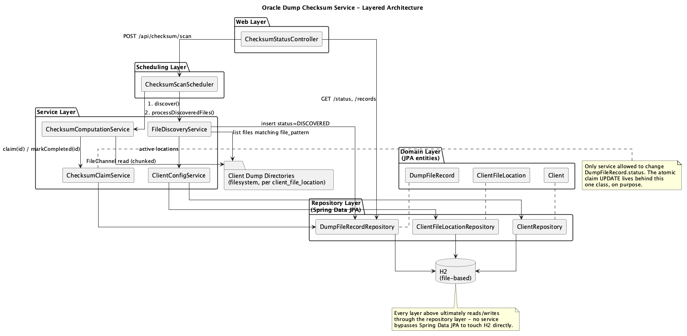
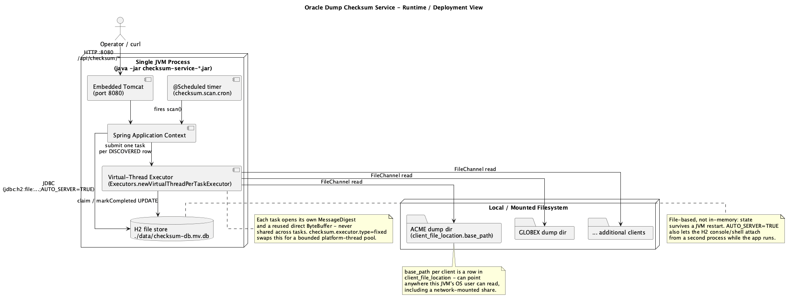

# Architecture — Oracle Dump Checksum Service

This document explains the **architecture** of the service defined in [`claude.md`](./claude.md): how the codebase is layered, how its components are wired together, how it behaves as a running process, and how a request or a scheduled tick actually flows through the system end to end. It complements, rather than repeats, [`analysis.md`](./analysis.md) (data-model/concurrency deep-dive and trade-offs) and [`runbook.md`](./runbook.md) (operator steps). Diagrams referenced below are pre-rendered PNGs in [`images/`](./images) — no diagram source is embedded inline in this file.

## Table of Contents

1. [Architectural Goals and Constraints](#1-architectural-goals-and-constraints)
2. [Layered Architecture](#2-layered-architecture)
3. [Component Architecture](#3-component-architecture)
4. [Data Architecture](#4-data-architecture)
5. [Concurrency Architecture](#5-concurrency-architecture)
6. [Runtime / Deployment Architecture](#6-runtime--deployment-architecture)
7. [Request Lifecycle — REST-Triggered Scan](#7-request-lifecycle--rest-triggered-scan)
8. [Scheduled Lifecycle — Timer-Triggered Scan](#8-scheduled-lifecycle--timer-triggered-scan)
9. [Configuration Architecture](#9-configuration-architecture)
10. [Cross-Cutting Concerns](#10-cross-cutting-concerns)
11. [Architectural Trade-offs (Summary)](#11-architectural-trade-offs-summary)
12. [References](#12-references)

---

## 1. Architectural Goals and Constraints

Every structural decision below traces back to one of `claude.md`'s objectives (§2):

| Goal | Architectural consequence |
|---|---|
| Multiple clients, multiple files, different locations per client | Client → path mapping is **data** (`client_file_location` rows), not code — see [§4](#4-data-architecture) and [§9](#9-configuration-architecture). |
| Checksum as fast as possible, multithreaded | A dedicated executor bean (virtual threads by default) decoupled from the common `ForkJoinPool` — see [§5](#5-concurrency-architecture). |
| Never re-pick a claimed/processed file, even across restarts | The claim is a database fact (`dump_file_record.status`), not an in-memory set — see [§3](#3-component-architecture) and [§7](#7-request-lifecycle--rest-triggered-scan). |
| H2 for this phase, one `application.yaml` | A single configuration surface, deliberately split into "app config" (YAML) vs. "domain config" (H2 rows) — see [§9](#9-configuration-architecture). |

**Note — architecture vs. analysis:** this document answers *"how is the system put together and how does it run?"*. It intentionally does **not** re-derive *why* the claim SQL is race-safe, or walk the `DumpFileRecord` state machine transition-by-transition — that reasoning lives in `analysis.md` §5–6 and is linked from [§11](#11-architectural-trade-offs-summary) instead of duplicated here.

## 2. Layered Architecture


*Six layers, one direction of dependency (top to bottom). No layer skips the one below it except where explicitly drawn.*

The codebase follows a conventional Spring layering, with one specific rule enforced by convention (not by a build-time check): **only `service` classes talk to `repository` classes**, and **only `ChecksumClaimService` is allowed to change `DumpFileRecord.status`**.

- **Web layer** (`web`) — `ChecksumStatusController`. Translates HTTP into calls onto the scheduler and the repository; contains no business logic of its own.
- **Scheduling layer** (`scheduler`) — `ChecksumScanScheduler`. The only class with a `@Scheduled` method; also invoked directly by the web layer for on-demand triggers, so "timer-driven" and "manually triggered" runs share one code path (`scan()`).
- **Service layer** (`service`) — `ClientConfigService`, `FileDiscoveryService`, `ChecksumClaimService`, `ChecksumComputationService`. Each is a single-purpose stage in the scan pipeline (see [§8](#8-scheduled-lifecycle--timer-triggered-scan)); none of them depend on each other directly except where the pipeline requires it (`ChecksumComputationService` depends on `ChecksumClaimService` to claim before it hashes).
- **Repository layer** (`repository`) — `ClientRepository`, `ClientFileLocationRepository`, `DumpFileRecordRepository`. Thin Spring Data JPA interfaces; the one hand-written query is `DumpFileRecordRepository`'s atomic claim `UPDATE`.
- **Domain layer** (`domain`) — `Client`, `ClientFileLocation`, `DumpFileRecord`, `DumpFileStatus`. Deliberately anemic (Lombok-generated accessors only) — state-transition logic lives in the service layer, not on the entities, so nothing outside `ChecksumClaimService` can mutate `status` by accident.
- **Data layer** — H2, file-based.

**Example — why the arrows only point one way:** `FileDiscoveryService` never calls `ChecksumComputationService`, and neither service imports the other. `ChecksumScanScheduler.scan()` is the one place that sequences them (`discover()` then `processDiscoveredFiles()`). This is what lets [Step 6 of the runbook](runbook.md#step-6--watch-it-get-checksummed) exercise discovery and computation as independent, individually testable stages, and it's why the two REST endpoints (`/status`, `/records`) could be added later without touching either service.

## 3. Component Architecture


*Component-level view: which Spring bean calls which, and where the filesystem and H2 sit relative to them.*

**Reading the diagram:** the scheduler is the only component that runs on a timer; everything else is a plain Spring bean invoked either by the scheduler or by the REST controller. The H2 database sits at the center, not the filesystem — this is deliberate: **the rows in `dump_file_record` are the source of truth for "have we seen this file"**, not whatever currently exists on disk.

**Note — why the file system is not authoritative:** a dump file can legitimately be deleted after processing (e.g. moved to archival storage). If discovery treated "file exists on disk" as the signal, a deleted-then-never-replaced file would just quietly disappear from consideration — which is fine — but a *same-named replacement* dropped into the same path later would look identical to a first-time file if the database weren't the source of truth. Because `existsByClient_IdAndFilePath` is checked against H2 regardless of what is currently on disk, that replacement is correctly *not* re-processed by default (an explicit "reprocess" action would be needed — see `analysis.md` §10).

| Component | Type | Responsibility |
|---|---|---|
| `ChecksumStatusController` | `@RestController` | `POST /api/checksum/scan` (manual trigger), `GET /api/checksum/status` (counts by status), `GET /api/checksum/records` (full dump). |
| `ChecksumScanScheduler` | `@Component` | Sequences one scan cycle: `discover()` then `processDiscoveredFiles()`. |
| `ClientConfigService` | `@Service` | Reads active `client`/`client_file_location` rows — the only component that knows how client config maps to filesystem paths. |
| `FileDiscoveryService` | `@Service` | Lists each active `base_path` for files matching `file_pattern`; inserts a `DISCOVERED` row for anything not already known. |
| `ChecksumClaimService` | `@Service` | Owns every write to `DumpFileRecord.status` — `claim()`, `markCompleted()`, `markFailed()`. |
| `ChecksumComputationService` | `@Service` | Fans out one task per candidate id onto the checksum executor; each task claims, then hashes, then reports success/failure. |
| `AsyncExecutorConfig` | `@Configuration` | Produces the `ExecutorService` bean (`checksumExecutor`) that all checksum tasks run on. |

## 4. Data Architecture


*Three tables, two foreign keys, one composite unique constraint.*


*JPA entities mirror the tables directly — no separate DTO layer in this phase.*

- **`client`** — one row per client (`code`, `name`, `active`).
- **`client_file_location`** — one row per watched directory per client (`base_path`, `file_pattern`, `active`). This table is what satisfies "paths are data, not code": adding a client or changing where its dumps live is an `INSERT`/`UPDATE`, not a redeploy.
- **`dump_file_record`** — one row per discovered file, carrying its full lifecycle: discovery metadata (`file_size`, `last_modified`), checksum result (`checksum_algorithm`, `checksum_value`), claim bookkeeping (`status`, `claimed_by`, `claimed_at`), completion bookkeeping (`completed_at`, `checksum_duration_minutes`). The **`(client_id, file_path)`** unique constraint is the mechanism, not a nicety — it's what makes "already picked up" a fact the database enforces across restarts, independent of anything held in JVM memory.

**Example:** `checksum_duration_minutes` is stored as `DECIMAL(20,8)` (Java `BigDecimal`), computed as `completed_at - claimed_at` in `ChecksumClaimService.markCompleted()`. It is deliberately not a `double` — H2's web console renders small `DOUBLE` values in scientific notation (e.g. `2.0E-5`), which is unreadable when eyeballing the table during a demo; `DECIMAL` prints as a plain fixed-point number instead.

## 5. Concurrency Architecture

`ChecksumComputationService.processDiscoveredFiles()` fans out one `CompletableFuture.runAsync(..., checksumExecutor)` per candidate id, then joins on all of them. Two architectural decisions matter more than the code itself:

- **A dedicated executor bean, not the common `ForkJoinPool`.** `AsyncExecutorConfig` produces `checksumExecutor` as either `Executors.newVirtualThreadPerTaskExecutor()` (default, `checksum.executor.type=virtual`) or `Executors.newFixedThreadPool(fixedPoolSize)` (`checksum.executor.type=fixed`). The bean is declared with `destroyMethod = "close"`, so `ExecutorService.close()` runs on context shutdown rather than abandoning in-flight tasks.
- **Claim happens inside the task, not before submission.** Every candidate id gets a task submitted; only the task whose `ChecksumClaimService.claim()` call actually affects a row proceeds to open the file. This means "many threads running" never implies "many threads touching the same file" — see [§7](#7-request-lifecycle--rest-triggered-scan) for the full sequence.
- **Per-task isolation.** Each task calls `MessageDigest.getInstance(algorithm)` fresh (never shared — `MessageDigest` is not thread-safe) and reads through its own `ByteBuffer.allocateDirect(8 MB)` reused across `FileChannel.read()` calls, so memory use per task stays constant regardless of file size.

**Example — why virtual threads by default:** checksumming a multi-gigabyte dump file is dominated by blocking disk I/O, not CPU. Virtual threads let hundreds of files be "in flight" (mostly parked waiting on I/O) without needing hundreds of OS threads. `checksum.executor.type: fixed` exists as a config-only escape hatch for hardware where profiling shows SHA-256 computation itself, not the disk read, is the bottleneck — switching it requires no code change, only a property (see [§9](#9-configuration-architecture)).

## 6. Runtime / Deployment Architecture


*Everything in this phase runs inside one JVM process — there is no separate application server, message broker, or external cache.*

The service deploys as a single self-contained JVM process (`java -jar checksum-service-*.jar`, or `mvn spring-boot:run` for development):

- **Embedded Tomcat** (port 8080) serves the three REST endpoints.
- **A `@Scheduled` timer thread** fires `ChecksumScanScheduler.scan()` on `checksum.scan.cron`.
- **The virtual-thread executor** does the actual file I/O and hashing, reading from whatever filesystem paths `client_file_location.base_path` points at — local disk or a network-mounted share, since the code only needs `java.nio.file` access, not any special protocol support.
- **H2, file-based** (`./data/checksum-db.mv.db`), opened with `AUTO_SERVER=TRUE` so a second process (the H2 console, the H2 shell, DBeaver) can attach to the same file while the app is running — this is what makes [Step 5](runbook.md#step-5--add-a-client-and-drop-a-dump-file) and [Step 9](runbook.md#step-9--when-a-checksum-fails-and-how-to-recover-it) of the runbook possible without stopping the service.

**Note — no distributed coordination in this phase.** `claude.md` §6/§8 explicitly scopes the claim pattern to be *safe* under multiple app instances later (the guarantee comes from the database transaction, not JVM memory) without that scenario being *built or tested* now. Architecturally, that means today's deployment is always exactly one JVM against one H2 file — see `analysis.md` §10 and §11 for what changes if that assumption is lifted.

## 7. Request Lifecycle — REST-Triggered Scan

Walking `POST /api/checksum/scan` end to end shows how the layers in [§2](#2-layered-architecture) actually cooperate for one request:

1. `ChecksumStatusController.triggerScan()` receives the HTTP request and calls `checksumScanScheduler.scan()` synchronously — the HTTP response returns immediately after `scan()` returns (which itself blocks until every submitted checksum task completes, via `CompletableFuture.allOf(...).join()`).
2. `ChecksumScanScheduler.scan()` calls `FileDiscoveryService.discover()`: for every active `client_file_location`, list files matching `file_pattern`, and `INSERT ... status=DISCOVERED` for any `(client_id, file_path)` not already in `dump_file_record`.
3. `scan()` then calls `ChecksumComputationService.processDiscoveredFiles()`: fetch every `DISCOVERED` id, submit one task per id to `checksumExecutor`.
4. Each task calls `ChecksumClaimService.claim(id, workerId)` — the atomic `UPDATE ... WHERE status='DISCOVERED'`. If it affects `0` rows (someone else already claimed it, or it was never `DISCOVERED`), the task returns immediately.
5. The task that wins the claim opens the file via `FileChannel`, computes the digest, and calls `checksumClaimService.markCompleted(id, algorithm, checksum)` on success or `markFailed(id)` on `IOException`/`NoSuchAlgorithmException`.
6. The controller's response (`{"status": "scan triggered"}`) tells the caller the scan *ran*, not what it found — `GET /api/checksum/status` / `GET /api/checksum/records` are the follow-up calls that show the outcome.

**Example:** this is exactly the sequence exercised in [runbook.md Step 6](runbook.md#step-6--watch-it-get-checksummed) — `curl -X POST localhost:8080/api/checksum/scan` followed by `curl localhost:8080/api/checksum/status`, showing `{}` before and `{"COMPLETED": n}` after.

## 8. Scheduled Lifecycle — Timer-Triggered Scan


*The same `discover()` → `processDiscoveredFiles()` sequence as §7, fired by the cron trigger instead of an HTTP request.*

The only difference from [§7](#7-request-lifecycle--rest-triggered-scan) is the entry point: Spring's scheduling infrastructure invokes `ChecksumScanScheduler.scan()` directly on its own thread, on the cadence set by `checksum.scan.cron` (every 30 seconds by default), instead of a controller method invoking it on a request thread. Both paths converge on the identical `scan()` method — there is exactly one implementation of "run a scan," not one for manual and one for scheduled.

**Note — idempotent by construction, not by a special case.** A scan cycle with nothing new to discover costs one directory listing and one existence check per active location, then does nothing further: `discoveredIds()` returns an empty list and `processDiscoveredFiles()` short-circuits without submitting any tasks. There is no separate "did anything change?" guard — the discovery query itself naturally returns nothing new.

## 9. Configuration Architecture

`application.yaml` is the single configuration file (`claude.md` §7 requirement), and it deliberately carries only *application* configuration — never *domain* configuration:

```yaml
checksum:
  algorithm: SHA-256
  executor:
    type: virtual        # virtual (default) | fixed
    fixed-pool-size: 4
  scan:
    cron: "0/30 * * * * *"
```

| Belongs in `application.yaml` | Belongs in H2 (`client` / `client_file_location`) |
|---|---|
| Datasource URL, H2 console toggle | Which clients exist |
| `checksum.algorithm` | Where each client's dump files live (`base_path`) |
| `checksum.executor.type` / `fixed-pool-size` | Each location's `file_pattern` |
| `checksum.scan.cron` | Whether a client/location is currently `active` |

`ChecksumProperties` (`@ConfigurationProperties(prefix = "checksum")`) binds the YAML side; `ClientConfigService` reads the H2 side directly on every scan cycle (no caching layer in this phase — see `analysis.md` §10). This split is what lets a new client, or a changed path, take effect on the *next* scheduled scan with zero restart, while genuinely operational knobs (algorithm, thread pool shape, schedule) still require one, since they change far less often and a restart to apply them is an acceptable cost.

**Example:** switching from virtual threads to a fixed pool of 8 is a one-line YAML change (`checksum.executor.type: fixed`, `checksum.executor.fixed-pool-size: 8`) plus a restart — no code touched, because `AsyncExecutorConfig` already branches on `ChecksumProperties.Executor.Type` at bean-creation time.

## 10. Cross-Cutting Concerns

- **Logging** — `@Slf4j` on every service/scheduler/config class (Lombok-generated logger field); no separate logging framework configuration beyond Spring Boot's default.
- **Transactions** — `@Transactional` on `FileDiscoveryService.registerIfNew()` and on the claim/complete/fail methods in `ChecksumClaimService`, so each database mutation is atomic on its own; there is no long-lived transaction spanning a whole scan cycle or a whole file hash.
- **Error handling** — confined to `ChecksumComputationService.processOne()`: `IOException`/`NoSuchAlgorithmException` around the hashing step is caught and turned into `status = FAILED` rather than propagating and leaving the row `CLAIMED` forever. Discovery-time I/O errors (`FileDiscoveryService`) are logged and skipped, not thrown, so one unreadable file doesn't abort a whole scan cycle.
- **Security** — none. No authentication/authorization on `/api/checksum/*` or `/h2-console`, per `claude.md` §8's explicit non-goal for this phase.
- **Observability** — the two `GET` endpoints (`/status`, `/records`) *are* the observability surface; there is no `/actuator/health` (Actuator isn't a dependency) and no metrics export in this phase.

## 11. Architectural Trade-offs (Summary)

These are structural simplifications, not oversights — each is named explicitly in `claude.md` §8–9 and reasoned about in depth in `analysis.md` §10:

- No stale-`CLAIMED` sweep — a worker crash mid-hash leaves a row claimed forever until a manual reset.
- No caching layer in front of `ClientConfigService` — every scan cycle re-reads H2 directly.
- No multi-instance deployment topology, though the claim pattern is written to support one later.
- No authentication anywhere in the component or deployment views above.

See `analysis.md` §10–11 for the full reasoning and what changes if any of these are lifted (including the H2 → SQL Server migration path in `analysis.md` §11, which also revisits the deployment view in [§6](#6-runtime--deployment-architecture) for a networked database).

## 12. References

- `claude.md` — the technical specification this architecture is derived from (this repository, root of `oracle_dump_checksum`).
- `analysis.md` — deep-dive on data model, concurrency correctness, and trade-offs; this document defers to it rather than repeating it.
- `runbook.md` — operator-facing steps that exercise every lifecycle described in [§7](#7-request-lifecycle--rest-triggered-scan)/[§8](#8-scheduled-lifecycle--timer-triggered-scan) against the running service.
- Diagrams in [`images/`](./images) were authored as PlantUML source and rendered to PNG with the [PlantUML](https://plantuml.com/) CLI (`plantuml -tpng`) — the `.puml` sources are not part of this repository, only the rendered images, matching the convention already established in `analysis.md`.
- [Spring Framework — Layered Architecture](https://docs.spring.io/spring-framework/reference/core/beans/introduction.html) — the controller/service/repository convention this document's layering follows.
- [Spring Boot — `@ConfigurationProperties`](https://docs.spring.io/spring-boot/reference/features/external-config.html#features.external-config.typesafe-configuration-properties) — the mechanism behind `ChecksumProperties`.
- [Spring — `@Scheduled` tasks](https://docs.spring.io/spring-framework/reference/integration/scheduling.html#scheduling-annotation-support-scheduled) — the mechanism behind `ChecksumScanScheduler`.
- [JEP 444: Virtual Threads](https://openjdk.org/jeps/444) — background for the concurrency architecture in [§5](#5-concurrency-architecture).
- [Java `ExecutorService.close()`](https://docs.oracle.com/en/java/javase/21/docs/api/java.base/java/util/concurrent/ExecutorService.html#close()) — the graceful-shutdown behavior behind `AsyncExecutorConfig`'s `destroyMethod = "close"`.
- [H2 Database — Connection Modes (`AUTO_SERVER`)](https://www.h2database.com/html/features.html#auto_server) — why a second process can attach to the running service's database file, referenced in [§6](#6-runtime--deployment-architecture).
