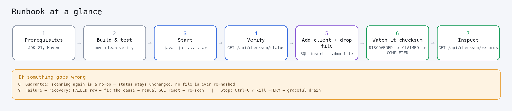
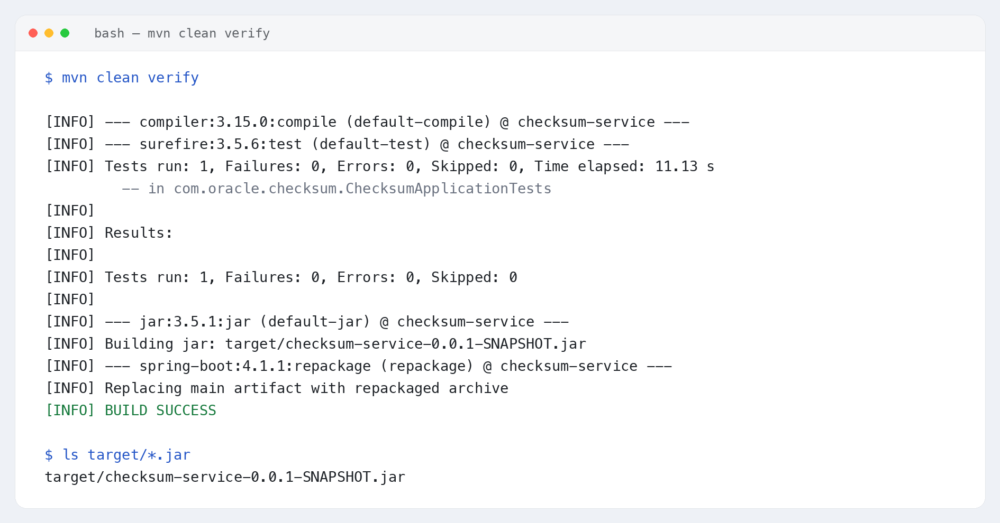
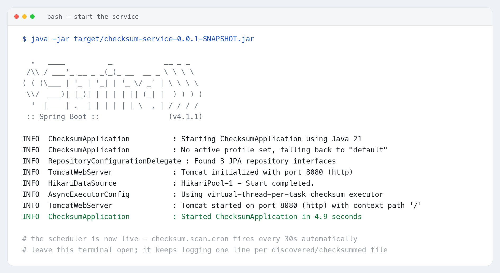
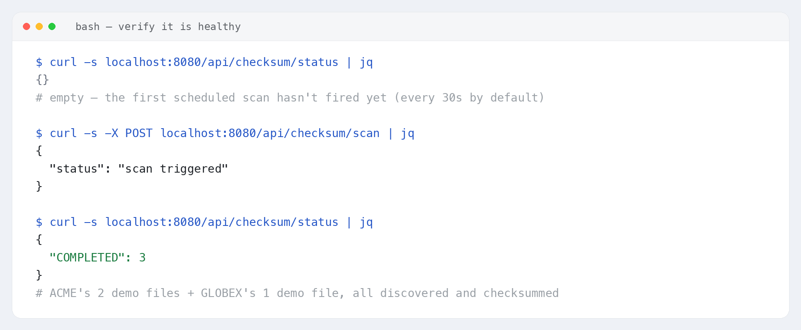
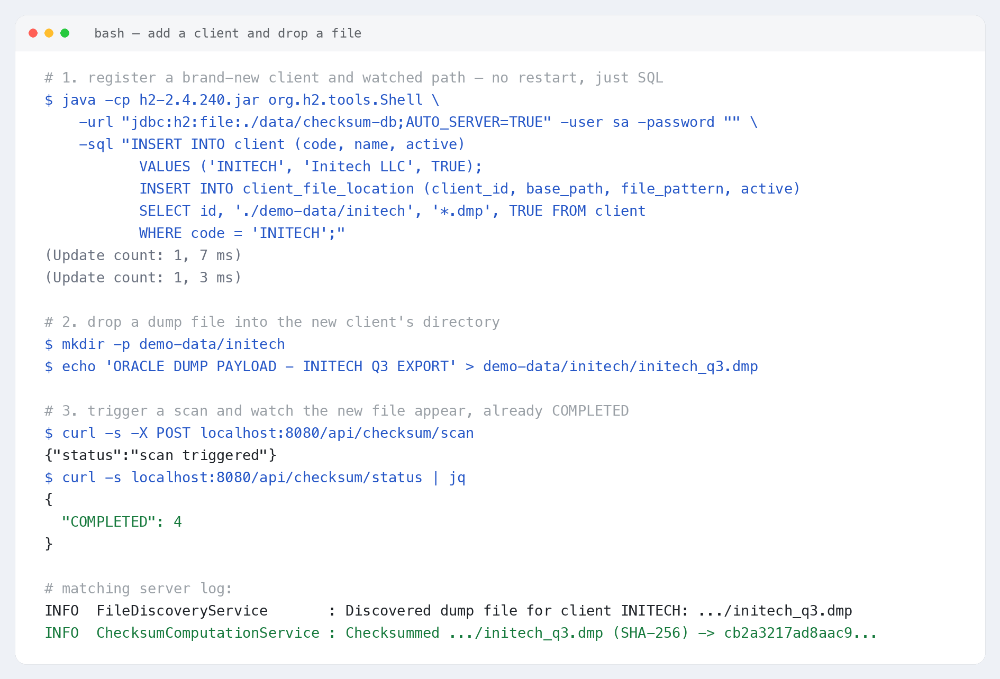
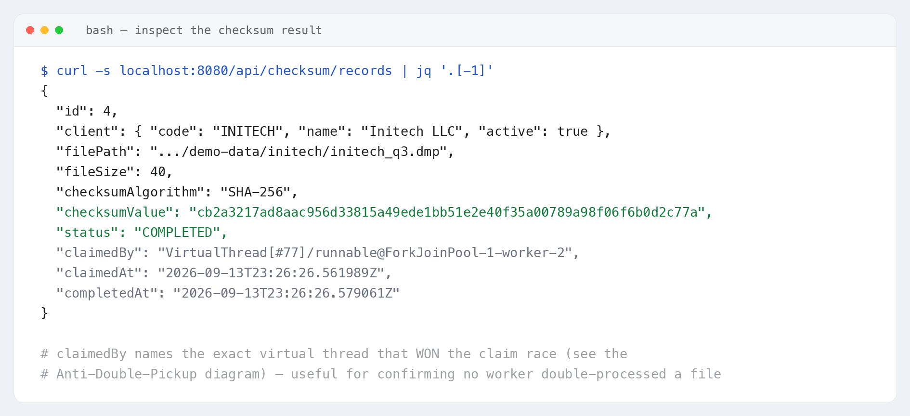
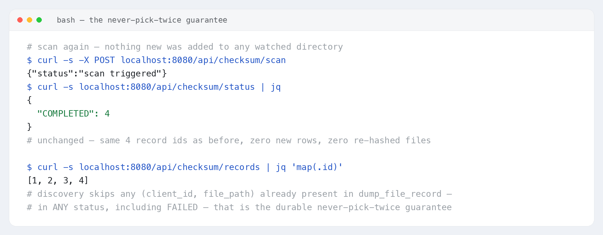
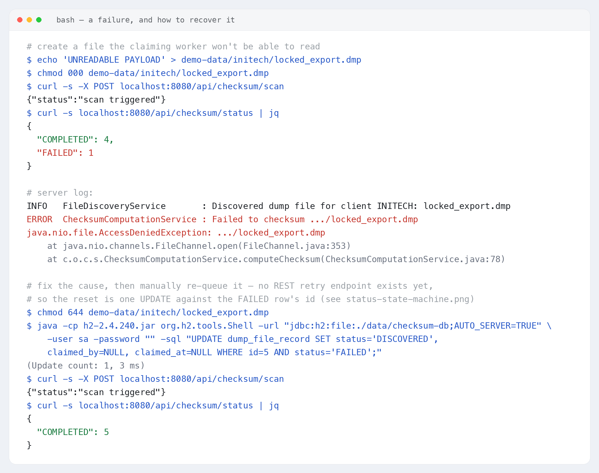
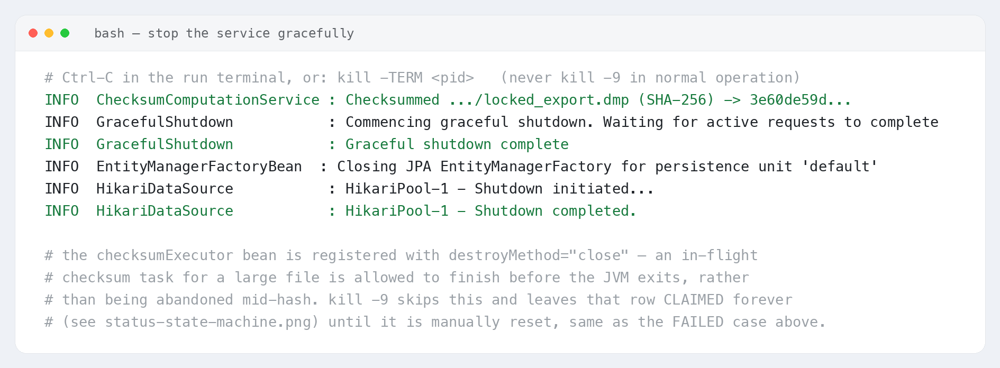

# Runbook — Oracle Dump Checksum Service

A step-by-step guide to **build, run, feed, verify and recover** the service. Every step has a
screenshot from a real run against this codebase. Images live in [`images/`](images/).

> **Who this is for:** an operator or developer running the service locally or on a server. No
> knowledge of the internals is required. For the "how it works" version, see
> [`analysis.md`](analysis.md).


*The seven steps below, at a glance. Steps 1–7 are the normal path; 8–9 are the guarantees and
recovery.*

---

## Contents

- [Step 0 — Prerequisites](#step-0--prerequisites)
- [Step 1 — Get the code](#step-1--get-the-code)
- [Step 2 — Build and run the tests](#step-2--build-and-run-the-tests)
- [Step 3 — Start the service](#step-3--start-the-service)
- [Step 4 — Verify it is healthy](#step-4--verify-it-is-healthy)
- [Step 5 — Add a client and drop a dump file](#step-5--add-a-client-and-drop-a-dump-file)
- [Step 6 — Watch it get checksummed](#step-6--watch-it-get-checksummed)
- [Step 7 — Inspect the result](#step-7--inspect-the-result)
- [Step 8 — The never-pick-twice guarantee](#step-8--the-never-pick-twice-guarantee)
- [Step 9 — When a checksum fails, and how to recover it](#step-9--when-a-checksum-fails-and-how-to-recover-it)
- [Step 10 — Stop the service gracefully](#step-10--stop-the-service-gracefully)
- [Inspecting the H2 metadata database](#inspecting-the-h2-metadata-database)
  - [What database am I connecting to?](#a--what-database-am-i-connecting-to)
  - [The tables](#b--the-tables)
  - [The `dump_file_record` columns in detail](#c--the-dump_file_record-columns-in-detail)
  - [Option 1 — the H2 web console (easiest)](#option-1--the-h2-web-console-easiest)
  - [Option 2 — the H2 command-line shell](#option-2--the-h2-command-line-shell)
  - [Option 3 — any external JDBC client (DBeaver, IntelliJ)](#option-3--any-external-jdbc-client-dbeaver-intellij)
  - [Option 4 — from your own backend / Java code](#option-4--from-your-own-backend--java-code)
  - [Useful queries](#useful-queries)
- [Operating the Service — Common Tasks](#operating-the-service--common-tasks)
- [Troubleshooting](#troubleshooting)
- [Quick command reference](#quick-command-reference)
- [References](#references)

---

## Step 0 — Prerequisites

| Requirement | Version | Check |
|---|---|---|
| JDK | **21+** | `java -version` |
| Maven | **3.9+** — no wrapper (`mvnw`) is checked into this repository | `mvn -v` |
| Disk | space for the H2 database (`./data`) | — |
| Ports | **8080** free (REST + H2 console) | — |
| Oracle client | **not required** — the service only computes checksums of dump files as opaque byte streams; it never opens or interprets an Oracle export format | — |

> **NOTE:** Client-to-directory mapping is **not** in `application.yaml`. It lives in the `client`
> and `client_file_location` H2 tables, seeded on first boot by `data.sql` with two demo clients
> (`ACME` → `/Users/<you>/temp/oracle-dumps/acme`, `GLOBEX` → `/Users/<you>/temp/oracle-dumps/globex`
> — an absolute, developer-machine-specific path, not the repo-relative `./demo-data/...` this
> runbook used previously). **Before Step 3, edit those two `base_path` values in `data.sql`** to a
> directory that actually exists on your machine (or run the `UPDATE client_file_location ...`
> shown in [Step 5](#step-5--add-a-client-and-drop-a-dump-file) after first boot). Adding a real
> client is a SQL insert, not a config edit either way.

---

## Step 1 — Get the code

```bash
cd <your workspace>
cd oracle_dump/oracle_dump_checksum
ls    # you should see: pom.xml  src/  readme.md  analysis.md  demo-data/
```

> The checked-in `demo-data/` folder is sample content only — `data.sql` no longer points at it by
> default (see the [Step 0](#step-0--prerequisites) note); it now seeds an absolute path outside
> the repo, so create/point that directory yourself before Step 3.

---

## Step 2 — Build and run the tests

**Goal of this step:** turn the source code into a runnable program (`.jar`) and prove it compiles
and boots cleanly by running the automated test.

### 2.1 — Open a terminal in the right folder

You must be in the folder that contains `pom.xml` — the same folder from
[Step 1](#step-1--get-the-code).

```bash
pwd     # shows where you are   (on Windows: cd)
ls      # you must see: pom.xml  src/   (on Windows: dir)
```

### 2.2 — Run the build

```bash
mvn clean verify
```

What the parts mean:

| Part | What it does |
|---|---|
| `mvn` | The Maven build tool. This project has no wrapper script — use a system-installed Maven ([Step 0](#step-0--prerequisites)). |
| `clean` | Deletes the previous build output (the `target/` folder) so you start fresh. |
| `verify` | Compiles the code, runs the test, and packages the `.jar`. If the test fails, the build stops here. |

### 2.3 — First run is slow — that's normal

The **first** time, Maven downloads all the libraries the project depends on (Spring Boot 4.1.1,
H2, Lombok, etc.) into `~/.m2/repository`. This needs an internet connection and can take a few
minutes. Later runs reuse the downloads and take well under a minute.

### 2.4 — What a successful run looks like

Near the bottom of the output you should see the test summary followed by `BUILD SUCCESS`:

```text
Tests run: 1, Failures: 0, Errors: 0, Skipped: 0
...
BUILD SUCCESS
```


*Actual output from this codebase: `Tests run: 1, Failures: 0, Errors: 0, Skipped: 0` then
`BUILD SUCCESS`, followed by the Spring Boot repackage step that produces the runnable jar.*

### 2.5 — What you now have

A runnable program at:

```text
target/checksum-service-0.0.1-SNAPSHOT.jar
```

### 2.6 — If it fails

| You see | What it means | What to do |
|---|---|---|
| `BUILD FAILURE` with `Could not resolve dependencies` | Maven couldn't download libraries — no internet, or `-o` (offline) was passed on a machine with an empty local repo | Connect to the internet and run `mvn clean verify` again without `-o` |
| `BUILD FAILURE` mentioning `release version 21` / `invalid target release` | Wrong Java version — this project needs **JDK 21+** | Run `java -version`; install a JDK 21+ distribution and retry |
| `BUILD FAILURE` with `Tests run: 1, Failures: 1` | A genuine test/context-load failure | Re-read the test's output; check `application.yaml` for typos first, since the one test just loads the full Spring context |

> **TIP:** To build without running the test (faster, but skips the safety check), use
> `mvn clean package -DskipTests`.

---

## Step 3 — Start the service

**Goal of this step:** launch the program so it runs continuously in your terminal, scanning
configured client directories on a schedule. It stays running until you stop it
([Step 10](#step-10--stop-the-service-gracefully)).

> **Before you start:** make sure nothing else is already using **port 8080**, and keep this
> terminal open — the service runs in the foreground and logs to it.

Two equivalent ways to start it:

```bash
# Option A — via the Spring Boot Maven plugin (good for development)
mvn spring-boot:run

# Option B — run the packaged jar directly, from Step 2
java -jar target/checksum-service-0.0.1-SNAPSHOT.jar
```

There is only **one** `application.yaml` — no profiles to choose between. On first boot,
`data.sql` seeds the two demo clients (`ACME`, `GLOBEX`) pointing at whatever absolute
`base_path` values are set in `data.sql` (by default `/Users/<you>/temp/oracle-dumps/acme` and
`/Users/<you>/temp/oracle-dumps/globex`). Make sure those two directories exist and contain sample
`.dmp` files **before** starting the service — unlike the old repo-relative `./demo-data/...`
convention, an absolute path outside the repo is not guaranteed to exist until you create it:

```bash
mkdir -p /Users/<you>/temp/oracle-dumps/acme /Users/<you>/temp/oracle-dumps/globex
echo 'ORACLE DUMP PAYLOAD - ACME SAMPLE 1' > /Users/<you>/temp/oracle-dumps/acme/sample1.dmp
echo 'ORACLE DUMP PAYLOAD - GLOBEX SAMPLE 1' > /Users/<you>/temp/oracle-dumps/globex/sample1.dmp
```

#### How to tell it started correctly

Watch the log for these lines (order may vary slightly):

```text
Using virtual-thread-per-task checksum executor
Tomcat started on port 8080 (http) with context path '/'
Started ChecksumApplication in <n> seconds
```


*Actual startup log from a fresh `java -jar` run. Once you see `Started ChecksumApplication`, the
scheduler (`checksum.scan.cron`, every 30 seconds by default) is already armed — leave this
terminal open and move to Step 4 in a new one.*

#### If it won't start

| You see | What it means | What to do |
|---|---|---|
| `Web server failed to start. Port 8080 was already in use.` | Another program (maybe an old run of this service) holds the port | Stop the other program, or add `--server.port=0` (random free port) / `--server.port=8081` |
| Startup fails during schema/`data.sql` handling | `spring.jpa.defer-datasource-initialization` was removed from `application.yaml` | Restore it to `true` — Hibernate must create the tables (`ddl-auto: update`) before `data.sql` runs |
| It starts but exits immediately with a compile error | Code doesn't compile | Fix [Step 2](#step-2--build-and-run-the-tests) first — it must reach `BUILD SUCCESS` |
| `command not found: mvn` | Maven isn't installed, or not on `PATH` | Install Maven ([Step 0](#step-0--prerequisites)) |

To stop the service at any time, press **Ctrl-C** (full details in
[Step 10](#step-10--stop-the-service-gracefully)).

---

## Step 4 — Verify it is healthy

**Goal of this step:** confirm from *outside* the program that it is running, by asking it for its
status over HTTP. Leave the service from Step 3 running and do this in a **new terminal**.

### 4.1 — One-time: install the helper tools

| Tool | What it's for | Install / check |
|---|---|---|
| `curl` | Sends an HTTP request from the terminal. Pre-installed on macOS, most Linux, and Windows 10+. | `curl --version` |
| `jq` | Pretty-prints the JSON reply so it's readable. Optional. | `jq --version` — macOS: `brew install jq`, Debian/Ubuntu: `sudo apt install jq`, Windows: `winget install jqlang.jq` |

If you don't want to install `jq`, drop the `| jq` part from every command — you'll get the same
JSON on one line.

### 4.2 — Ask the service for its status

```bash
curl -s localhost:8080/api/checksum/status | jq
```

`/api/checksum/status` is this app's own summary endpoint — a count of `dump_file_record` rows
grouped by status. There is no `/actuator/health` endpoint in this project (the Actuator
dependency isn't on the classpath) — this status endpoint, and the H2 console
([Step 9](#inspecting-the-h2-metadata-database)), are how you confirm the service is alive and
working.

### 4.3 — What a healthy sequence looks like

Immediately after startup the status is `{}` — nothing has been scanned yet. Trigger a scan
manually (the same code path the 30-second scheduler uses) and it fills in:


*`{}` right after startup → `POST /api/checksum/scan` → `{"COMPLETED": 3}`, matching the two demo
clients' three sample files.*

### 4.4 — If the check fails

| You see | What it means | What to do |
|---|---|---|
| `curl: (7) Failed to connect to localhost port 8080` | The service isn't running (or is still starting, or on another port) | Check the Step 3 terminal for `Started ChecksumApplication`; wait a few seconds and retry |
| `curl: command not found` | `curl` isn't installed | Install it, or open the URL in a web browser instead |
| JSON prints but `jq: command not found` follows | `jq` isn't installed | Remove `| jq` from the command, or install it (see 4.1) |
| Status never leaves `{}` even after 30+ seconds | A configured `base_path` doesn't exist, or the demo `.dmp` files were deleted | Check the Step 3 log for a `WARN ... not a directory` line; confirm the absolute paths seeded in `data.sql` (e.g. `/Users/<you>/temp/oracle-dumps/acme` and `.../globex`) actually exist on this machine |

---

## Step 5 — Add a client and drop a dump file

**Goal of this step:** register a brand-new client with its own watched directory **at runtime** —
no config file edit, no restart — then feed it a file, proving requirement 5 of `claude.md`
(client-to-path mapping is data, not YAML).

### 5.1 — Register the client via SQL

Every client and watched path lives in two H2 tables. Use the H2 command-line shell (the jar is
already in your local Maven cache from [Step 2](#step-2--build-and-run-the-tests)) to insert one
while the service keeps running:

```bash
H2_JAR=~/.m2/repository/com/h2database/h2/2.4.240/h2-2.4.240.jar

java -cp "$H2_JAR" org.h2.tools.Shell \
  -url "jdbc:h2:file:./data/checksum-db;AUTO_SERVER=TRUE" -user sa -password "" \
  -sql "INSERT INTO client (code, name, active) VALUES ('INITECH', 'Initech LLC', TRUE);
        INSERT INTO client_file_location (client_id, base_path, file_pattern, active)
        SELECT id, '/Users/<you>/temp/oracle-dumps/initech', '*.dmp', TRUE FROM client WHERE code = 'INITECH';"
```

`base_path` must be an absolute directory that exists on this machine, matching the convention
`data.sql` now uses for the `ACME`/`GLOBEX` seed rows ([Step 0](#step-0--prerequisites)) —
relative paths like the old `./demo-data/initech` are resolved against the working directory the
service was started from, which is fragile if you start it from somewhere else next time.

`;AUTO_SERVER=TRUE` on the URL is what lets this second, short-lived connection reach the same
database file the running service already has open — see
[§A](#a--what-database-am-i-connecting-to) for why that matters.

### 5.2 — Drop a dump file into its directory

```bash
mkdir -p /Users/<you>/temp/oracle-dumps/initech
echo 'ORACLE DUMP PAYLOAD - INITECH Q3 EXPORT' > /Users/<you>/temp/oracle-dumps/initech/initech_q3.dmp
```

Any file matching the location's `file_pattern` (`*.dmp` by default) is a candidate — the content
is irrelevant to the service, since it is checksummed as opaque bytes.

> **NOTE — no `.part`/rename convention here.** Unlike scanners that require a two-step
> write-then-rename to avoid reading a half-written file, this service has no file-stability
> check — it reads the file the moment discovery finds it. For real dump exports, make sure the
> writer finishes (or use `impdp`'s own completion signal) before the next scan cycle picks the
> file up; there is no built-in safeguard against reading a file that is still being written.


*Real output: register `INITECH` via the H2 shell, drop `initech_q3.dmp`, trigger a scan, and the
status count moves from 3 to 4 — the new file was discovered and checksummed in the same cycle.*

---

## Step 6 — Watch it get checksummed

**Goal of this step:** understand what the file's status did between "not in the database" and
`COMPLETED`, even though — for a small demo file — you won't usually catch it mid-flight.

### 6.1 — The stages

```text
(no row) → DISCOVERED → CLAIMED → COMPLETED
```

| Stage | What's happening |
|---|---|
| *(no row)* | The scanner hasn't seen the file yet, or a previous cycle already saw it (in which case it's skipped forever — [Step 8](#step-8--the-never-pick-twice-guarantee)). |
| `DISCOVERED` | `FileDiscoveryService` found the file and inserted a row — no worker has touched it yet. |
| `CLAIMED` | A virtual thread's atomic `UPDATE ... WHERE status = 'DISCOVERED'` succeeded; that thread now owns the file and is hashing it. |
| `COMPLETED` | SHA-256 computed and stored. |

### 6.2 — Why you usually won't see `CLAIMED` for a small file

`ChecksumScanScheduler.scan()` calls `discover()` and then `processDiscoveredFiles()` **in the same
call** — for a demo-sized file (tens of bytes), the claim-and-hash step finishes in a few
milliseconds, well inside one HTTP request. By the time `POST /api/checksum/scan` returns, the
file is typically already `COMPLETED`. `CLAIMED` is real and is exactly what makes the
never-pick-twice guarantee safe (see the [claim-race diagram](images/claim-race-sequence.png)) —
it's just too brief to observe here. For a multi-gigabyte real dump file, polling
`GET /api/checksum/records` every second or two during the scan would show it sitting in
`CLAIMED` for as long as the hash takes to compute.

### 6.3 — How long it takes

There is no artificial delay anywhere in this pipeline (unlike systems that simulate a slow
import) — a demo file completes in well under a second. A real multi-gigabyte Oracle dump takes
roughly as long as reading it once from disk, since the checksum is computed while streaming the
file through 8 MB chunks.

---

## Step 7 — Inspect the result

**Goal of this step:** look at exactly what the service recorded about the file you just
checksummed.

```bash
curl -s localhost:8080/api/checksum/records | jq '.[-1]'
```

`/api/checksum/records` returns every `dump_file_record` row as JSON — client, path, size,
algorithm, checksum value, status, and the claim/completion timestamps.


*Real record for `initech_q3.dmp`: `checksumAlgorithm: "SHA-256"`, the actual computed
`checksumValue`, `status: "COMPLETED"`, and `claimedBy` naming the exact virtual thread that won
the claim.*

> **NOTE:** `claimedBy` is useful for diagnostics, not for correctness — the correctness guarantee
> comes from the database `UPDATE`, not from recording who won it. If you ever needed to audit that
> no two records were claimed by the same worker in a way that suggests double-processing, this is
> the field to check.

---

## Step 8 — The never-pick-twice guarantee

**Goal of this step:** prove, rather than just assert, requirement 3 from `claude.md` — a file
already known is never picked up again, even when the scanner runs again and the file is still
sitting right there on disk.

```bash
curl -s -X POST localhost:8080/api/checksum/scan
curl -s localhost:8080/api/checksum/status | jq
curl -s localhost:8080/api/checksum/records | jq 'map(.id)'
```


*Scanning again with nothing new on disk leaves the status count and the set of record ids
completely unchanged — no new row, no re-hashed file.*

**Why this holds:** `FileDiscoveryService.registerIfNew()` checks
`existsByClient_IdAndFilePath(clientId, absolutePath)` before inserting anything — a file with a
row already there, **in any status including `FAILED`**, is never inserted a second time. Combined
with the atomic claim `UPDATE` from [Step 6](#step-6--watch-it-get-checksummed), this is what makes
"already picked up" a fact the database enforces, not something a scheduler merely tries not to
repeat.

> **NOTE — replacing a file's content at the same path is invisible to this guarantee.** The
> dedup key is `(client_id, file_path)` alone; `file_size`/`last_modified` are captured at
> discovery time but never compared against a later state of the same path. If a client
> legitimately replaces `initech_q3.dmp` with new content, this service will not notice — that
> would need an explicit "reprocess" action, which is not built in this phase (`claude.md` §9).

---

## Step 9 — When a checksum fails, and how to recover it

**Goal of this step:** see the real failure path and the one manual step that puts a failed file
back in the queue — there is **no** `POST .../retry` endpoint in this project, unlike systems that
expose one, so recovery here is one SQL statement.

### 9.1 — What "failed" means

`ChecksumComputationService.processOne()` catches `IOException` and `NoSuchAlgorithmException`
around the hashing step and writes `status = FAILED` rather than leaving the row `CLAIMED`
forever. The most realistic real-world trigger is a permissions problem or the file being moved
out from under the worker mid-read.

### 9.2 — Reproduce a real failure

```bash
echo 'UNREADABLE PAYLOAD' > /Users/<you>/temp/oracle-dumps/initech/locked_export.dmp
chmod 000 /Users/<you>/temp/oracle-dumps/initech/locked_export.dmp
curl -s -X POST localhost:8080/api/checksum/scan
curl -s localhost:8080/api/checksum/status | jq
```

`chmod 000` still lets `Files.size()`/`getLastModifiedTime()` succeed at discovery time (reading
file metadata only needs directory traversal, not read permission on the file itself) — so the
row is discovered normally. The failure happens one step later, when the claiming worker calls
`FileChannel.open(file, READ)`.

### 9.3 — What you'll see

```text
{"COMPLETED": 4, "FAILED": 1}
```

with a real `java.nio.file.AccessDeniedException` in the server log:


*Top: the real `AccessDeniedException` thrown from `ChecksumComputationService.computeChecksum`.
Bottom: fix the permission, manually reset the row from `FAILED` back to `DISCOVERED` via SQL
(matching the [status state machine](images/status-state-machine.png)), then rescan — the file
reaches `COMPLETED`.*

### 9.4 — The recovery command

```bash
chmod 644 /Users/<you>/temp/oracle-dumps/initech/locked_export.dmp

java -cp ~/.m2/repository/com/h2database/h2/2.4.240/h2-2.4.240.jar org.h2.tools.Shell \
  -url "jdbc:h2:file:./data/checksum-db;AUTO_SERVER=TRUE" -user sa -password "" \
  -sql "UPDATE dump_file_record SET status = 'DISCOVERED', claimed_by = NULL, claimed_at = NULL
        WHERE id = <id> AND status = 'FAILED';"

curl -s -X POST localhost:8080/api/checksum/scan
```

> **NOTE — fix the cause first.** The `UPDATE` only re-queues the row; it doesn't fix anything. In
> the reproduction above, resetting the row without first running `chmod 644` would just fail
> again with the same exception.

> **NOTE — crash recovery is NOT automatic, unlike a failed checksum.** If the process is killed
> (`kill -9`) while a row is `CLAIMED`, it is never marked `FAILED` and stays `CLAIMED` forever —
> there is no periodic sweep in this phase (`claude.md` §6.5 flags one as optional future
> hardening). Recovering it needs the exact same manual `UPDATE` shown above, just starting from
> `status = 'CLAIMED'` instead of `'FAILED'`.

---

## Step 10 — Stop the service gracefully

**Goal of this step:** shut the service down cleanly so no checksum task is abandoned mid-hash.

### 10.1 — How to stop it

Go to the terminal running the service (from [Step 3](#step-3--start-the-service)) and press
**Ctrl-C** once, or from another terminal:

```bash
kill -TERM <pid>     # graceful — never kill -9 unless you are deliberately testing crash recovery
```

### 10.2 — What a clean shutdown looks like


*Real shutdown log: Tomcat's graceful shutdown completes, then the JPA `EntityManagerFactory` and
the Hikari connection pool close in order.*

> **NOTE:** `AsyncExecutorConfig.checksumExecutor()` is registered as a Spring bean with
> `destroyMethod = "close"`, so `ExecutorService.close()` runs during context shutdown. `close()`
> waits for already-submitted tasks to finish before returning, so an in-flight checksum of a large
> file is allowed to complete rather than being abandoned — provided the process receives `SIGTERM`
> (plain `kill`, or Ctrl-C) and not `SIGKILL` (`kill -9`).
>
> **The database survives restarts.** Unlike an in-memory demo setup, `jdbc:h2:file:./data/checksum-db`
> is a file on disk — stopping and restarting the service does **not** erase `dump_file_record`
> history. That row-by-row history is the entire point of the design (§4 of `analysis.md`).

---

## Inspecting the H2 metadata database

**Goal of this section:** open the database the service uses for everything — client config and
checksum results alike — see which tables exist, and run SQL against them.

> The REST API (`/api/checksum/status`, `/api/checksum/records`) already exposes the checksum
> results, but **not** the `client` / `client_file_location` configuration tables. Go to the
> database directly for that, for ad-hoc SQL, or to debug a stuck row.

### A — What database am I connecting to?

| | Value |
|---|---|
| JDBC URL | `jdbc:h2:file:./data/checksum-db;AUTO_SERVER=TRUE` (from `application.yaml`) |
| Where it lives | a file on disk: `./data/checksum-db.mv.db` (relative to the working directory the app was started from) |
| Reachable from outside the app? | **Yes** — `AUTO_SERVER=TRUE` lets a second process (the H2 console, the H2 shell, DBeaver, …) connect to the same file while the app is running, which is exactly what [Step 5](#step-5--add-a-client-and-drop-a-dump-file) and [Step 9](#step-9--when-a-checksum-fails-and-how-to-recover-it) rely on |
| Credentials | user **`sa`**, password **empty** |

Other facts worth knowing:

- **Schema management is automatic.** `spring.jpa.hibernate.ddl-auto: update` creates/updates the
  schema from the entity classes on startup. There is no `schema.sql` and no Flyway/Liquibase
  migration history table in this phase — see `analysis.md` §11 for what a production migration to
  a real datastore would add.
- **Identifiers follow the entity/column names as written** — this project's `@Table`/`@Column`
  names are already lower-case with underscores (`dump_file_record`, `client_file_location`), so
  the SQL in this document matches the real column names exactly; no quoting games are needed.
- H2 version is **2.4.240** (pulled in by the Spring Boot 4.1.1 dependency-management BOM) —
  matters only if you download a standalone H2 jar for [Option 2](#option-2--the-h2-command-line-shell);
  use the same major version so the file format matches.

### B — The tables

The application defines exactly **three** tables. Everything else you see belongs to H2 itself.

| Table | Origin | Contents |
|---|---|---|
| `client` | JPA entity `Client` | One row per client (`code`, `name`, `active`). |
| `client_file_location` | JPA entity `ClientFileLocation` | One row per watched directory per client (`base_path`, `file_pattern`, `active`). |
| `dump_file_record` | JPA entity `DumpFileRecord` | One row per discovered file, with its full lifecycle, checksum, and claim/completion timestamps. This is the **single source of truth** for "already picked up." |
| `INFORMATION_SCHEMA.*` | built into H2 | Catalog views — `TABLES`, `COLUMNS`, `INDEXES`, `CONSTRAINTS`. Read-only; use them to explore. |

The only index beyond each table's primary key is the **unique constraint on
`(client_id, file_path)`** on `dump_file_record` — the load-bearing part of the whole design (see
[analysis.md §3](analysis.md#3-data-model-analysis)).

### C — The `dump_file_record` columns in detail

| Column | Type (H2) | Null? | Meaning |
|---|---|---|---|
| `id` | `BIGINT` identity | no | Primary key — the `id` you pass in the manual recovery `UPDATE` ([Step 9](#step-9--when-a-checksum-fails-and-how-to-recover-it)). |
| `client_id` | `BIGINT` FK | no | Which client this file belongs to. |
| `file_path` | `VARCHAR` | no | Absolute path. Unique together with `client_id`. |
| `file_size` | `BIGINT` | yes | File size captured at discovery time. |
| `last_modified` | `TIMESTAMP` | yes | File mtime captured at discovery time (UTC). Never re-checked after discovery — see [Step 8's](#step-8--the-never-pick-twice-guarantee) note on same-path replacement. |
| `checksum_algorithm` | `VARCHAR` | yes | e.g. `SHA-256`. `NULL` until the checksum stage runs. |
| `checksum_value` | `VARCHAR` | yes | The computed digest, hex-encoded. `NULL` until `COMPLETED`. |
| `status` | `VARCHAR` | no | `DISCOVERED` \| `CLAIMED` \| `COMPLETED` \| `FAILED`. |
| `claimed_by` | `VARCHAR` | yes | The worker (virtual thread) identifier that won the claim. |
| `claimed_at` | `TIMESTAMP` | yes | When the claim `UPDATE` succeeded. |
| `completed_at` | `TIMESTAMP` | yes | When the checksum finished successfully. `NULL` for `FAILED` rows. |
| `checksum_duration_minutes` | `DECIMAL(20,8)` | yes | `completed_at - claimed_at`, in minutes. `NULL` until `COMPLETED`. Stored as `DECIMAL`/`BigDecimal` rather than `DOUBLE` on purpose — H2's console prints small `DOUBLE` values in scientific notation (e.g. `2.0E-5`), which isn't readable when eyeballing the table. |

### Option 1 — the H2 web console (easiest)

1. With the service running, open **`http://localhost:8080/h2-console`** in a browser.
2. On the login screen enter:

   | Field | Value |
   |---|---|
   | JDBC URL | `jdbc:h2:file:./data/checksum-db` |
   | User Name | `sa` |
   | Password | *(leave blank)* |

   If you get `Database may be already in use`, the running app already holds the file — the
   `application.yaml` datasource URL already includes `AUTO_SERVER=TRUE`, so this normally just
   works; if you changed that URL, add `;AUTO_SERVER=TRUE` back.
3. Click **Connect**, then run SQL, e.g. `SELECT * FROM dump_file_record;`.

> The console is enabled by `spring.h2.console.enabled: true` in `application.yaml`, and requires
> the `spring-boot-h2console` starter on the classpath (`pom.xml`) — Spring Boot 4.1.1 split the
> console's auto-configuration out of the `h2` JDBC driver dependency into its own artifact, so
> both must be present. **Do not carry either into a shared or production environment** — see
> `analysis.md` §10.

### Option 2 — the H2 command-line shell

Used throughout this runbook ([Step 5](#step-5--add-a-client-and-drop-a-dump-file),
[Step 9](#step-9--when-a-checksum-fails-and-how-to-recover-it)). Uses the H2 jar Maven already
downloaded:

```bash
java -cp ~/.m2/repository/com/h2database/h2/2.4.240/h2-2.4.240.jar org.h2.tools.Shell \
  -url "jdbc:h2:file:./data/checksum-db;AUTO_SERVER=TRUE" -user sa -password ""
```

At the `sql>` prompt:

```sql
SHOW TABLES;
SELECT id, client_id, file_path, status FROM dump_file_record ORDER BY id;
```

Non-interactive (one query, then exit): add `-sql "SELECT COUNT(*) FROM dump_file_record"`.

### Option 3 — any external JDBC client (DBeaver, IntelliJ)

While the service is running, `AUTO_SERVER=TRUE` allows a second connection:

- **Driver:** H2 (`org.h2.Driver`), version 2.4.x
- **JDBC URL:** `jdbc:h2:file:/ABSOLUTE/PATH/TO/data/checksum-db;AUTO_SERVER=TRUE`
  (use the real absolute path to the `.mv.db` file, without the `.mv.db` suffix)
- **User:** `sa`  **Password:** *(blank)*

If the service is **not** running, connect with a plain `jdbc:h2:file:/ABSOLUTE/PATH/...` URL (no
`AUTO_SERVER` needed).

### Option 4 — from your own backend / Java code

Inside the Spring application you already have first-class access via Spring Data JPA — don't open
a second JDBC connection from application code.

**a. Use the existing repository.** `DumpFileRecordRepository` is a bean you can inject anywhere:

```java
@Service
class ReportingService {

    private final DumpFileRecordRepository dumpFileRecordRepository;

    ReportingService(DumpFileRecordRepository dumpFileRecordRepository) {
        this.dumpFileRecordRepository = dumpFileRecordRepository;
    }

    List<DumpFileRecord> failed() {
        return dumpFileRecordRepository.findByStatus(DumpFileStatus.FAILED);
    }
}
```

Methods that already exist: `existsByClient_IdAndFilePath`, `findByStatus`, plus everything
`JpaRepository` provides for free (`findAll`, `findById`, …), and the hand-written `claim(...)`
`@Modifying` query described in `analysis.md` §5.

**b. Add your own query** to that interface — JPQL against the entity, or native SQL:

```java
public interface DumpFileRecordRepository extends JpaRepository<DumpFileRecord, Long> {

    @Query("select r from DumpFileRecord r where r.client.id = :clientId and r.status = :status")
    List<DumpFileRecord> byClientAndStatus(@Param("clientId") Long clientId,
                                            @Param("status") DumpFileStatus status);

    @Query(value = "SELECT status, COUNT(*) FROM dump_file_record GROUP BY status",
           nativeQuery = true)
    List<Object[]> statusHistogram();
}
```

**c. Drop to `JdbcTemplate`** for one-off SQL without an entity:

```java
@Component
class ChecksumStats {
    private final JdbcTemplate jdbc;
    ChecksumStats(JdbcTemplate jdbc) { this.jdbc = jdbc; }   // auto-configured from the datasource

    Map<String, Long> countByClient() {
        return jdbc.query(
            "SELECT c.code, COUNT(*) c2 FROM dump_file_record d JOIN client c ON c.id = d.client_id GROUP BY c.code",
            rs -> {
                Map<String, Long> out = new LinkedHashMap<>();
                while (rs.next()) out.put(rs.getString("code"), rs.getLong("c2"));
                return out;
            });
    }
}
```

> Treat writes with care: the pipeline relies on the `status` state machine and the atomic claim
> `UPDATE`. Prefer adding a proper "reprocess"/"retry" service method over hand-updating `status`
> from application code — the manual SQL shown in [Step 9](#step-9--when-a-checksum-fails-and-how-to-recover-it)
> is an operator escape hatch for this demo phase, not a pattern to build application features on.

### Useful queries

```sql
-- everything, newest first
SELECT id, client_id, file_path, status, file_size, checksum_value
FROM dump_file_record
ORDER BY id DESC;

-- how many files in each state
SELECT status, COUNT(*) FROM dump_file_record GROUP BY status ORDER BY 2 DESC;

-- rows currently claimed (in flight, or stuck if a worker crashed)
SELECT id, client_id, file_path, claimed_by, claimed_at
FROM dump_file_record
WHERE status = 'CLAIMED';

-- everything for one client, by code
SELECT d.id, d.file_path, d.status, d.checksum_value
FROM dump_file_record d JOIN client c ON c.id = d.client_id
WHERE c.code = 'ACME';

-- active client/path configuration (not exposed by the REST API)
SELECT c.code, l.base_path, l.file_pattern
FROM client_file_location l JOIN client c ON c.id = l.client_id
WHERE l.active = TRUE AND c.active = TRUE;

-- inspect the schema itself
SELECT column_name, data_type, is_nullable
FROM INFORMATION_SCHEMA.COLUMNS
WHERE table_name = 'DUMP_FILE_RECORD'
ORDER BY ordinal_position;
```

---

## Operating the Service — Common Tasks

### Temporarily stop scanning a client without deleting its history

```sql
UPDATE client SET active = FALSE WHERE code = 'ACME';
```
Existing rows for `ACME` are untouched; only future discovery is skipped. Set `active = TRUE`
again to resume.

### Retire one watched path but keep the client active

```sql
UPDATE client_file_location SET active = FALSE WHERE base_path = '/Users/<you>/temp/oracle-dumps/acme/archive';
```

### Change the checksum algorithm

Edit `checksum.algorithm` in `application.yaml` (e.g. to `SHA-512`) and restart. This only affects
files discovered *after* the change — existing `checksum_algorithm`/`checksum_value` values on
already-`COMPLETED` rows are not recomputed.

### Switch the executor from virtual threads to a fixed pool

If profiling on real dump files shows digest computation, not disk I/O, is the bottleneck, set:

```yaml
checksum:
  executor:
    type: fixed
    fixed-pool-size: 8   # tune to available cores
```
and restart. See `analysis.md` §4 for when this trade-off actually applies.

---

## Troubleshooting

| Symptom | Likely Cause | Fix |
|---|---|---|
| `Web server failed to start. Port 8080 was already in use.` | Another instance of the app is already listening on 8080 | Stop the other process, or run with `--server.port=0` |
| A client's files never get discovered | `client_file_location.base_path` doesn't exist, isn't a directory, or is `active = FALSE`; or the client itself is `active = FALSE` | Check via the H2 console; the log also prints `WARN ... not a directory` for a missing path |
| A file never reaches `COMPLETED` | It's `FAILED` (see [Step 9](#step-9--when-a-checksum-fails-and-how-to-recover-it)), or stuck `CLAIMED` after a crash | Check `/api/checksum/status` and `/records`; reset via the manual `UPDATE` shown in Step 9 |
| Replacing a file's content at the same path doesn't get re-checksummed | Expected — see [Step 8](#step-8--the-never-pick-twice-guarantee). The dedup key is the path alone | No built-in fix in this phase; would need an explicit "reprocess" action |
| H2 console shows "Database may be already in use" | A second connection was opened without `AUTO_SERVER=TRUE` while the app holds the file | Add `;AUTO_SERVER=TRUE` to the connecting client's URL, matching `application.yaml` |
| `data.sql` seems to run every restart | Expected — `spring.sql.init.mode: always`. It's written with `WHERE NOT EXISTS` guards, so it's safe to re-run | No action needed |

---

## Quick command reference

```bash
# build + test
mvn clean verify

# run
mvn spring-boot:run
# or
java -jar target/checksum-service-0.0.1-SNAPSHOT.jar

# status / inventory
curl -s localhost:8080/api/checksum/status | jq
curl -s localhost:8080/api/checksum/records | jq

# trigger a scan on demand (same code path as the 30s scheduler)
curl -s -X POST localhost:8080/api/checksum/scan

# add a client at runtime (no restart)
java -cp ~/.m2/repository/com/h2database/h2/2.4.240/h2-2.4.240.jar org.h2.tools.Shell \
  -url "jdbc:h2:file:./data/checksum-db;AUTO_SERVER=TRUE" -user sa -password "" \
  -sql "INSERT INTO client (code, name, active) VALUES ('CODE', 'Name', TRUE);
        INSERT INTO client_file_location (client_id, base_path, file_pattern, active)
        SELECT id, '/path/to/dumps', '*.dmp', TRUE FROM client WHERE code = 'CODE';"

# recover a FAILED (or crash-stuck CLAIMED) row by id
java -cp ~/.m2/repository/com/h2database/h2/2.4.240/h2-2.4.240.jar org.h2.tools.Shell \
  -url "jdbc:h2:file:./data/checksum-db;AUTO_SERVER=TRUE" -user sa -password "" \
  -sql "UPDATE dump_file_record SET status='DISCOVERED', claimed_by=NULL, claimed_at=NULL
        WHERE id=<id>;"

# open the metadata DB: browser -> http://localhost:8080/h2-console
#   JDBC URL: jdbc:h2:file:./data/checksum-db   (user sa, no password)

# stop
# Ctrl-C, or: kill -TERM <pid>   (never kill -9 in normal operation)
```

---

## References

- [`claude.md`](./claude.md) — the technical specification this service was implemented from.
- [`analysis.md`](./analysis.md) — a deeper design analysis, including a full H2-to-SQL-Server
  production migration walkthrough.
- Diagrams in [`images/`](./images) — the architecture/data-model/sequence diagrams
  (`architecture-overview.png`, `er-diagram.png`, `claim-race-sequence.png`,
  `status-state-machine.png`, `scan-cycle-sequence.png`, `domain-class-diagram.png`) were authored
  as PlantUML source and rendered to PNG; the step screenshots in this runbook (`r00`–`r08`) are
  real terminal output captured against this codebase, laid out as macOS-style terminal cards.
  Only rendered images are kept in this repository, per the "use an image, not diagram code"
  convention for this document.
- [Java `MessageDigest` — thread-safety note](https://docs.oracle.com/en/java/javase/21/docs/api/java.base/java/security/MessageDigest.html)
- [`Executors.newVirtualThreadPerTaskExecutor()` — JDK 21 API](https://docs.oracle.com/en/java/javase/21/docs/api/java.base/java/util/concurrent/Executors.html#newVirtualThreadPerTaskExecutor())
- [JEP 444: Virtual Threads](https://openjdk.org/jeps/444)
- [Spring Data JPA — Modifying Queries](https://docs.spring.io/spring-data/jpa/reference/jpa/query-methods.html#jpa.modifying-queries) — the mechanism behind the atomic claim query.
- [Spring Boot — Graceful shutdown](https://docs.spring.io/spring-boot/reference/web/graceful-shutdown.html) — behind the sequence in [Step 10](#step-10--stop-the-service-gracefully).
- [Spring Boot + H2 console](https://docs.spring.io/spring-boot/reference/data/sql.html#data.sql.h2-web-console)
- [H2 Database — features, URLs, `AUTO_SERVER`](https://www.h2database.com/html/features.html)
- [H2 tools (`Shell`, `Console`)](https://www.h2database.com/html/tutorial.html#command_line_tools)
- [H2 Database — Locking and transaction isolation](https://www.h2database.com/html/advanced.html#transaction_isolation) — why the conditional `UPDATE` claim is race-safe.
- [Spring Boot — Data Initialization (`data.sql`, `defer-datasource-initialization`)](https://docs.spring.io/spring-boot/how-to/data-initialization.html)
- [`jq`](https://jqlang.github.io/jq/) — used throughout the examples.
